> Tags: #mappView #语言 #Eventbinding

- [1 B05.045.mappView语言多客户端同时切换](#_1-b05045mappview%E8%AF%AD%E8%A8%80%E5%A4%9A%E5%AE%A2%E6%88%B7%E7%AB%AF%E5%90%8C%E6%97%B6%E5%88%87%E6%8D%A2)
- [2 解决方式](#_2-%E8%A7%A3%E5%86%B3%E6%96%B9%E5%BC%8F)
	- [2.1 PLC程序中的文本通过 sLanguageID 的内容来切换语言](#_21-plc%E7%A8%8B%E5%BA%8F%E4%B8%AD%E7%9A%84%E6%96%87%E6%9C%AC%E9%80%9A%E8%BF%87-slanguageid-%E7%9A%84%E5%86%85%E5%AE%B9%E6%9D%A5%E5%88%87%E6%8D%A2%E8%AF%AD%E8%A8%80)
	- [2.2 语言切换依然采用 LanguageSelector](#_22-%E8%AF%AD%E8%A8%80%E5%88%87%E6%8D%A2%E4%BE%9D%E7%84%B6%E9%87%87%E7%94%A8-languageselector)
	- [2.3 一个Client修改了语言，其他Client也需要修改成相应的语言](#_23-%E4%B8%80%E4%B8%AAclient%E4%BF%AE%E6%94%B9%E4%BA%86%E8%AF%AD%E8%A8%80%EF%BC%8C%E5%85%B6%E4%BB%96client%E4%B9%9F%E9%9C%80%E8%A6%81%E4%BF%AE%E6%94%B9%E6%88%90%E7%9B%B8%E5%BA%94%E7%9A%84%E8%AF%AD%E8%A8%80)
	- [2.4 Client链接的时候画面显示语言，与其他Client保持一致](#_24-client%E9%93%BE%E6%8E%A5%E7%9A%84%E6%97%B6%E5%80%99%E7%94%BB%E9%9D%A2%E6%98%BE%E7%A4%BA%E8%AF%AD%E8%A8%80%EF%BC%8C%E4%B8%8E%E5%85%B6%E4%BB%96client%E4%BF%9D%E6%8C%81%E4%B8%80%E8%87%B4)
- [3 更新日志](#_3-%E6%9B%B4%E6%96%B0%E6%97%A5%E5%BF%97)

# 1 B05.045.mappView语言多客户端同时切换

- mappView支持多客户端同时访问画面，且不同客户端访问的内容可完全不一样，若所有文本均使用TMX文本，使用语言切换，可实现一个客户端访问中文画面，另一个客户端访问的为英文画面。
    - 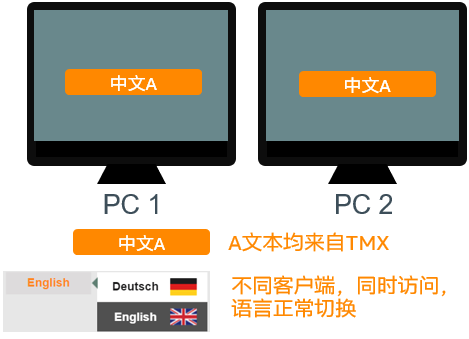
- 但很多时候，界面上的文本信息不仅仅全部通过TMX文本来显示，部分内容来源配置文件，在同一时刻，PLC内的文本只能是一种语言，mappView画面进行语言切换就容易出现这样的情况，例如英文与中文混合。
    - 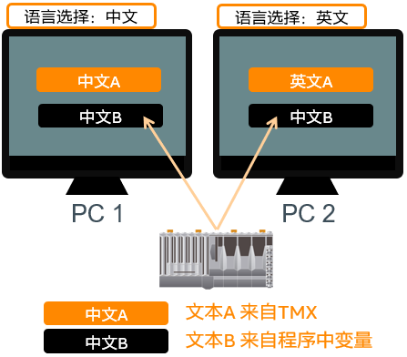
- 解决思路
    - mappView画面上进行语言切换时，通过变量同时控制下位PLC程序的变量语言内容，并影响所有连接的客户端更新显示语言，保持画面显示内容一致性。

# 2 解决方式

## 2.1 PLC程序中的文本通过 sLanguageID 的内容来切换语言

## 2.2 语言切换依然采用 LanguageSelector

- 增加以下EventBinding可以获取到选择的语言
- 程序中增加一个控制语言是string变量，并且OPC UA使能
    - 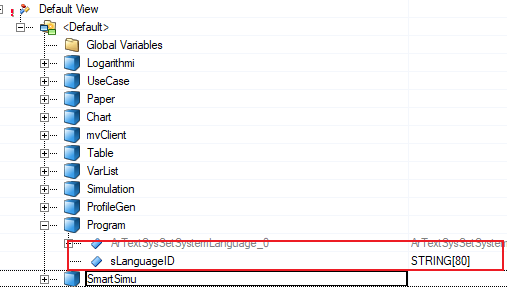
- EventBinding中增加一个WidgetEvent
    - 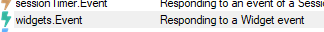
- binding 画面，控件，事件选择索引变化
    - 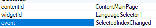
- 增加一个OPCUA Node Action
    - 
- 将每次语言切换的结果输出到ID变量上
    - 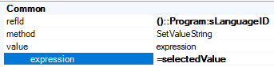
    - 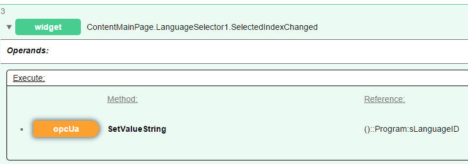
    - 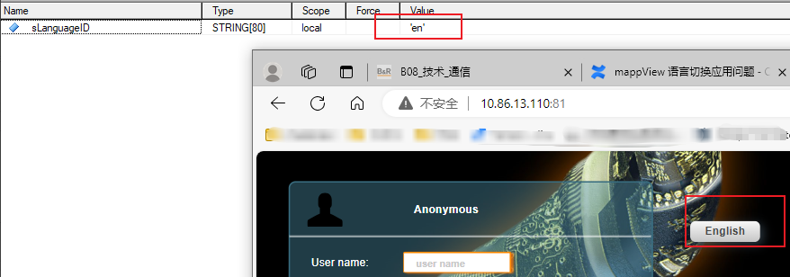

## 2.3 一个Client修改了语言，其他Client也需要修改成相应的语言

- 增加一个OPC UA Event
    - 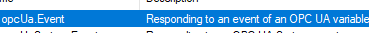
- 事件选择数值改变，变量依然是ID变量
    - 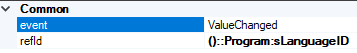
- 需要将OPC UA数值转换为Event中间变量，增加一个OPC UA operand
    - 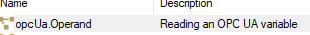
- 命名为getID，绑定变量
    - 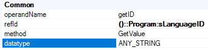
- 增加一个Client System Action
    - 
- 动作为设置语言，语言等于获得的getID
    - 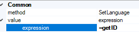
- 这样可以做到有人修改了语言，所以client都会捕捉到这个事件，然后修改语言
    - 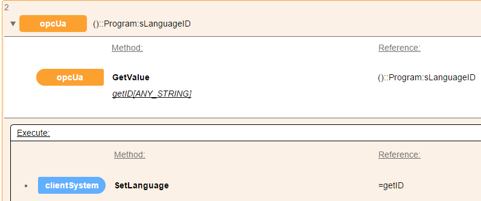

## 2.4 Client链接的时候画面显示语言，与其他Client保持一致

- 增加一个系统Event
    - 
- 事件选择页面加载
    - 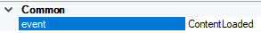
- 需要将OPC UA数值转换为Event中间变量，增加一个OPC UA operand
    - 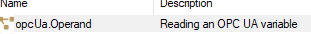
- 命名为getID，绑定变量
    - 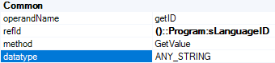
- 增加一个Client System Action
    - 
- 动作为设置语言，语言等于获得的getID
    - 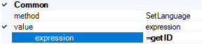
- 这样可以做到client切换画面的时候都会按CPU要求语言来修改语言
    - 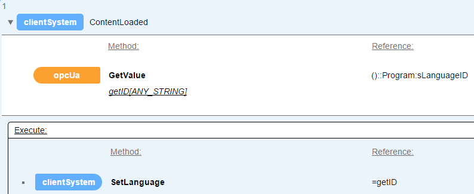

# 3 更新日志

| 日期         | 修改人 | 修改内容      |
| :--------- | :-- | :-------- |
| 2024-03-22 | HYW | 验证并编写     |
| 2024-03-27 | YZY | 更新至brhelp |
