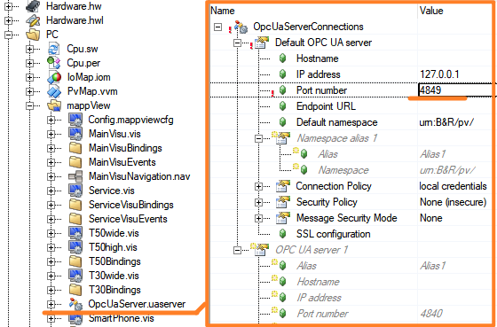
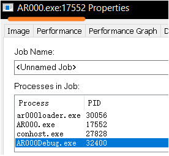

> Tags: #mappView #OPC_UA

- [1 046mappView界面控件连接OPC UA变量无法正常显示_显示XX](#_1-046mappview%E7%95%8C%E9%9D%A2%E6%8E%A7%E4%BB%B6%E8%BF%9E%E6%8E%A5opc-ua%E5%8F%98%E9%87%8F%E6%97%A0%E6%B3%95%E6%AD%A3%E5%B8%B8%E6%98%BE%E7%A4%BA_%E6%98%BE%E7%A4%BAxx)
- [2 检查方向](#_2-%E6%A3%80%E6%9F%A5%E6%96%B9%E5%90%91)
	- [2.1 确认开启OCP UA通信](#_21-%E7%A1%AE%E8%AE%A4%E5%BC%80%E5%90%AFocp%C2%A0ua%E9%80%9A%E4%BF%A1)
	- [2.2 确认变量已在程序中调用](#_22-%E7%A1%AE%E8%AE%A4%E5%8F%98%E9%87%8F%E5%B7%B2%E5%9C%A8%E7%A8%8B%E5%BA%8F%E4%B8%AD%E8%B0%83%E7%94%A8)
	- [2.3 检查OpcUaMap.uad文件](#_23-%E6%A3%80%E6%9F%A5opcuamapuad%E6%96%87%E4%BB%B6)
	- [2.4 确认mappView控件的访问权限](#_24-%E7%A1%AE%E8%AE%A4mappview%E6%8E%A7%E4%BB%B6%E7%9A%84%E8%AE%BF%E9%97%AE%E6%9D%83%E9%99%90)
	- [2.5 确认.binding文件已被调用](#_25-%E7%A1%AE%E8%AE%A4binding%E6%96%87%E4%BB%B6%E5%B7%B2%E8%A2%AB%E8%B0%83%E7%94%A8)
	- [2.6 确认AccessAndSecurity中User分配了合理的Role](#_26-%E7%A1%AE%E8%AE%A4accessandsecurity%E4%B8%ADuser%E5%88%86%E9%85%8D%E4%BA%86%E5%90%88%E7%90%86%E7%9A%84role)
	- [2.7 确认OPC UA Remote Server参数的合理性](#_27-%E7%A1%AE%E8%AE%A4opc-ua-remote-server%E5%8F%82%E6%95%B0%E7%9A%84%E5%90%88%E7%90%86%E6%80%A7)
		- [2.7.1 若修改了 OPC UA 端口，mappView 对应的 `OpcUaServer.uaserver` 需要跟着修改](#_271-%E8%8B%A5%E4%BF%AE%E6%94%B9%E4%BA%86-opc-ua-%E7%AB%AF%E5%8F%A3%EF%BC%8Cmappview-%E5%AF%B9%E5%BA%94%E7%9A%84-opcuaserveruaserver-%E9%9C%80%E8%A6%81%E8%B7%9F%E7%9D%80%E4%BF%AE%E6%94%B9)
	- [2.8 确认OPC UA的端口是否被占用](#_28-%E7%A1%AE%E8%AE%A4opc-ua%E7%9A%84%E7%AB%AF%E5%8F%A3%E6%98%AF%E5%90%A6%E8%A2%AB%E5%8D%A0%E7%94%A8)
	- [2.9 OPC UA 协议开启了SSL安全加密但mappView侧未开启](#_29-opc-ua-%E5%8D%8F%E8%AE%AE%E5%BC%80%E5%90%AF%E4%BA%86ssl%E5%AE%89%E5%85%A8%E5%8A%A0%E5%AF%86%E4%BD%86mappview%E4%BE%A7%E6%9C%AA%E5%BC%80%E5%90%AF)
	- [2.10 AS软件BUG，升级AS软件的SP更新包解决](#_210-as%E8%BD%AF%E4%BB%B6bug%EF%BC%8C%E5%8D%87%E7%BA%A7as%E8%BD%AF%E4%BB%B6%E7%9A%84sp%E6%9B%B4%E6%96%B0%E5%8C%85%E8%A7%A3%E5%86%B3)
- [3 更新日志](#_3-%E6%9B%B4%E6%96%B0%E6%97%A5%E5%BF%97)

# 1 046mappView界面控件连接OPC UA变量无法正常显示_显示XX

- 现象为mappView界面控件连接OPC UA变量无法正常显示，内容显示为XX
    - 

# 2 检查方向

## 2.1 确认开启OCP UA通信

- 检查配置，确认OPC UA通信配置开启
    - 

## 2.2 确认变量已在程序中调用

- 检查确认此OPC UA变量在Task中调用且此Task分配至PLC循环任务周期中

## 2.3 检查OpcUaMap.uad文件

- 使用的OPC UA变量已使能，且分配相关用户读权限
    - 
- 若此处文件异常，建议删除uad文件后重新配置

## 2.4 确认mappView控件的访问权限

- 检查Content里当前控件属性访问权限，如设置访问权限，确认当前系统登入用户具有读权限
    - 

## 2.5 确认.binding文件已被调用

- 检查.vis文件，确认其调用对应.binding文件
    - 

## 2.6 确认AccessAndSecurity中User分配了合理的Role

- 检查AccessAndSecurity中User是否分配相应的Role
    - 
- 请勿删除或者编辑自带的Anonymous匿名用户

## 2.7 确认OPC UA Remote Server参数的合理性

- 若项目中使用OPC UA Remote Server，在OpcUaServer.uaserver文件中确保存有默认的OPC UA Server配置。
- 默认参数如下
    - 

### 2.7.1 若修改了 OPC UA 端口，mappView 对应的 `OpcUaServer.uaserver` 需要跟着修改

- 将默认的 Port number 从 4840 修改为 4849
    - 
- `OpcUaServer.uaserver` 的默认服务器的 Port number 没有对应跟着修改，应该修改如下
    - 

## 2.8 确认OPC UA的端口是否被占用

- 检查使用的OPC UA端口（默认4840）是否被其它进程占用。（Win平台上使用ArSim仿真容易出现这个问题）
- 输入Win + R，输入cmd，调用cmd窗口。
    - 
- 输入 `netstat -ano` 查看端口占用信息
    - 
- `netstat -ano|findstr "81"`  查看对应端口被使用情况
    - 
- `tasklist | findstr “17552”`查看端口对应的任务名
    - 
- 可以在任务管理器中找到此进程并关闭，或者通过有管理权限的cmd中的命令`taskkill /f /pid 17552` 强行关闭
    - 

## 2.9 OPC UA 协议开启了SSL安全加密但mappView侧未开启

- 详情请参考以下信息
    - [044mappView对接SSL加密的OPC UA服务](044mappView对接SSL加密的OPC%20UA服务.md)

## 2.10 AS软件BUG，升级AS软件的SP更新包解决

- 在使用mappView进行编辑时的稳定性，表现为闪退或者在编译通过后变量显示为XX。此外，它还会导致OpcUA通讯失败，导致mappView画面显示的数值均显示为XX
- 在版本4.12中首次被发现，并在后续的4.12.5（SP）升级包中得到了修复。

# 3 更新日志

| 日期         | 修改人               | 修改内容 |
| :--------- | :---------------- | :--- |
| 2024-07-01 | CJP YZY CJP | 初次创建 |
