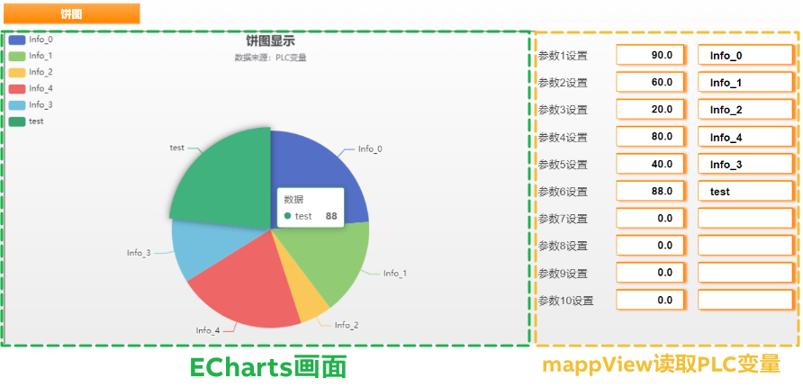
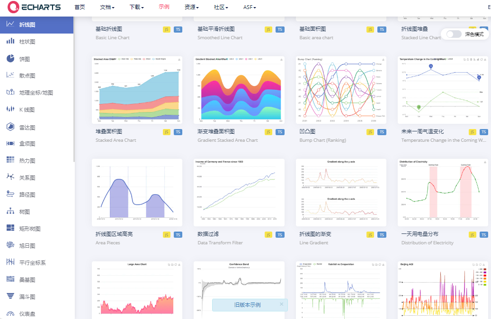
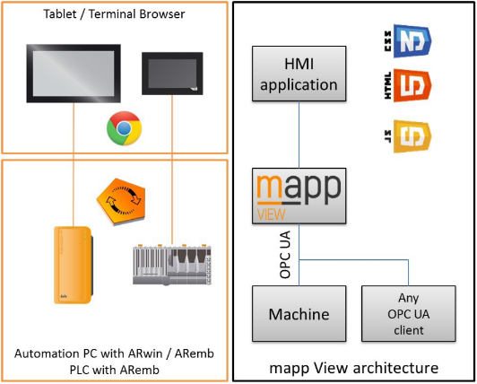
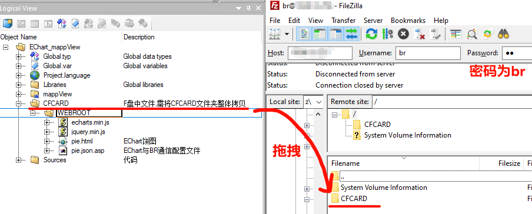
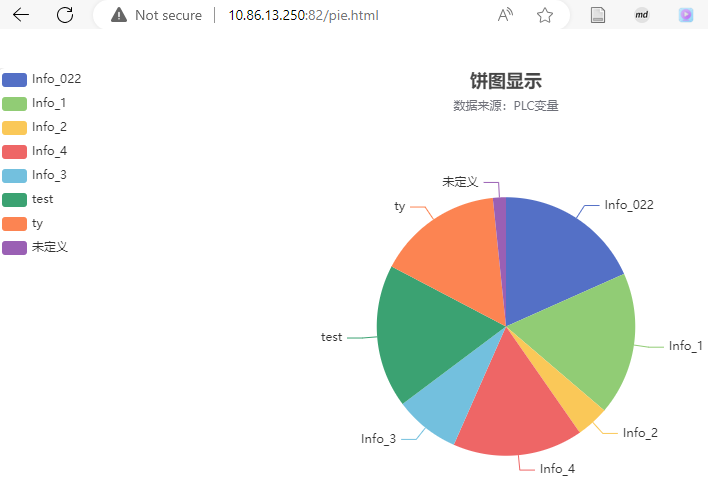
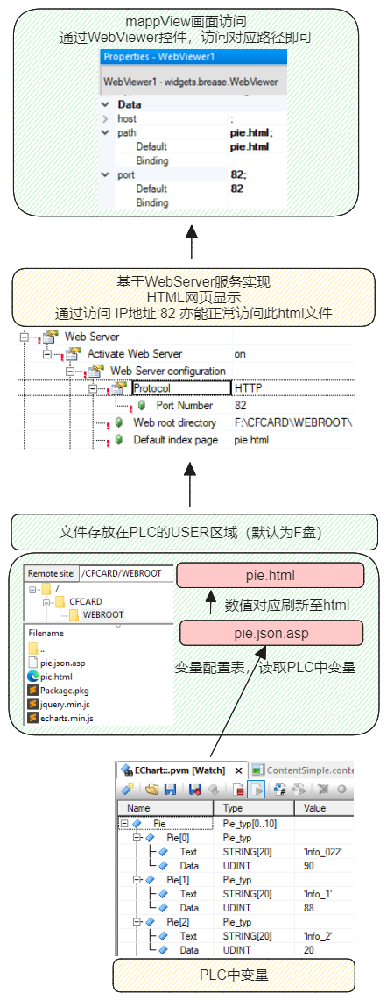

> Tags: #mappView

- [1 B05.048.mappView与ECharts配合显示动态可视化图表库](#_1-b05048mappview%E4%B8%8Eecharts%E9%85%8D%E5%90%88%E6%98%BE%E7%A4%BA%E5%8A%A8%E6%80%81%E5%8F%AF%E8%A7%86%E5%8C%96%E5%9B%BE%E8%A1%A8%E5%BA%93)
- [2 Demo下载](#_2-demo%E4%B8%8B%E8%BD%BD)
- [3 演示效果](#_3-%E6%BC%94%E7%A4%BA%E6%95%88%E6%9E%9C)
- [4 Demo使用方式](#_4-demo%E4%BD%BF%E7%94%A8%E6%96%B9%E5%BC%8F)
- [5 方案实现思路说明](#_5-%E6%96%B9%E6%A1%88%E5%AE%9E%E7%8E%B0%E6%80%9D%E8%B7%AF%E8%AF%B4%E6%98%8E)
- [6 更新日志](#_6-%E6%9B%B4%E6%96%B0%E6%97%A5%E5%BF%97)

# 1 B05.048.mappView与ECharts配合显示动态可视化图表库

- 前端开源可视化库可以方便的和贝加莱 mappView 集成，显示更定制化的画面
- 
 - ECharts 是什么？
    - ECharts 是一个使用 JavaScript 实现的开源可视化库，涵盖各行业图表，满足各种需求。
    - ECharts 提供了丰富的图表类型和交互能力，使用户能够通过简单的配置生成各种各样的图表，包括但不限于折线图、柱状图、散点图、饼图、雷达图、地图等。
    - ECharts 遵循 Apache-2.0 开源协议，免费商用。
    - [Examples - Apache ECharts](https://echarts.apache.org/examples/zh/index.html#chart-type-line)
    - 
 - mappView 是什么？
    - mappView 是贝加莱新一代 HMI 技术，可以让 PLC 具备网站服务器的功能，提供基于 HTML5的网页，方便带有浏览器的任意设备访问与控制实时 PLC 中的数据。
    - 

# 2 Demo下载

- [点击下载 → mappView + EChart演示Demo](/B05_技术_mapp/FILES/048mappView与ECharts配合显示动态可视化图表库/2024-07-19-EChart_mappView_Demo_AS_4C.zip ':ignore')

# 3 演示效果

<video muted autoplay="autoplay" loop="loop" width="640" height="360" controls>
  <source src="/B05_技术_mapp/FILES/048mappView与ECharts配合显示动态可视化图表库/2024-07-19-饼图EChart演示视频.mp4" type="video/mp4">
  Your browser does not support the video tag.
</video>

- 支持在 mappView 画面上动态修改参数，EChart 画面实时更新调整
- 饼图中显示的条目项可根据实际需求，自动增减
- 显示 EChart 的 Html 文件基本无需修改，除了在在 mappView 上修改，也支持通过 PLC 在线 Watch EChart 任务，调整 Pie 数据结构体进行数据关联。

# 4 Demo使用方式

- 注：步骤基于实际 PLC
- 1___编译获得的 Demo 项目，可根据需求调整 **IP 地址**与硬件型号，烧卡
- 2___烧卡完成后，等待 PLC 启动，使用 FTP 客户端（用户名 br 密码 br），将项目中的 CFCARD 文件夹拖拽至根目录下
    - 
- 3___访问 mappView 画面，浏览器输入 `PLC的IP地址:81`，即可完成访问
- 若需要使用 ARSim 在本地电脑仿真运行
    - 需要在 Physical View → PLC 型号右键 Configuration → Web Server，将本地电脑上可访问的文件路径参数进行修改
    - 
    - 浏览器访问的 IP 地址为 `127.0.0.1:81`

# 5 方案实现思路说明

- 核心思路
    - 通过修改 EChart 提供的 HTML 文件，通过 JQuery 的 AJAX 方法，基于 PLC 内置的asp 服务，获取 PLC 中的变量信息，动态更新 EChart 的 HTML 文件。
    - 贝加莱 AR 可提供 Web Server 服务，支持动态显示自定义的 HTML 文件，HTML 相关文件直接放置设置的 Web root directory 下即可，PLC 启动后，可直接通过 `IP地址:自定义端口` 访问此 HTML 文件。
    - 
    - mappView 即可通过 webviewer 方式，再加载显示 HTML 画面。
- 

# 6 更新日志

| 日期                             | 修改人 | 修改内容 |
| :----------------------------- | :-- | :--- |
| 2024-07-19 | YZY | 初次创建 |
