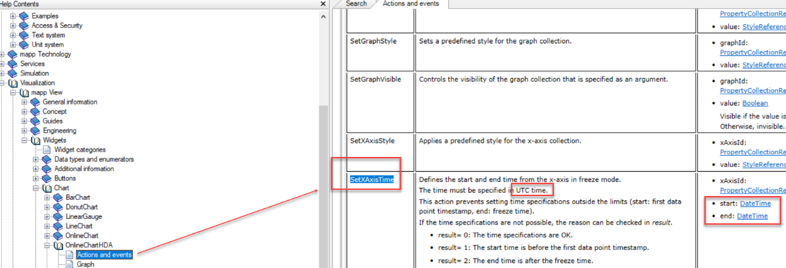

> Tags: #mappView #对时

- [1 B05.049.OnlineChartHDA做历史趋势查询时区偏差问题](#_1-b05049onlinecharthda%E5%81%9A%E5%8E%86%E5%8F%B2%E8%B6%8B%E5%8A%BF%E6%9F%A5%E8%AF%A2%E6%97%B6%E5%8C%BA%E5%81%8F%E5%B7%AE%E9%97%AE%E9%A2%98)
- [2 解决方式](#_2-%E8%A7%A3%E5%86%B3%E6%96%B9%E5%BC%8F)
- [3 更新日志](#_3-%E6%9B%B4%E6%96%B0%E6%97%A5%E5%BF%97)

# 1 B05.049.OnlineChartHDA做历史趋势查询时区偏差问题

- 用OnlineChartHDA组件做历史趋势，目前使用这个组件Actions的SetXAxisTime做查看历史曲线时间的筛选，发现时间时区总是对不上，电脑时间和PLC时间设置都是东8区，但是这里输入的时间还是差8个小时。
- 
- 

# 2 解决方式

- 时区偏差问题在数据采集和组件上调整不能解决
- 目前是通过LocalDT_TO_UtcDTStructure函数将画面输入的查询时间做一个转换，然后再给到SetXAxisTime的Actions
- 

# 3 更新日志

| 日期         | 修改人       | 修改内容 |
| :--------- | :-------- | :--- |
| 2024-09-29 | LZ YZY | 初次创建 |
