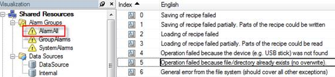

> Tags: #mappAlarmX #中文

# B05.050.mappAlarmX使用VC4画面中英文切换方式

- mappAlarmX的报警文本信息以VC4画面中的方式存储
- 

# 中英文切换方式

- VC4画面的中英文进行切换
- mappAlarmX的相关接口进行调整，例如 `MpAlarmXListUIConnect.Language := 'cn';`

# 更新日志

| 日期         | 修改人        | 修改内容 |
| :--------- | :--------- | :--- |
| 2024-10-18 | ZYJ YZY | 初次创建 |
