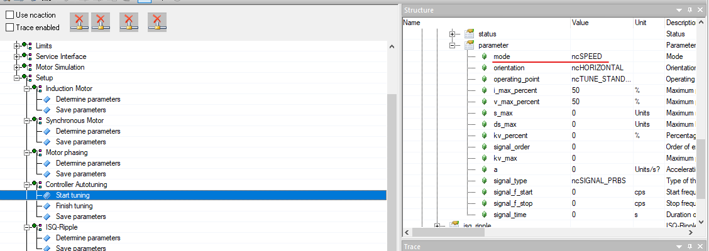
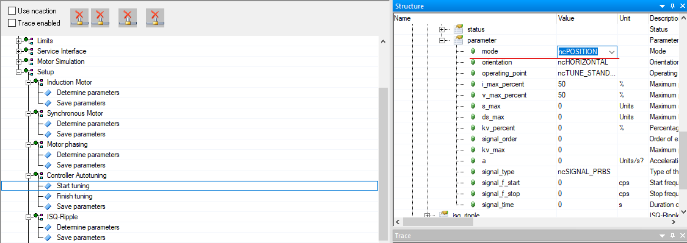

# 003如何自动整定三环参数？
Tags：Auto Tuning、三环、PID
A：
Auto Tuning是NC Test中自带的环参数自动整定功能，能根据当前系统状态自动计算环参数。
一般在用NC Test测试电机运转情况前，需要通过Auto Tuning计算速度环和位置环的参数。
如果在没有进行Auto Tuning的情况下，通过NC Test中的指令让电机转动，则电机在转动过程中会发出较大的噪音。
具体整定方法如下：
1.进入NC Test界面，展开Setup→Controller Autotuning→Start Tuning；mode选择Speed
并双击Start Tuning。此时电机会发出三次响声，代表速度环整定完毕。

2.mode选择Position并双击Start Tuning。此时电机会发出一次长响，代表位置环整定完毕。

3.整定完毕后使用Basis Movement指令，此时电机就会在整定完毕的情况下转动。