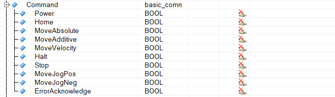
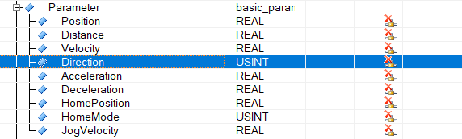

# 007如何使用PLCopen功能块控制轴反方向转动？
Tags：PLCopen

A：
当轴正转时，Parameter窗口中的Direction的值为0。将Direction的值改为1，使用MoveAbsolute与MoveVelocity指令可让轴反转。
如要使用MoveAdditive指令，可以将Distance设为负值，则触发MoveAdditive指令时，轴将沿着反方向转动所设Distance的距离。

