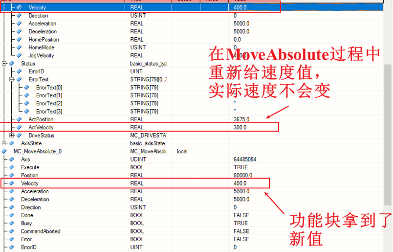
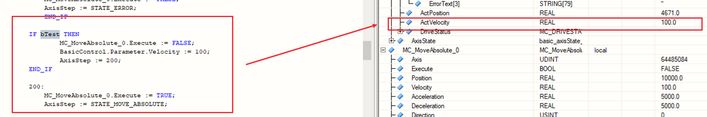

> Tags: #PLCopen

# B06.015.MoveAbsolute功能块如何实现分段控制速度

# 需求

- 伺服做绝对值定位控制时，如果要在快到到达设定是改变运动速度，是直接改
- MovementSpeed,还是改了MovementSpeedMoveAbsolute?简单来说就是快到设定位置是降速

# 解决方式

- 1.MoveAbsolute运动过程中重新赋速度值无法生效
    - 
- 2.轴Stop/Halt后重新使能MoveAbsolute均可重新设置MoveAbsolute功能块速度值
- 3.通过程序在轴不停的情况下重新赋速度值
    - 
