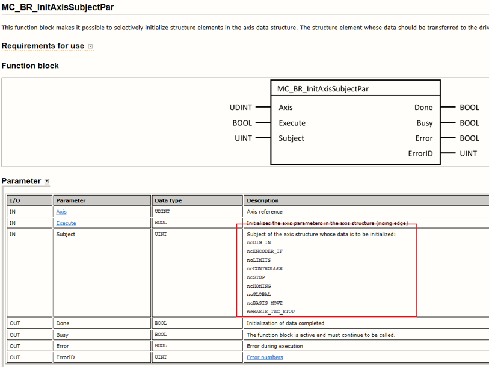
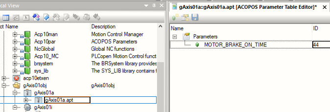
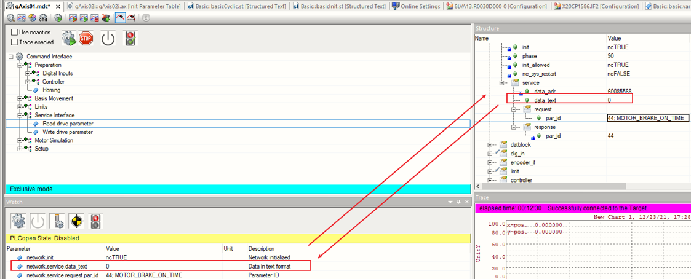

# 016伺服驱动器ParaID参数写入方式有哪些
①MC_BR_CyclicWrite 循环写，适用于写位置，刷新轴位置那些实时会变化的参数读取，同时调用多个有上限

②MC_BR_InitCyclicWrite 也是循环写，然后写的值不能变，保持为这个初始值

③MC_BR_WriteParID单次写，如果同时调用多个MC_BR_WriteParID，一个周期仅能执行一个功能块，其他功能块同步执行，根据调用顺序依次执行

④MC_BR_InitAxisSubjectPar初始化一系列的ParaID，ParaID组写在轴的结构体中

⑤通过轴初始化参数表写入

⑥通过Test窗口读取/写入

注意：重启后通过MC_BR_WriteParID等功能块写入的ParaID参数会被覆盖