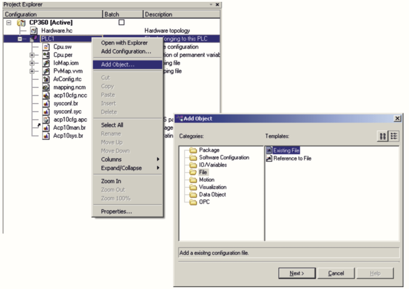
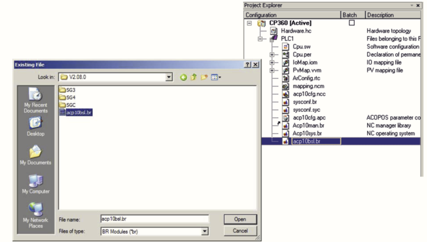
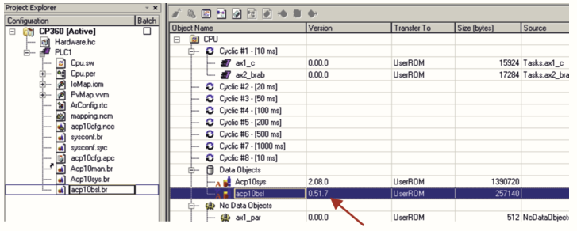

# 017如何进行ACOPOS驱动器的BsLoader文件升级？
- BsLoader文件升级是在AS程序中完成的，步骤如下，也可以参见 AS 4.x_Help Guid:    d7adcf7c-f697-4ad5-b877-3c529106ac3a；
- 1）在AS项目程序中的Configuration View中选择Add Object-File-Existing File。
    - 
- 2）选择BsLoader文件，文件路径如下：
    - AS V2.x：“项目程序\AS\Motion\Firmware\Acp10\x.xx.xx\acp10bsl.br"（x.xx.xx指当前项目的ACP10版本）；
    - AS V3.x：“项目程序\AS\Library\Acp10man\V x.xx.xx\acp10bsl.br"（x.xx.xx指当前项目的ACP10版本）；
    - 
    - 
- 3）添加完毕后，下载程序至PLC。重启PLC与ACOPOS驱动器后，BsLoader文件会被传输至ACOPOS驱动器。至此，该驱动器已经能够正常使用8AC114.60-2通讯卡。
    - 升级完毕后，需将BsLoader文件删除，重新下载项目，已检验是否升级成功。

   
    