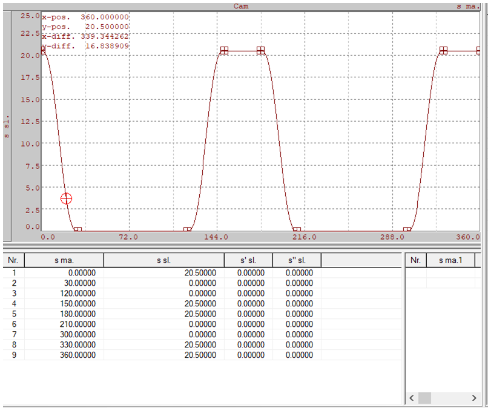

> Tags: #PLCopen

# B06.021.使用MC_BR_GetCamSlavePosition功能块根据主轴位置计算从轴位置时报警8566

# 问题描述

- 在支持客户时发现，使用MC_BR_GetCamSlavePosition功能块根据主轴位置计算从轴位置时，对Cam曲线设计有潜在要求，在Help中暂未发现相关说明。具体如下：
- 客户设计曲线如下：
- 
 - 在调用MC_BR_GetCamSlavePosition功能块，根据主轴计算从轴位置时，期望主轴为0时，功能块输出从轴位置20.5，主轴为30时，功能块输出从轴位置0。
- 而实际测试及仿真测试发现，主轴为0时功能块输出从轴位置0，主轴为30时功能块输出从轴位置-20.5。即曲线整体被平移。

# 解决方案

- 编译时有一行warning，如下图所示。
    - 
- 对应8566说明：
    - 
- 即Cam设计时要求从轴起点为0。
