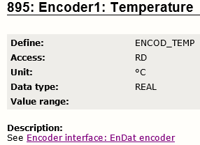
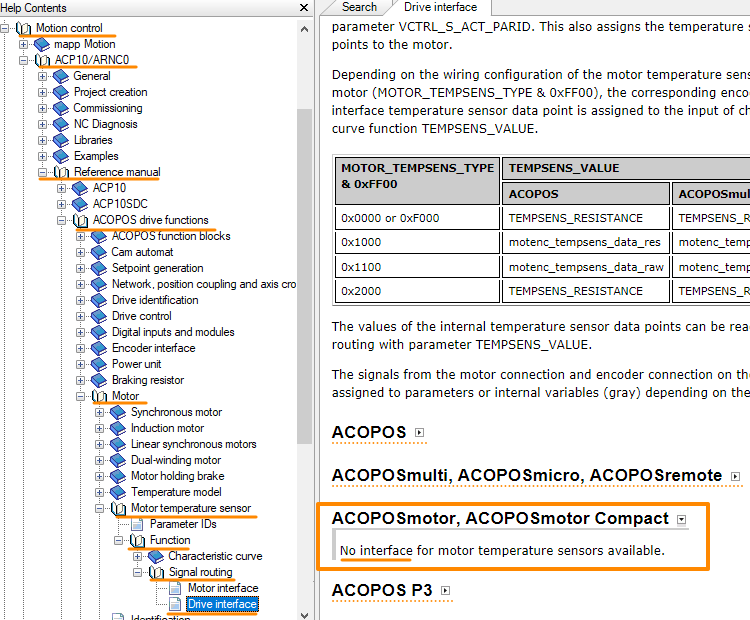
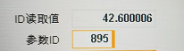

> Tags: #ACOPOSmotor #温度 #ParID

- [1 B06.026.ACOPOSmotor温度无法从ParID381中读到](#_1-b06026acoposmotor%E6%B8%A9%E5%BA%A6%E6%97%A0%E6%B3%95%E4%BB%8Eparid381%E4%B8%AD%E8%AF%BB%E5%88%B0)
- [2 现象](#_2-%E7%8E%B0%E8%B1%A1)
- [3 原因](#_3-%E5%8E%9F%E5%9B%A0)
- [4 解决方式](#_4-%E8%A7%A3%E5%86%B3%E6%96%B9%E5%BC%8F)

# 1 B06.026.ACOPOSmotor温度无法从ParID381中读到

# 2 现象

- ACOPOSmotor 8DI 电机温度？现在读到ID381MOTOR TEMP都是0。
	- 读取温度参数ID64 ~ ID73都是0，手写了温度参数组ID64 ~ ID73后，ID381也是0。
- 有些项目中，ACOPOSmotor的温度读取是看根据模型算出来的理论温度。
	- 393: Motor: Temperature model: Temperature: TEMP_MOTOR_MODELL
- 由于编码器是Endat 2.2，因此可尝试读编码器的温度来得到实际温度：
	- 895: Encoder1: Temperature
	- 

# 3 原因

- ACOPOSmotor，ACOPOSmotor Compact电机是没有温度传感器接口的。
- 
- GUID: 8b116354-ca26-4679-8e6f-3780ac2cdd01

# 4 解决方式

- 读ParID 895
	- 
