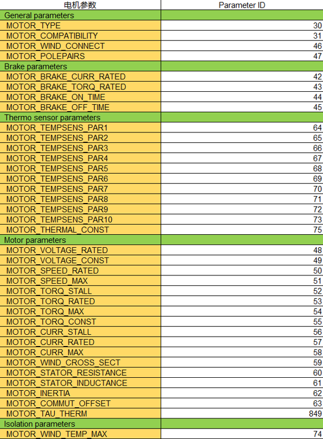
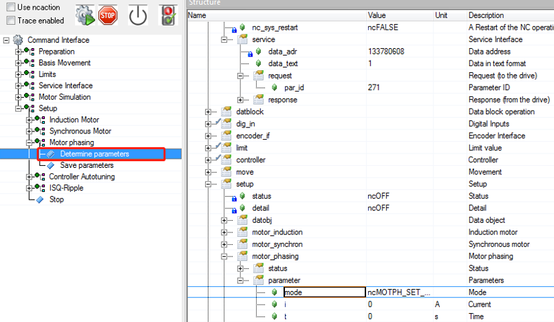
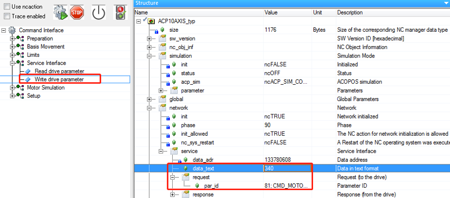

> Tags: #电机 #整定 #磁偏角 #EnDat

- [1 B06.027.如何重新整定电机磁偏角](#_1-b06027%E5%A6%82%E4%BD%95%E9%87%8D%E6%96%B0%E6%95%B4%E5%AE%9A%E7%94%B5%E6%9C%BA%E7%A3%81%E5%81%8F%E8%A7%92)
- [2 现象](#_2-%E7%8E%B0%E8%B1%A1)
- [3 整定方式一 通过在Test界面中的写Parameter ID的方式来校准磁偏角](#_3-%E6%95%B4%E5%AE%9A%E6%96%B9%E5%BC%8F%E4%B8%80-%E9%80%9A%E8%BF%87%E5%9C%A8test%E7%95%8C%E9%9D%A2%E4%B8%AD%E7%9A%84%E5%86%99parameter-id%E7%9A%84%E6%96%B9%E5%BC%8F%E6%9D%A5%E6%A0%A1%E5%87%86%E7%A3%81%E5%81%8F%E8%A7%92)
- [4 整定方式二通过Test界面中的Moter phasing命令来校准磁偏角](#_4-%E6%95%B4%E5%AE%9A%E6%96%B9%E5%BC%8F%E4%BA%8C%E9%80%9A%E8%BF%87test%E7%95%8C%E9%9D%A2%E4%B8%AD%E7%9A%84moter-phasing%E5%91%BD%E4%BB%A4%E6%9D%A5%E6%A0%A1%E5%87%86%E7%A3%81%E5%81%8F%E8%A7%92)
- [5 将参数保存下载](#_5-%E5%B0%86%E5%8F%82%E6%95%B0%E4%BF%9D%E5%AD%98%E4%B8%8B%E8%BD%BD)
- [6 注意事项](#_6-%E6%B3%A8%E6%84%8F%E4%BA%8B%E9%A1%B9)
- [7 更新日志](#_7-%E6%9B%B4%E6%96%B0%E6%97%A5%E5%BF%97)

# 1 B06.027.如何重新整定电机磁偏角

# 2 现象

- 有些电机需要重新整定磁偏角，否则电机运动会报 4007 Lag Error
- 常见的问题复现步骤：
    - 搭建好物理拓扑后空项目编译，Test 模式下进行测试，电机直接速度环 tuning 报错4007 Lag Error
- EnDat编码器更换后，亦需要重新进行Phasing磁偏角整定
    - 对于第三方电机，更换EnDat编码器需要获得第三方电机的电机参数。可以找电机厂商索要相关电机参数。
    - 为了保险起见，建议通过Test读Parameter ID 的方式读取原编码器内的电机参数。
    - 将读到的电机参数填写到对应的初始化参数表内，其中Parameter ID 63（磁偏角）参数要先写 0。
    - PS：对于贝加莱自己的电机只需配置好硬件即可。
- 电机参数对应的Parameter ID如下：
    - 
- 更换EnDat编码器后，如果是感应式的EnDat编码器还需要用海德汉的设备校准。
- 校准完成后，我们就可以进行Phasing操作，调校磁偏角。
    - PS: 在校准磁偏角之前我们需要将电机脱离负载。

# 3 整定方式一 通过在Test界面中的写Parameter ID的方式来校准磁偏角

- 通过在 Test 界面中的写 Parameter ID 的方式来校准磁偏角。
- 1. 首先将磁偏角清零，Parameter ID63参数要先写0。
- 2. 之后 ID276写1，ID334写258，电机会进行缓慢的正反转运行。
- 3. 通过观察 LED 状态，确认 phasing 操作完成。完成后读取 ID63参数，记录磁偏角数据并重复上述步骤。
- 4. 校准3次取平均值作为最终值。磁偏角平均值为3.997，如下图所示:
    - 
- 整定磁偏角后将校准好的磁偏角填到对应的电机参数表内，保存下载程序。
- 通过在Test界面中进行匀速运动以及固定距离运动，观察电机此时可正常运行。

# 4 整定方式二通过Test界面中的Moter phasing命令来校准磁偏角

- 通过Test界面中的Moter phasing命令来校准磁偏角。
- 双击Detemine parameters，电机会进行缓慢的正反转运行。
- 通过观察LED状态，确认phasing操作是否完成。
- 记录磁偏角数据并重复上述步骤。
- 校准3次取平均值作为最终值。
- 

# 5 将参数保存下载

- 将校准好的磁偏角填到对应的电机参数表内，保存下载程序。
- 进入TEST试运行，检查Lag error、电机运行是否正常。
- 如一切正常，ID 81 写 340。可反复多写2次，确定参数写至编码器内parameter burning的步骤就已经完成。
    - 

# 6 注意事项

- 正常磁偏角的数值一般为 π/2的整数倍，若发现运行过程中报4007，且每次磁偏角都有变化，则可怀疑电机损坏。

# 7 更新日志

| 日期         | 修改人 | 修改内容                 |
| :--------- | :-- | :------------------- |
| 2022-02-08 | YSZ | EnDat编码器更换后phasing操作 |
| 2023-04-13 | CJP | 补充4007异常问题           |
| 2024-07-06 | YZY | 文档汇总整理               |
