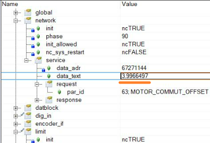

> Tags: #电机 #整定

# 1 027如何重新整定电机磁偏角

# 2 现象

- 有些电机需要重新整定磁偏角，否则电机运动会报 4007 Lag Error
- 常见的问题复现步骤：
    - 搭建好物理拓扑后空项目编译，Test 模式下进行测试，电机直接速度环 tuning 报错4007 Lag Error

# 3 整定方式

- 通过在 Test 界面中的写 Parameter ID 的方式来校准磁偏角。
- 1. 首先将磁偏角清零，Parameter ID63参数要先写0。
- 2. 之后 ID276写1，ID334写258，电机会进行缓慢的正反转运行。
- 3. 通过观察 LED 状态，确认 phasing 操作完成。完成后读取 ID63参数，记录磁偏角数据并重复上述步骤。
- 4. 校准3次取平均值作为最终值。磁偏角平均值为3.997，如下图所示:
    - 
- 整定磁偏角后将校准好的磁偏角填到对应的电机参数表内，保存下载程序。
- 通过在Test界面中进行匀速运动以及固定距离运动，观察电机此时可正常运行。
