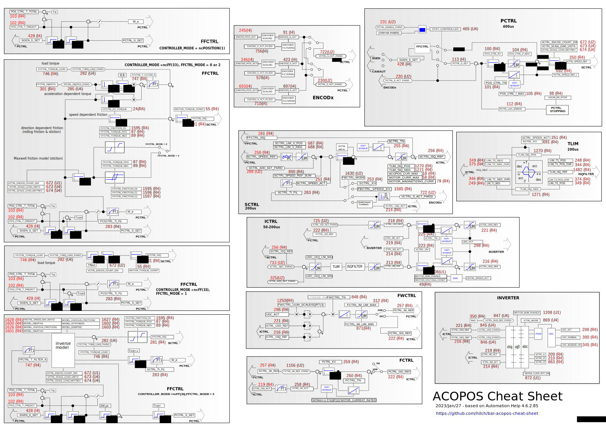

> 028BuR贝加莱ACOPOS备忘录

> 🌐 来源 : [hilch/bar-acopos-cheat-sheet: B&R ACOPOS Cheat Sheet (github.com)](https://github.com/hilch/bar-acopos-cheat-sheet)

> #轴控 #ACOPOS #ParID

- [1 简述](#1%20%E7%AE%80%E8%BF%B0)
- [2 SVG图](#2%20SVG%E5%9B%BE)
- [3 PDF版本下载](#3%20PDF%E7%89%88%E6%9C%AC%E4%B8%8B%E8%BD%BD)

# 1 简述

- 有时，使用一张纸来诊断 B&R ACOPOS 伺服驱动器可能会更方便。这就是这份完整的 "小抄 "发挥作用的地方。
- 最后更新时间：2023.01.27
- 使用inkscape软件绘制

# 2 SVG图

> 右键另存为即可下载获得SVG原图

# 3 PDF版本下载

[ACOPOS_CTRL_PDF_点击下载](/B06_技术_运动控制/FILES/028BuR贝加莱ACOPOS备忘录/ACOPOS_CTRL.pdf ':ignore')
