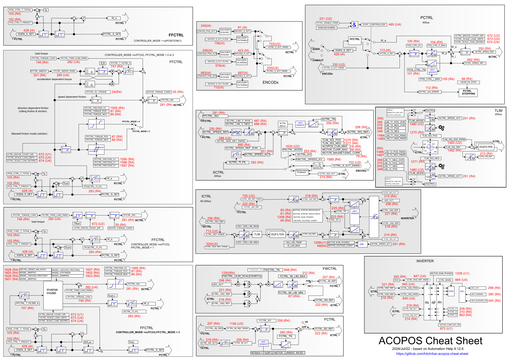
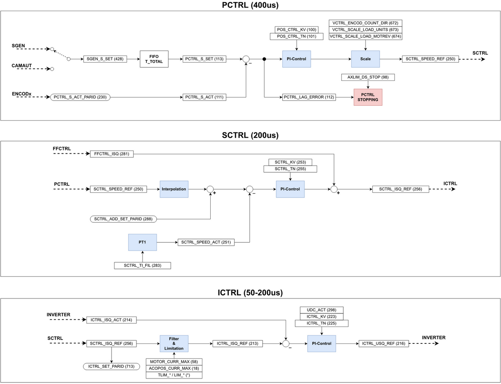

> #轴控 #ACOPOS #ParID

> 🌐 来源 : [hilch/bar-acopos-cheat-sheet: B&R ACOPOS Cheat Sheet (github.com)](https://github.com/hilch/bar-acopos-cheat-sheet)

- [1 B06.028.贝加莱ACOPOS备忘录](#_1-b06028%E8%B4%9D%E5%8A%A0%E8%8E%B1acopos%E5%A4%87%E5%BF%98%E5%BD%95)
- [2 完整三环控制图](#_2-%E5%AE%8C%E6%95%B4%E4%B8%89%E7%8E%AF%E6%8E%A7%E5%88%B6%E5%9B%BE)
	- [2.1 PDF版本在线显示与下载](#_21-pdf%E7%89%88%E6%9C%AC%E5%9C%A8%E7%BA%BF%E6%98%BE%E7%A4%BA%E4%B8%8E%E4%B8%8B%E8%BD%BD)
- [3 简单版本三环控制图](#_3-%E7%AE%80%E5%8D%95%E7%89%88%E6%9C%AC%E4%B8%89%E7%8E%AF%E6%8E%A7%E5%88%B6%E5%9B%BE)
	- [3.1 PDF版本在线显示与下载](#_31-pdf%E7%89%88%E6%9C%AC%E5%9C%A8%E7%BA%BF%E6%98%BE%E7%A4%BA%E4%B8%8E%E4%B8%8B%E8%BD%BD)

# 1 B06.028.贝加莱ACOPOS备忘录

# 2 完整三环控制图

- 有时，使用一张纸来诊断 B&R ACOPOS 伺服驱动器可能会更方便。这就是这份完整的 "小抄 "发挥作用的地方。
- 最后更新时间：2024-07-22
- 基于AS Help版本：4.12.6
- 使用inkscape软件绘制
- 

## 2.1 PDF版本在线显示与下载

- [点击下载 → acopos-cheat-sheet_V6-1.pdf](/B06_技术_运动控制/FILES/028BuR贝加莱ACOPOS备忘录/acopos-cheat-sheet_V6-1.pdf ':ignore')

# 3 简单版本三环控制图

- 

## 3.1 PDF版本在线显示与下载

- [点击下载 → ACOPOS CheatSheet简化版本](/B06_技术_运动控制/FILES/028BuR贝加莱ACOPOS备忘录/HAB_ACOPOS_CheatSheet_simplified.pdf ':ignore')
