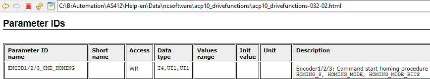
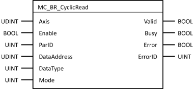
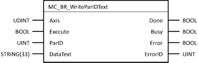

> Tags: #ParID

- [1 问题](#1%20%E9%97%AE%E9%A2%98)
- [2 解决方式](#2%20%E8%A7%A3%E5%86%B3%E6%96%B9%E5%BC%8F)
- [3 更新日志](#3%20%E6%9B%B4%E6%96%B0%E6%97%A5%E5%BF%97)

# B06.029-ParID读写_如何操作有多个参数的ParID

# 1 问题

- 
- 例如 **ENCOD1/2/3_CMD_HOMING**，此ParID有三个是参数，应该如何读写？
- ❌无法使用 **MC_BR_CyclicWrite** 进行读写，此函数要求输入DataType
    - 

# 2 解决方式

- ✔️使用 **MC_BR_WriteParIDText** 此类功能块进行读写操作
    - 
    - DataText输入的信息可在Test窗口中进行确认，全部为STRING类型数据
    - 例如："10000,0,0"

# 3 更新日志

| 日期         | 修改人 | 修改内容        |
| :--------- | :-- | :---------- |
| 2023-12-14 | YZY | 基于QZY反馈初次创建 |
