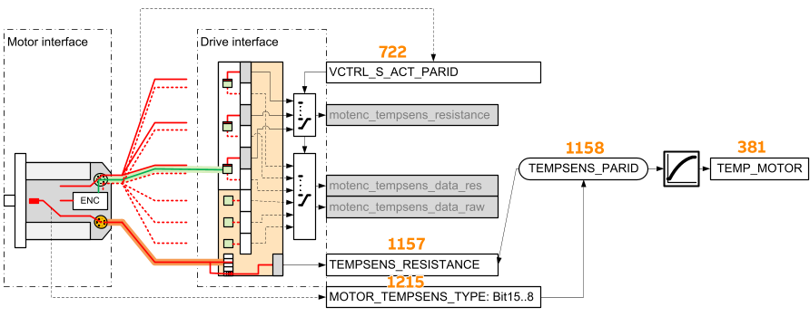
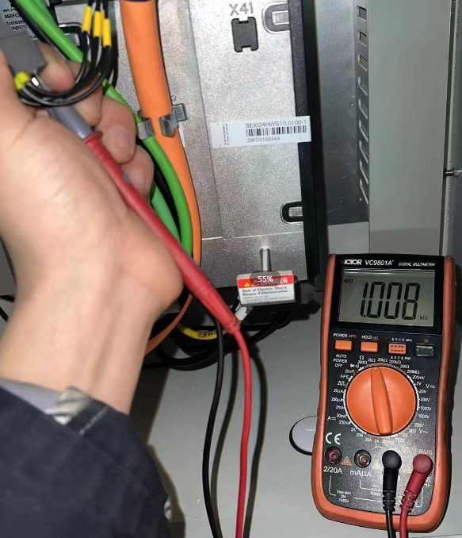

> Tags: #温度 #电机

- [1 B06.030-电机温度读取注意事项](#_1-b06030-%E7%94%B5%E6%9C%BA%E6%B8%A9%E5%BA%A6%E8%AF%BB%E5%8F%96%E6%B3%A8%E6%84%8F%E4%BA%8B%E9%A1%B9)
- [2 常见电机温度读取方式](#_2-%E5%B8%B8%E8%A7%81%E7%94%B5%E6%9C%BA%E6%B8%A9%E5%BA%A6%E8%AF%BB%E5%8F%96%E6%96%B9%E5%BC%8F)
- [3 非ACOPOSmotor读取不到电机温度解决方式](#_3-%E9%9D%9Eacoposmotor%E8%AF%BB%E5%8F%96%E4%B8%8D%E5%88%B0%E7%94%B5%E6%9C%BA%E6%B8%A9%E5%BA%A6%E8%A7%A3%E5%86%B3%E6%96%B9%E5%BC%8F)
	- [3.1 确认T+T-的阻值正常，在1000Ω左右](#_31-%E7%A1%AE%E8%AE%A4tt-%E7%9A%84%E9%98%BB%E5%80%BC%E6%AD%A3%E5%B8%B8%EF%BC%8C%E5%9C%A81000%CE%A9%E5%B7%A6%E5%8F%B3)
	- [3.2 自行创建电机温度参数表](#_32-%E8%87%AA%E8%A1%8C%E5%88%9B%E5%BB%BA%E7%94%B5%E6%9C%BA%E6%B8%A9%E5%BA%A6%E5%8F%82%E6%95%B0%E8%A1%A8)
	- [3.3 如何确认电机温度参数表参数](#_33-%E5%A6%82%E4%BD%95%E7%A1%AE%E8%AE%A4%E7%94%B5%E6%9C%BA%E6%B8%A9%E5%BA%A6%E5%8F%82%E6%95%B0%E8%A1%A8%E5%8F%82%E6%95%B0)
- [4 更新日志](#_4-%E6%9B%B4%E6%96%B0%E6%97%A5%E5%BF%97)

# 1 B06.030-电机温度读取注意事项

- 电机温度传感器到驱动器接口的信号路径，由电机中传感器与**电机连接器**或**编码器连接器**的连接、通过**电机电缆**（橙色）或**编码器电缆**（绿色）的信号路径以及驱动器上使用的电机编码器连接确定。
- 信号转换在驱动接口或编码器中进行。通过配置电机温度传感器MOTOR_TEMPSENS_TYPE & 0xFF00并选择电机编码器VCTRL_S_ACT_PARID，将转换后的电机温度传感器信号分配给特性曲线TEMPSENS_VALUE的输入参数。
- 
- 相关链接
    - [026ACOPOSmotor温度无法从ParID381中读到](026ACOPOSmotor温度无法从ParID381中读到.md)

# 2 常见电机温度读取方式

- 通过ParID 381（381: Temperature sensor: Temperature），读取电机温度
- 如果使用EnDat2.2编码器，可尝试读编码器的温度来得到实际温度
	- ParID 895: Encoder1: Temperature
	- 若使用ACOPOSmotor，一般使用这种方式获取温度信息

# 3 非ACOPOSmotor读取不到电机温度解决方式

## 3.1 确认T+T-的阻值正常，在1000Ω左右

- 通过这种方式，排除温度传感器本身与线路上的问题
- 

## 3.2 自行创建电机温度参数表

- 可能电机中电机温度参数表数据相关没有传进去，或者参数错误
- 即使是 Endat 的编码器，也建议自己建个电机温度参数表把正常参数写进去

## 3.3 如何确认电机温度参数表参数

- 有些电机是没有温度传感器，读64到73是0，应该就是没有温度传感器，所以381里面是0
- 在贝加莱AS软件的硬件树上加下这个电机，看看温度传感器的参数是不是零，不是零就说明这个电机有传感器，可以把参数抄到参数表里，这样381就有数值了
- 若使用第三方电机，询问厂家确认电机温度表参数

# 4 更新日志

| 日期         | 修改人 | 修改内容 |
| :--------- | :-- | :--- |
| 2024-01-19 | YZY | 初次创建 |
