> Tags: #ACOPOS_P3 #制动电阻

- [1 B06.034.驱动器制动电阻参数设置](#_1-b06034%E9%A9%B1%E5%8A%A8%E5%99%A8%E5%88%B6%E5%8A%A8%E7%94%B5%E9%98%BB%E5%8F%82%E6%95%B0%E8%AE%BE%E7%BD%AE)
- [2 什么时候需要外部制动电阻](#_2-%E4%BB%80%E4%B9%88%E6%97%B6%E5%80%99%E9%9C%80%E8%A6%81%E5%A4%96%E9%83%A8%E5%88%B6%E5%8A%A8%E7%94%B5%E9%98%BB)
	- [2.1 必要参数](#_21-%E5%BF%85%E8%A6%81%E5%8F%82%E6%95%B0)
- [3 原理说明](#_3-%E5%8E%9F%E7%90%86%E8%AF%B4%E6%98%8E)
- [4 如何选择制动电阻](#_4-%E5%A6%82%E4%BD%95%E9%80%89%E6%8B%A9%E5%88%B6%E5%8A%A8%E7%94%B5%E9%98%BB)
	- [4.1 功率：满足负载要求](#_41-%E5%8A%9F%E7%8E%87%EF%BC%9A%E6%BB%A1%E8%B6%B3%E8%B4%9F%E8%BD%BD%E8%A6%81%E6%B1%82)
		- [4.1.1 确认制动电阻可满足的功率](#_411-%E7%A1%AE%E8%AE%A4%E5%88%B6%E5%8A%A8%E7%94%B5%E9%98%BB%E5%8F%AF%E6%BB%A1%E8%B6%B3%E7%9A%84%E5%8A%9F%E7%8E%87)
		- [4.1.2 确认驱动器的峰值负载能力限制](#_412-%E7%A1%AE%E8%AE%A4%E9%A9%B1%E5%8A%A8%E5%99%A8%E7%9A%84%E5%B3%B0%E5%80%BC%E8%B4%9F%E8%BD%BD%E8%83%BD%E5%8A%9B%E9%99%90%E5%88%B6)
		- [4.1.3 确认应用场景所需的制动功率](#_413-%E7%A1%AE%E8%AE%A4%E5%BA%94%E7%94%A8%E5%9C%BA%E6%99%AF%E6%89%80%E9%9C%80%E7%9A%84%E5%88%B6%E5%8A%A8%E5%8A%9F%E7%8E%87)
	- [4.2 阻值：满足驱动器最小阻值要求](#_42-%E9%98%BB%E5%80%BC%EF%BC%9A%E6%BB%A1%E8%B6%B3%E9%A9%B1%E5%8A%A8%E5%99%A8%E6%9C%80%E5%B0%8F%E9%98%BB%E5%80%BC%E8%A6%81%E6%B1%82)
	- [4.3 电压：制动电阻满足可能承受的最高电压要求](#_43-%E7%94%B5%E5%8E%8B%EF%BC%9A%E5%88%B6%E5%8A%A8%E7%94%B5%E9%98%BB%E6%BB%A1%E8%B6%B3%E5%8F%AF%E8%83%BD%E6%89%BF%E5%8F%97%E7%9A%84%E6%9C%80%E9%AB%98%E7%94%B5%E5%8E%8B%E8%A6%81%E6%B1%82)
	- [4.4 带载：制动电阻的带载能力评估](#_44-%E5%B8%A6%E8%BD%BD%EF%BC%9A%E5%88%B6%E5%8A%A8%E7%94%B5%E9%98%BB%E7%9A%84%E5%B8%A6%E8%BD%BD%E8%83%BD%E5%8A%9B%E8%AF%84%E4%BC%B0)
	- [4.5 环境：满足安装环境要求](#_45-%E7%8E%AF%E5%A2%83%EF%BC%9A%E6%BB%A1%E8%B6%B3%E5%AE%89%E8%A3%85%E7%8E%AF%E5%A2%83%E8%A6%81%E6%B1%82)
- [5 接线说明](#_5-%E6%8E%A5%E7%BA%BF%E8%AF%B4%E6%98%8E)
	- [5.1 ACOPOS](#_51-acopos)
	- [5.2 ACOPOSmulti](#_52-acoposmulti)
	- [5.3 ACOPOS P3](#_53-acopos%C2%A0p3)
	- [5.4 多个驱动器共用一个电阻](#_54-%E5%A4%9A%E4%B8%AA%E9%A9%B1%E5%8A%A8%E5%99%A8%E5%85%B1%E7%94%A8%E4%B8%80%E4%B8%AA%E7%94%B5%E9%98%BB)
- [6 参数配置](#_6-%E5%8F%82%E6%95%B0%E9%85%8D%E7%BD%AE)
	- [6.1 热阻和热容的计算](#_61-%E7%83%AD%E9%98%BB%E5%92%8C%E7%83%AD%E5%AE%B9%E7%9A%84%E8%AE%A1%E7%AE%97)
- [7 补充说明](#_7-%E8%A1%A5%E5%85%85%E8%AF%B4%E6%98%8E)
	- [7.1 相关帮助信息说明](#_71-%E7%9B%B8%E5%85%B3%E5%B8%AE%E5%8A%A9%E4%BF%A1%E6%81%AF%E8%AF%B4%E6%98%8E)
	- [7.2 相关ParID](#_72-%E7%9B%B8%E5%85%B3parid)
	- [7.3 判断制动电阻是否工作](#_73-%E5%88%A4%E6%96%AD%E5%88%B6%E5%8A%A8%E7%94%B5%E9%98%BB%E6%98%AF%E5%90%A6%E5%B7%A5%E4%BD%9C)
	- [7.4 整机上电后，伺服报错7227](#_74-%E6%95%B4%E6%9C%BA%E4%B8%8A%E7%94%B5%E5%90%8E%EF%BC%8C%E4%BC%BA%E6%9C%8D%E6%8A%A5%E9%94%997227)
	- [7.5 上电报38008报警](#_75-%E4%B8%8A%E7%94%B5%E6%8A%A538008%E6%8A%A5%E8%AD%A6)
- [8 制动电阻选型 ACOPOS系列案例](#_8-%E5%88%B6%E5%8A%A8%E7%94%B5%E9%98%BB%E9%80%89%E5%9E%8B-acopos%E7%B3%BB%E5%88%97%E6%A1%88%E4%BE%8B)
- [9 ACOPOS P3选型案例](#_9-acopos-p3%E9%80%89%E5%9E%8B%E6%A1%88%E4%BE%8B)
	- [9.1 ACOPOS P3制动电阻接线与配置](#_91-acopos-p3%E5%88%B6%E5%8A%A8%E7%94%B5%E9%98%BB%E6%8E%A5%E7%BA%BF%E4%B8%8E%E9%85%8D%E7%BD%AE)
- [10 更新日志](#_10-%E6%9B%B4%E6%96%B0%E6%97%A5%E5%BF%97)

# 1 B06.034.驱动器制动电阻参数设置

- 简介
    - 制动电阻是用于将电动机的再生能量以热能方式消耗的载体，它包括电阻阻值和功率容量两个重要的参数。伺服驱动器受体积影响，内部可以自带的制动电阻功率有限，在很多高速启停或者负载惯量比较大的设备上需要客户选择功率大一些的外接制动电阻来消耗掉再生能量。
- 制动电阻主要作用
    - 制动电阻在电机系统中扮演着至关重要的角色。当电机由驱动状态切换至制动状态，其旋转动能转化为电能，回流至电源系统，可能引起驱动器母线电压的急剧上升。此时，制动电阻通过将这些额外的再生能量转化为热能，有效消耗掉，确保母线电压维持在安全阈值内，从而避免对驱动器造成损害。这一过程不仅保障了系统的稳定性，也延长了设备的使用寿命。
- 通常在工程上选用较多的是 **波纹电阻** 和 **铝合金电阻** 两种：
    - 波纹电阻采用表面立式波纹有利于散热减低寄生电感量，并选用高阻燃无机涂层，有效保护电阻丝不被老化，延长使用寿命；
        - 价格便宜但过载能力不高
    - 铝合金电阻易紧密安装、易附加散热器，外型美观，高散热性的铝合金外盒全包封结构，具有极强的耐振性，耐气候性和长期稳定性，且体积小、功率大，安装方便稳固，外形美观，广泛应用于高度恶劣工业环境使用。
        - 价格略高，过载能力较好
- 制动电阻特点
    - 大功率电阻
    - 能耐受高电压（500VDC, 1000VDC）
    - 散热良好
    - 关键参数
        - 阻值
        - 额定（平均）功率 Continuous Power
        - 峰值功率 Peak Power
    - 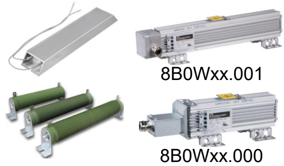
- 通常选择制动电阻的时候都需要计算实际项目中需要的制动功率，适当放大功率进行选择。
- 实际项目中如果运动轴被拖动会导致DC bus电压升高，升高到泄放电压（ParID 345 UDC_BLEEDER_ON）时，会将能量转移到制动电阻，随后制动电阻温度升高。如果连续制动，可能会发生制动电阻温度过高的报警41041或9040。
- ACOPOS 伺服驱动器的设计允许激活内置制动电阻或外部制动电阻。无法同时使用两个制动电阻进行制动。只能在ACOPOS 伺服驱动器初始化阶段通过软件对ParID 398设置，决定选择驱动器内置制动电阻还是外置的。
- 伺服电机制动（减速）时，电源将返回 ACOPOS 伺服驱动器。这将导致直流母线中的电容器充电至更高电压。在直流母线电压约为 800 V 时，ACOPOS 伺服驱动器通过制动斩波器将制动电阻与直流母线相连，并将制动能量转化为热量。
    - 对于 ACOPOS 伺服驱动装置，制动电阻器已集成在设备中，也可连接外部制动电阻器。不同的功能可参见下表：
    - [ACOPOS → 制动电阻相关说明](https://help.br-automation.com/#/en/4/hardware%2Fmaacp2%2Fkapitel_dimensionierung%2Fallgemeines-3.html)
        - 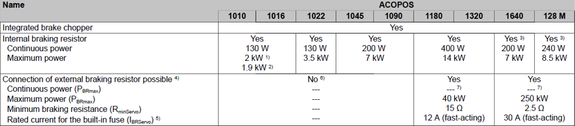
    - [ACOPOS P3 → 制动电阻相关说明](https://help.br-automation.com/#/en/4/hardware%2Fmaacpp3%2Fkapitel_dimensionierung%2Fbremswiderstand.html)
    - [ACOPOSmulti → 制动电阻相关说明](https://help.br-automation.com/#/en/4/hardware%2Fmaacpm%2Fkapitel_technische_daten%2Fubersicht%2Ftechnische_daten-22.html)

# 2 什么时候需要外部制动电阻

- 选型时
    - 非共直流母线，非有源电源，不能增加母线电容
    - 所需制动功率超出驱动器内置电阻的连续或峰值功率
- 运行时
    - 驱动器过压报警： -1067377607: DC bus: Overvoltage (超过用户设置阈值),
    - -1067377632: DC bus: Overvoltage（超过驱动器极限阈值）
    - 7225: DC bus: Overvoltage (超过用户设置阈值),
    - 7200: DC bus: Overvoltage (超过驱动器极限阈值）

## 2.1 必要参数

- 阻值、连续运行功率、最大功率是选型时最重要的参数。
- 热容值、 热阻值、最高温度是在参数表内配置制动电阻时需要设置的参数，如供应商不能提供，可利用AS帮助内表格计算出。
- 一般铝壳电阻的允许最高温度为375°。

# 3 原理说明

- 为什么要使用制动电阻
    - 有时电机会作为发电机运行
        - 扭矩和速度不一致时：减速, 或被负载带动(例如, 垂直负载，张力负载)
    - 再生制动– 调节直流母线电压
        - 电机能量通过由IGBT寄生的二极管构成的整流桥流入直流母线
        - 母线电容吸收能量电压升高 – 若不做控制会导致过压
        - 制动IGBT Q7闭合, 电流流过R2, 以发热的形式消耗能量, 母线电压下降
        - 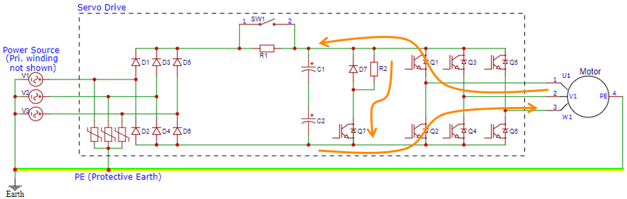
- 选型标准
    - 制动电阻阻值：位于驱动器允许的最小制动电阻值，和应用允许的最大制动电阻值之间
    - 往复运动时制动电阻不过载 (电阻额定功率 >= 应用的平均制动功率)
    - 电阻的峰值功率，需大于应用的峰值制动功率，且后者大于驱动器允许的峰值制动功率
    - 应用的峰值制动功率和单次制动时间位于驱动器的peak load capacity曲线下
    - 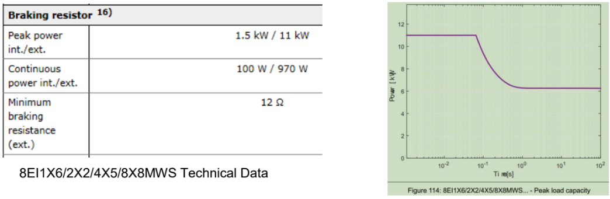
- 如何选型
    - 准备工作
        - 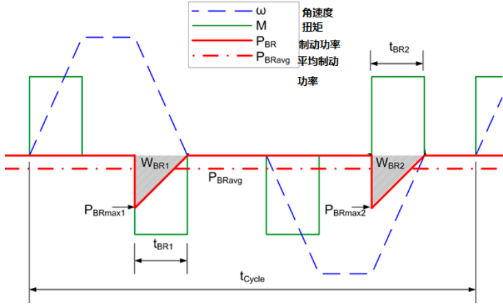
        - 记录一个完整的运动周期: 角速度ω, 扭矩M
        - 计算 PBR = ω * M， ω 单位(rad/s)，M单位(Nm)
        - 搜集驱动器允许的最小制动电阻Rmin, 以及允许的峰值制动功率
        - 测量母线电压UDC （再生制动电路开始动作的UDC ）
        - 备选制动电阻的参数表: 阻值，额定功率, 峰值功率等
    - 制动电阻选型
        - 确定整个周期内的**P**BRmax , 制动能量**W**BR1, **W**BR2
        - 检查**P**BRmax 和tBR 在驱动器的peak load capacity曲线下
        - 应用允许的阻值：**R**max = UDC^2 / **P**BRmax
        - 确定平均制动功率：
            - **P**BRavg = (**W**BR1 + **W**BR2) / tCycle
        - 检查**P**BRmax =< 驱动器允许的峰值制动功率;
            - 否则更换大一号的驱动器，或降低减速度
        - 选择合适的阻值和功率, 满足:
            - **R**min =< 阻值 =< **R**max
            - 电阻额定功率>= **P**BRavg
            - 电阻峰值功率 >= **P**BRmax
    - 注意
        - 本方法忽略了驱动器内置的直流母线电容缓存制动能量的能力。
        - 过多增加母线电容可能导致预充电电阻过载损坏；需咨询驱动器开发部门确定最大允许的母线电容。
    - 详情可见 [B&R Online Help 相关章节](https://help.br-automation.com/#/en/4/hardware%2Fmaacpp3%2Fkapitel_dimensionierung%2Fbeispiel.html)

# 4 如何选择制动电阻

- 在选择制动电阻时需要重点考虑以下几点因素

## 4.1 功率：满足负载要求

- 在选择制动电阻时，需要确保其额定功率大于或等于负载在制动周期内的平均制动功率。如果制动电阻的额定功率低于平均制动功率，长时间工作会导致电阻过热，甚至烧毁。同时也要确保所选制动电阻能承受的瞬时功率，应大于或等于负载在制动过程中可能产生的最大功率。这是因为在制动的瞬间，可能会产生比平均功率更高的瞬时功率，如果制动电阻无法承受，也可能导致损坏

### 4.1.1 确认制动电阻可满足的功率

- 贝加莱制动电阻参数表
    - 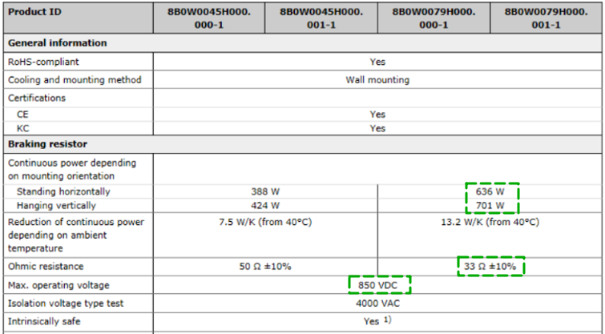
    - 一般在制动电阻的参数中，都会标明其额定功率，以8B0W0079H000.​001-1制动电阻为例，水平安装和垂直安装的额定功率分别为636W和701W。峰值功率一般可通过U²/R进行计算。例如8B0W0079H000.​001-1的峰值功率=850²/33= 21.89kw。

### 4.1.2 确认驱动器的峰值负载能力限制

- 在做负载评估时，也要同时参考驱动器对使用外部制动电阻时的峰值负载能力的限制，每个驱动器型号都可以查到对应的peak load capacity曲线图，要保证应用的峰值制动功率和单次制动时间位于驱动器的peak load capacity曲线下。否则就要调整制动电阻开始工作的电压阈值，再次评估制动电阻的带载能力是否满足实际需求。
- 驱动器peak load capacity曲线图
    - 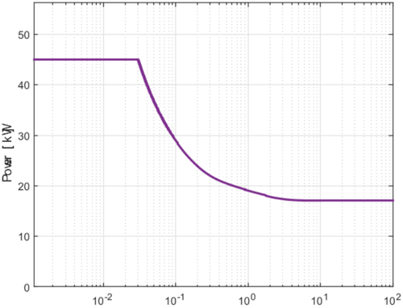

### 4.1.3 确认应用场景所需的制动功率

- 有多种计算方法
- 方法一：P= ED% * P0
    - ED%：制动电阻使用率，范围是从10％-50％不等，一般30%可 满足大部分应用需求；P0是电机的额定功率。
- 方法二：trace机器的一个完整周期内
    - MOTOR_TERMINAL_POWER(ID 844)，然后新建表格，应用如下公式：
        - ((Motor terminal power < 0) * Motor terminal power) * -1
    - 在新表格内添加Y轴均方根和Y轴最大值选项
    - 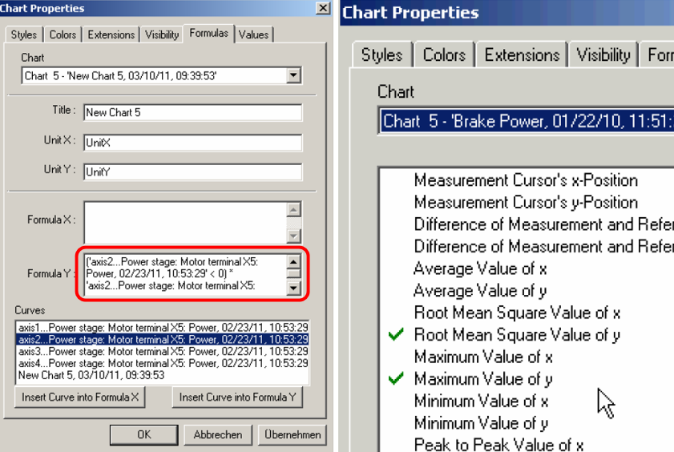
    - 如下图所示：在设备完整运动周期的起始点间，Y-RMS是平均抱闸功率，Y-MAX是最大抱闸功率。所选电阻的最大功率和连续功率应大于此二值。
    - 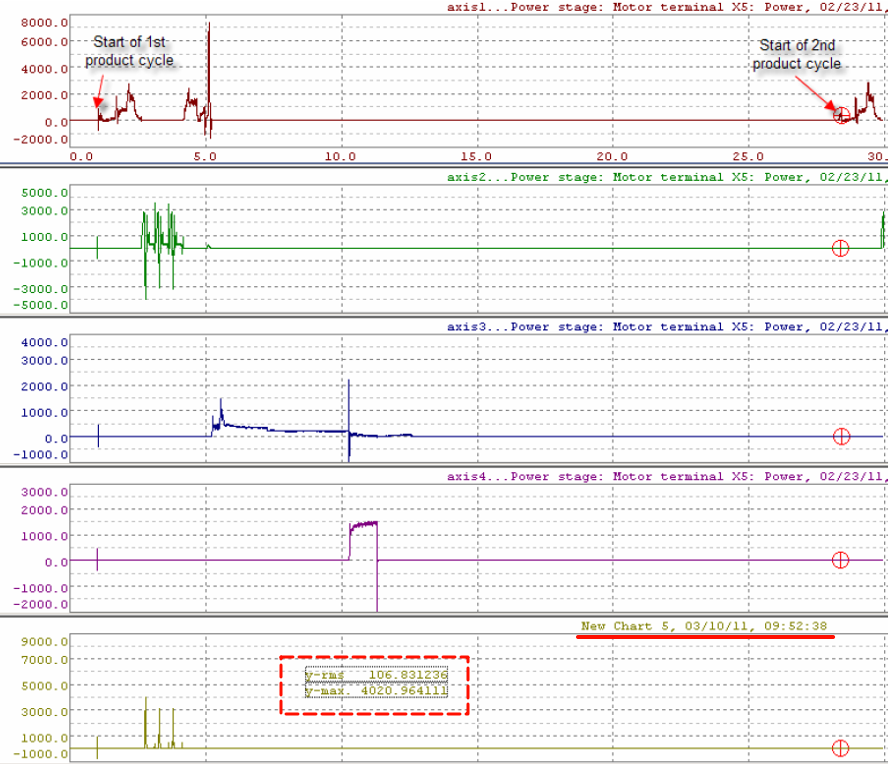
    - ParID 844: Inverter: Output: Power
        - GUID: 028d8243-64cd-404b-bde4-c7e55e4440a7
        - MOTOR_TERMINAL_POWER = 3/2 * ( ICTRL_ISQ_ACT * ICTRL_USQ_REF + ICTRL_ISD_ACT * ICTRL_USD_REF )
- 方法三：P =J * ω²/2T，其中J为惯量，ω为角速度，T为减速时间。

## 4.2 阻值：满足驱动器最小阻值要求

- 电阻值将影响制动电流和制动效果。电阻值越低，制动电流越大，制动效果越明显。
- 对于ACOPOS P3驱动器，其参数表中已经标明了允许外接的最小制动电阻阻值，这主要是为了限制通过驱动器母线控制单元的最大电流，保护电路。
- 制动单元可允许通过电流决定了制动电阻的最小阻值，可查看帮助内的硬件技术参数表格获得，实际选择电阻通常阻值略大于最小允许阻值。
- 例如
    - [ACOPOS P3 1轴型号参数](https://help.br-automation.com/#/en/4/hardware%2Fmaacpp3%2Fkapitel_technische_daten%2Ftechnische_daten-2.html)
        - 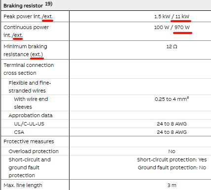

## 4.3 电压：制动电阻满足可能承受的最高电压要求

- 制动电阻能承受的电压范围应大于在制动过程中可能承受的最高电压，这个参数在制动电阻参数表中都会明确给出。
- ParID 345参数决定了制动电阻开关打开的阈值，一般情况下如果制动电阻功率选择合理，当泄压开关打开后，母线电压将不再会有较大的上升。
    - 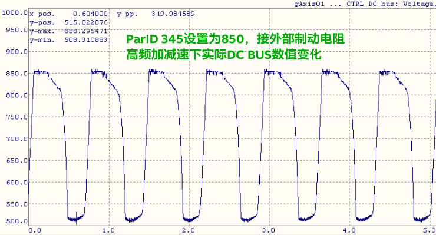
- 默认参数如下
    - 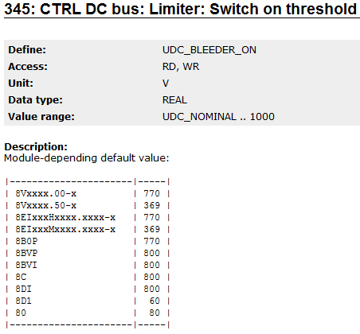

## 4.4 带载：制动电阻的带载能力评估

- AS帮助中给出了一个用于评估制动电阻带载能力的计算公式表“bleederdatachopper”，将制动电阻的额定功率、环境温度、最大允许承受温度输入后，就可以得到热阻值。
- GUID : caf38754-8a4d-4347-b975-17232db4cfcc
    - [点击下载 → 制动电阻计算公式EXCEL](/B06_技术_运动控制/FILES/034驱动器制动电阻参数设置/bleederdatachopper_e_00.xls ':ignore')
- 制动电阻的热阻和热容值是其特性参数，当制动电阻选定后，这两个值就已经确定。所以如果我们知道实际工况的制动周期时间，以及母线电压（制动开关打开的电压），那么我们可以调整占空比，直到得到和制动电阻相同的热容值，那么这个占空比对应的周期时间，就是该制动电阻以该峰值功率在该周期时间下允许接通的最长时间。以此我们能够比较直观的了解所选制动电阻承载能力。
- 公式表中右侧的折线图反映了制动电阻在不同周期时间和不同负载下，所能允许的最大周期接通时间占空比。
- 以图中右侧所展示示例说明（参考图，可以通过左侧表通过计算算出对应的曲线），假如制动电阻额定功率为250w，制动电阻的工作周期为120s，以等效的制动功率 3000w 工作，那么这个制动电阻周期内可工作的最大时间占比为 7% ，也就是在一个周期120s内，最多允许工作8.4s，如果等效制动功率为250w或更低，则在整个周期内，制动电阻可一直接通而不用担心超温损坏。
- 制动电阻带载能力评估表
- 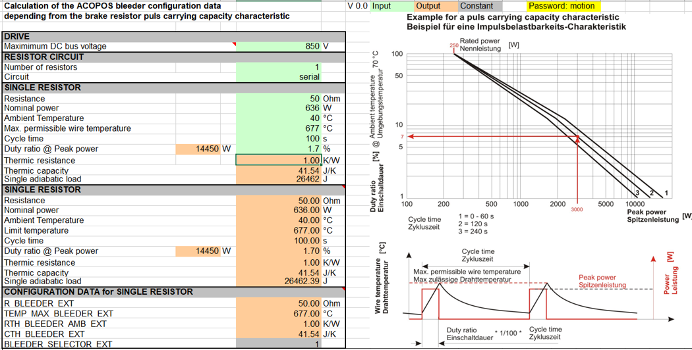

## 4.5 环境：满足安装环境要求

- 安装环境对选择制动电阻的影响主要包括环境温湿度，酸碱度以及安装空间限制等。
- 环境温度主要影响制动电阻的散热，高温环境可能需要考虑选择具有更高耐温性能和更佳散热设计的制动电阻。
- 对于湿度较高环境，需要选择具有更高防护等级（IP等级）的制动电阻，以防止水分侵入造成短路或其他故障。
- 对于酸碱环境下，制动电阻应选择耐腐蚀材料的如不锈钢外壳、铝合金外壳的制动电阻，或选择带有防腐涂层的产品以提高抗腐蚀性。
- 安装空间的大小会影响制动电阻的尺寸选择。在空间受限的环境中，可能需要选择体积更小但性能相同的制动电阻。

# 5 接线说明

## 5.1 ACOPOS

- ACOPOS 驱动器仅在1180以上型号才可以配外部制动电阻，接线如下图：
- 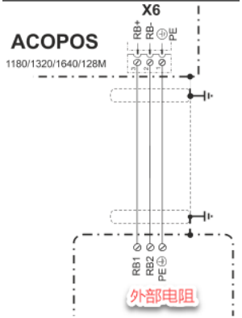
- 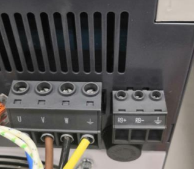

## 5.2 ACOPOSmulti

- 只有被动电源才可能需要配外部制动电阻，电阻参数考虑电源模块 驱动的所有逆变模块的制动情况。接线如下：
- 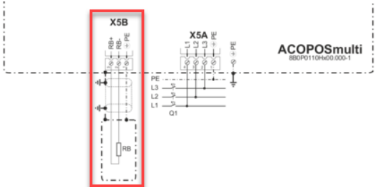
- 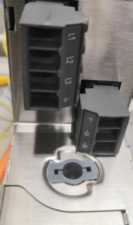

## 5.3 ACOPOS P3

- 接外部电阻时，不必考虑右侧内部电阻的接线了。
- ACOPOS P3内置电阻其实是装在P3里面的外置电阻，帮助里能查到参数。
- 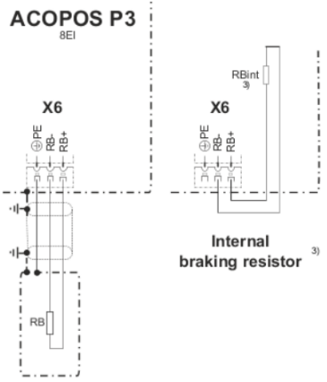

## 5.4 多个驱动器共用一个电阻

- ACOPOS 和ACOPOS P3允许共母线运行，多个驱动器也允许共同使用一个制动电阻，此时需要将这些驱动器的DC BUS并联。
- 通过共母线，将发电电机带来的母线电压升高被耗电电机抵消一部分，既能节约电能又能降低制动电阻的功率等级和使用频率。
- 此种方案制动电阻只需接在其中一个驱动器的制动电阻接线端子上，且在该驱动器参数表内配置制动电阻参数即可。

# 6 参数配置

- 使用外接制动电阻需要在参数表内配置以下参数

| Parameter ID         | ParID | 缩写         | 访问权限  | 类型  | 单位   | 说明                                     |
| -------------------- | ----- | ---------- | ----- | --- | ---- | -------------------------------------- |
| R_BLEEDER_EXT        | 10    | **R**Bl    | RD,WR | R4  | Ohm  | 电阻阻值                                   |
| TEMP_MAX_BLEEDER_EXT | 11    | **T**Blmax | RD,WR | R4  | °C   | 最高可承受温度                                |
| RTH_BLEEDER_AMB_EXT  | 12    | **R**Blth  | RD,WR | R4  | K/W  | 热阻                                     |
| CTH_BLEEDER_EXT      | 13    | **C**Blth  | RD,WR | R4  | Ws/K | 热容                                     |
| BLEEDER_SELECTOR_EXT | 398   |            | RD,WR | UI1 |      | 是否使用外部制动电阻开关 0  内部制动电阻 1  外部制动电阻 |

- 最高可承受温度 **T**Blmax
    - 是指制动电阻能够安全运行的最高温度。
- 热阻 **R**Blth
    - 是指热量传递的阻碍程度。单位是K/W, 热阻越小，制动电阻散热越快，所以热阻越小越好。
- 热容 **C**Blth
    - 是指物体吸收或释放热量时温度变化的能力。单位是Ws/K 或 J/K，热容越大，物体吸收或释放相同热量时温度变化越小。所以热容越大越好。
- 如果采用的第三方制动电阻未能提供**热容和热阻**参数，也可以通过已知参数间的关系计算得出。
    - 其中热阻 **R**Blth与最高可承受温度TBlmax的关系为：最高可承受温度=电阻值 * 热阻 + 环境温度。
    - 所以，热阻 **R**Blth =（最高可承受温度 - 环境温度）/ 电阻值。
- 有些制动电阻参数表中给出了热平衡时间常数 **τ** ，是用来描述系统达到热平衡所需的时间。
    - 可以通过以下公式计算：**τ** = RBlth * CBlth。

## 6.1 热阻和热容的计算

- 热阻和热容可利用帮助中提供的计算公式自动求得
    - GUID : caf38754-8a4d-4347-b975-17232db4cfcc
    - [点击下载 → 制动电阻计算公式EXCEL](/B06_技术_运动控制/FILES/034驱动器制动电阻参数设置/bleederdatachopper_e_00.xls ':ignore')
- Maximimum DC bus voltage是制动电阻的工作电压UDC_BLEEDER_ON（ID345）;
- Cycle time是制动器对应的电机的完整的运动周期（加速 → 匀速 → 减速），对于正常状态下不变速的轴来说，该值应设定为减速段的最短时间；
- 详情使用可见以上章节 → 带载：制动电阻的带载能力评估

# 7 补充说明

## 7.1 相关帮助信息说明

- GUID: e7337be8-ac8c-4c5b-b4f3-e02d7f547941
- [点击访问在线英文帮助 → B&R Online Help (br-automation.com)](https://help.br-automation.com/#/en/4/ncsoftware%2Facp10_drivefunctions%2Fbremswiderstand%2Fbremswiderstand_.html)

## 7.2 相关ParID

- UDC_BLEEDER_ON ：ID345，制动电阻工作电压（泄放电压）；
- UDC_ACT：ID298，直流母线实际电压；
- UDC_CHOP_CURR：ID1155，实际制动电流，仅在8B0P有效，单位A，只读
- BLEEDER_POWER_LOSS：ID876，制动功率损耗，此值与配置的电阻参数共同作用于制动电阻的温度模型，当热容或热阻等设置不正确时，可能导致制动电阻温度模型报警41041/9040/9041。

## 7.3 判断制动电阻是否工作

- 通过监控ID298或ID1155或ID876可确定在制动过程中，制动电阻是否工作。 不工作的可能原因有以下几点：
    - a、接线错误；
    - b、保险丝未安装或烧毁（P3无保险丝）
    - c、UDC_BLEEDER_ON设置过高
    - d、8B0P必须使能
- 在运行过程中Trace DC Bus ParID 298的电压值，发现不会超过ParID UDC_BLEEDER_ON的数值
    - ParID 345的含义为驱动器在使用外部制动电阻时，DC BUS电压超过此参数后，电流释放至制动电阻消耗
    - 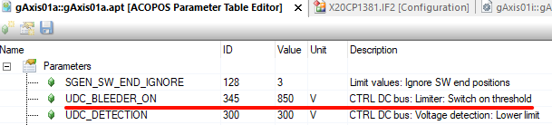

## 7.4 整机上电后，伺服报错7227

- 降低参数表内R_BLEEDER_EXT（ID10）数值。
- 实际使用过程发现，8B0P0440电源的制动电阻实际阻值是13Ω，连续功率 10KW。
- 伺服在整机上电后会报错7227，复位后即不再产生此错误，修改参数表内 R_BLEEDER_EXT至10Ω后，问题解决。

## 7.5 上电报38008报警

- **现象**
    - 若选用的制动电阻制动功率较低，而供电电压也偏低，则在驱动器 Switch on 时，直流母线电压可能会偶发下降不到2%，从而出发此38008报警。
- **解决方式**
    - 方式一：选择更合适的制动电阻
    - 方式二：屏蔽此检测机制，ParID 866写为64

# 8 制动电阻选型 ACOPOS系列案例

- 对于 ACOPOS驱动器从1180开始的伺服才有制动电阻接口，1090及以下伺服驱动器都是没有外部制动电阻接口的。
- 选择制动电阻时需要考虑两个方面：
    - 1___电阻阻值
    - 2___电阻功率

| 外部制动电阻      | 最小阻值  | 最大功率  | 最大连续制动功率 |
| ----------- | ----- | ----- | -------- |
| ACOPOS 1180 | 15欧姆  | 40 KW | 8 KW     |
| ACOPOS 1320 | 15欧姆  | 40 KW | 8 KW     |
| ACOPOS 1640 | 2.5欧姆 | 250KW | 24 KW    |
| ACOPOS 128M | 2.5欧姆 | 250KW | 24 KW    |

- 通常选择制动电阻的时候都需要计算实际项目中需要的制动功率，适当放大功率进行选择。
- 更多的时候是凭借经验，例如可能连续制动的情况下，需要电机或者伺服功率的一半，按此选择制动电阻功率，最小阻值也适当放大一些。
- 例如收放卷使用ACOPOS 1320，可能选择8KW的制动电阻，阻值20-25欧姆。
- 由于国内购买制动电阻的时候常常没有参数，我们只能自己手动输入到参数表中，为防止由于计算温度过高造成报警，所以需要将计算参数放大。可以参考我们公司自己的制动电阻相似功率参数进行填写。
- 举例如下：
    - 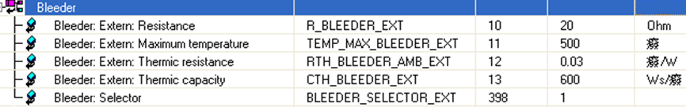
- 需要注意以上所有参数都要设置，否则会报警。
- 功率越大热阻越小，热容越大。

# 9 ACOPOS P3选型案例

- 驱动器型号为8EI017HWS10.XXXX-1，数据表总关于制动电阻有如下规定：
- 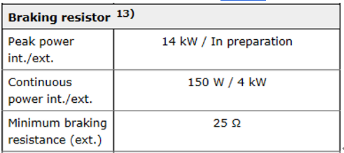
- 项目中由于电机额定功率仅为3kW，所以选择1.5kW 以上功率的制动电阻应该足够，且在实际应用中，采用两个驱动器共用一个制动电阻；另一方面考虑偏航电机连续工作时间很短，且工作不频繁，所以选用两个2.5kW铝壳制动电阻。
- 制动电阻参数如下：
    - 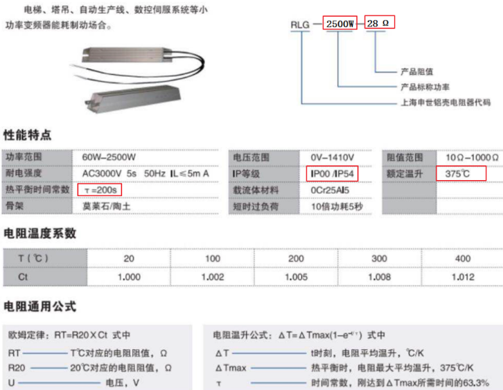

## 9.1 ACOPOS P3制动电阻接线与配置

- 该项目中两个驱动器共用一个制动电阻，接线中将两驱动器DC BUS相连，制动电阻接到其中一个驱动器制动电阻接线端子。如下图所示
- 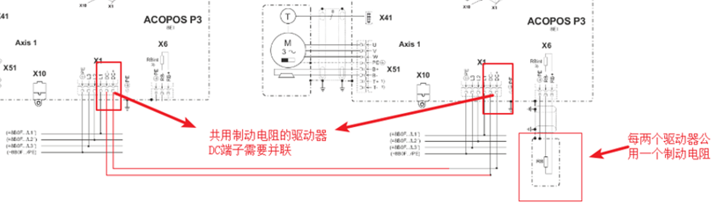
- 采用两个驱动器共用一个制动电阻的方式，只需要在接有制动电阻的驱动器对应的ACOPOS参数表中设置相关参数,没有接制动电阻的驱动器则不用设置。
- 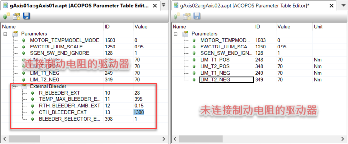

# 10 更新日志

| 日期         | 修改人 | 修改内容        |
| :--------- | :-- | :---------- |
| 2017-09-18 | LBY | 标准化功能块V4.15 |
| 2022-01-29 | DSP | 原理介绍        |
| 2023-04-17 | LZ  | ACOPOS P3应用 |
| 2024-07-05 | YZY | 文档汇总整理      |
| 2024-07-23 | LZ  | 更新文档        |
