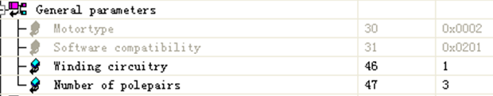
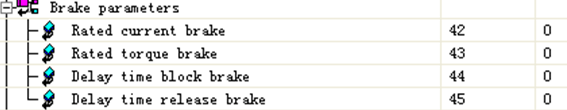
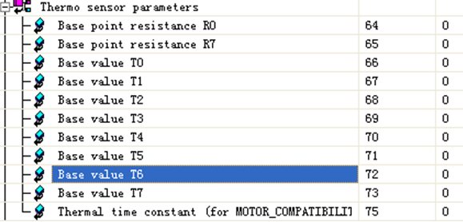
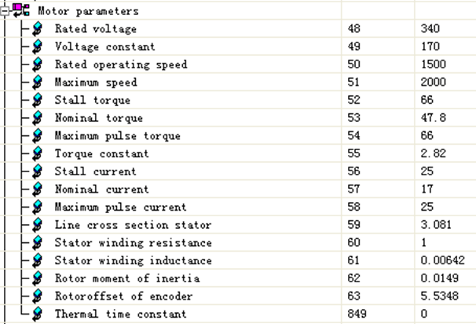
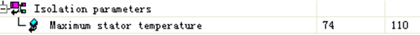

> Tags: #ParID #同步电机

- [1 B06.035.贝加莱同步电机常用ParID说明](#_1-b06035%E8%B4%9D%E5%8A%A0%E8%8E%B1%E5%90%8C%E6%AD%A5%E7%94%B5%E6%9C%BA%E5%B8%B8%E7%94%A8parid%E8%AF%B4%E6%98%8E)
- [2 基本参数](#_2-%E5%9F%BA%E6%9C%AC%E5%8F%82%E6%95%B0)
- [3 常用参数](#_3-%E5%B8%B8%E7%94%A8%E5%8F%82%E6%95%B0)
- [4 伺服电机电流](#_4-%E4%BC%BA%E6%9C%8D%E7%94%B5%E6%9C%BA%E7%94%B5%E6%B5%81)
	- [4.1 电流方向](#_41-%E7%94%B5%E6%B5%81%E6%96%B9%E5%90%91)
- [5 制动器参数](#_5-%E5%88%B6%E5%8A%A8%E5%99%A8%E5%8F%82%E6%95%B0)
- [6 温度参数](#_6-%E6%B8%A9%E5%BA%A6%E5%8F%82%E6%95%B0)
- [7 电机参数](#_7-%E7%94%B5%E6%9C%BA%E5%8F%82%E6%95%B0)
- [8 最大温度](#_8-%E6%9C%80%E5%A4%A7%E6%B8%A9%E5%BA%A6)
- [9 更新日志](#_9-%E6%9B%B4%E6%96%B0%E6%97%A5%E5%BF%97)

# 1 B06.035.贝加莱同步电机常用ParID说明

> 推荐入门了解资源：TM450 培训手册

> 推荐：[028BuR贝加莱ACOPOS备忘录](028BuR贝加莱ACOPOS备忘录.md)

# 2 基本参数

- 
- ID30：电机类型
    - 异步电机1 
    - 同步电机2
- ID31：只能是0x0201
- ID46：星型连接 1 
    - 没得选，只支持这个；
- ID47：极对数 (MOTOR_POLEPAIRS)
    - 可以通过寻磁偏角的方法找到这个参数；
    - 寻磁偏角找方法：
        - [027如何重新整定电机磁偏角](027如何重新整定电机磁偏角.md)
        - 将ID276 phasing_mode 设为stepper mode；
        - 将ID334 cmd_phasing 设为258(start)；
        - 然后读取该参数ID47得到极对数。
        - 读取ID63可以得到磁偏角，最好多做几次取平均值。

# 3 常用参数

- ID111：当前位置（PCTRL_S_ACT）
    - 单位：Units
- ID112：位置跟随误差（PCTRL_LAG_ERROR）
    - 单位：Units
- ID113：设定位置（PCTRL_S_SET）
    - 单位：Units
- ID209：逆变器：相位1：电流（VCTRL_I1）
    - 单位：A
- ID210：逆变器：相位2：电流（VCTRL_I2）
    - 单位：A
- ID250：设定速度（SCTRL_SPEED_REF）
    - 单位：1/s
- ID251：CTRL Speed：当前速度（SCTRL_SPEED_ACT）
    - 单位：1/s
- ID256：速度环设定电流前端（SCTRL_ISQ_REF）
    - 单位：A
- ID281：设定定子电流（FFCTRL_ISQ）
    - 单位：A
- ID342：建模电机温度负载（LOAD_MOTOR_MODEL）
    - 单位：%
- ID373：电机温度模型建模模式（TEMP_MOTOR_MODEL_MODE）
- ID381：电机温度传感器所测量温度（TEMP_MOTOR）
    - 单位：℃
    - [026ACOPOSmotor温度无法从ParID381中读到](026ACOPOSmotor温度无法从ParID381中读到.md)
- ID393：电机温度模型计算所得温度（TEMP_MOTOR_MODELL）
    - 单位：℃
- ID668：电机环境温度（TEMP_MOTOR_AMB）
    - 单位：℃
- ID849：电机：热时间常数（MOTOR_TAU_THERM）
    - 单位：s
- ID1215：温度传感器类型（MOTOR_TEMPSENS_TYPE）
- ID1747：温度传感器：转换器数值（TEMPSENS_VALUE）
    - 单位：Ohm
- ID277：电机：扭矩（TORQUE_ACT）
    - 单位：Nm
- ID18：逆变器：峰值电流（COPOS_CURR_MAX）
    - 单位：A

# 4 伺服电机电流

- ID213：设置定子电流正交分量（ICTRL_ISQ_REF）
    - 单位：A
- ID214：CTRL Current：实际定子电流正交分量（ICTRL_ISQ_ACT）
    - 单位：A
    - 通常我们监控电流是ID214 定子电流平方分量。 ID219是励磁分量，对于同步电机ID219比较小，可以在计算电流时忽略。
    - **实际电流**按照 ID214/1.414 进行计算
    - 伺服选型按照**伺服额定电流**与 ID214/1.414 比较
    - **电机扭矩** = ID214/1.414 * 扭矩常数
    - **电机功率ID278** = 2 * 3.1415926 * **电机扭矩ID277（Nm）*** 电机转速（rev/s）
- ID216：定子电压正交分量（ICTRLS_USQ_REF）
    - 单位：V
- ID219：CTRL Current：实际定子电流直流分量
    - 单位：A
    - ID219是励磁分量，对于同步电机ID219比较小，可以在计算电流时忽略。

## 4.1 电流方向

|        | 编码器方向 stand | 编码器方向 reverse |
| ------ | ----------- | ------------- |
| Pos 运动 | 电流 +        | 电流 -          |
| Neg运动  | 电流 -        | 电流 +          |

- 同样是pos运动，编码器方向设定不同，电流方向也会不同；
- 编码器方向standard，运动方向 pos，负载越大电流越大；
- 电流方向与电机物理运动方向保持一致。我们从电机轴向电机后面接线方向看去，电机轴顺时针运动，电流为正，逆时针电流为负。

# 5 制动器参数

- 
- 带制动器的电机相关参数，主要用来设定何时抱闸。

# 6 温度参数

- 
- 定义最高温度最低温度的电阻，然后输入中间阻值对应的温度，即提供一个表格供伺服查找，伺服通过线性插值确定当前温度，**如果要屏蔽温度检测，那么将以上所有参数设置为0。**

# 7 电机参数

- 
- ID48：额定电压
    - 暂时没什么用，如果不知道可以设0，通常情况下按照我们的参数设定就好。
- ID49：电压常数
    - 与电流环有关的参数，可以测量，测量方法是：让另一个电机带动其转动，使其作为发电机使用，在转速1000转的时候测量两相的电压，然后除以1000得到该参数。
    - 也可以通过公式估算：k=64 * Mn / In 其中Mn表示额定转矩，In表示额定电流。
- ID50：额定转速 (MOTOR_SPEED_RATED)
    - 单位：1/min
    - 从电机铭牌读取。
- ID51：最大转速
    - 作为默认速度限制。
- ID52：堵转扭矩（MOTOR_TORQ_STALL）
    - 单位：Nm
- ID53：额定扭矩（MOTOR_TORQ_RATED）
    - 单位：Nm
- ID54：峰值扭矩
    - 峰值电流下的扭矩。
- ID55：扭矩常数
    - 可以通过公式估算：K=Mn/In其中Mn表示额定转矩，In表示额定电流。
    - 此参数表示输出1A电流时，该电机可以出多少扭矩（牛米）。
- ID56：堵转电流（MOTOR_CURR_STALL）
    - 单位：A
- ID57：额定电流（MOTOR_CURR_RATED）
    - 单位：A
    - 效果 ：电机温度模型，默认寻磁偏角电流。
- ID58：峰值电流（MOTOR_CURR_MAX）
    - 效果 ：电流限制，扭矩模型，电机温度模型。
- ID59：电线截面积
    - 影响电机温度模型。
- ID60：定子阻抗
    - 效果 ：影响电流环控制，可以通过万用表测量，越准确越好。
- ID61：定子电感
    - 效果 ：电流环控制。
    - 很难测试，通常需要电机供应商提供该参数。此参数直接影响电流环控制，所以一定要设定正确。
    - 如果实在没有办法，可以通过自整定或参考我们的电机进行设定。控制效果可能会打折扣。
- ID62：转子转动惯量
    - 暂时没什么作用，不知道的话设0好了。
- ID63：磁偏角
    - 大大的影响控制效果，使用寻磁偏角功能得出。
    - 仅对于同步电机，如果不是绝对编码器（增量式），需要每次上电寻找。
- ID849： 0，只有这个参数。

# 8 最大温度

- 
- ID74：最大定子温度
    - 通常Endat编码器风冷电机可以设定为90，自冷却电机最大设定110度。旋转编码器风冷电机可以设定为110度，自冷却电机最大设定为130度。

# 9 更新日志

| 日期         | 修改人 | 修改内容         |
| :--------- | :-- | :----------- |
| 2013-07-01 | LBY | 初次创建         |
| 2024-08-27 | YZY | 汇总目前常用的ParID |
