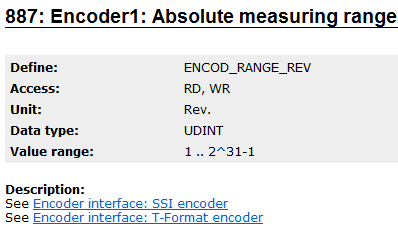

> Tags: #编码器 #ParID

# 037如何判断编码器是单圈还是多圈

- 为了避免电机上安装了错误的编码器，或者做一些信息判断
- 要获得编码器是单圈还是多圈信息，客户可以读取 ParID 887 ENCOD_RANGE_REV。
    - 
- 如果编码器为单圈编码器，则该 ParID 值为 1。
- 如果编码器为多圈编码器，则此 ParID 的值大于 1（通常为 4096）

# 更新日志

| 日期         | 修改人                   | 修改内容 |
| :--------- | :-------------------- | :--- |
| 2024-07-24 |  Mario Krucker YZY | 初次创建 |
