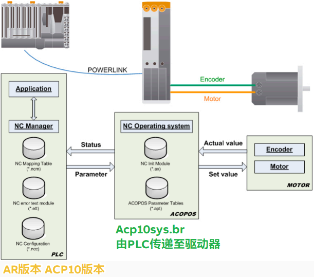
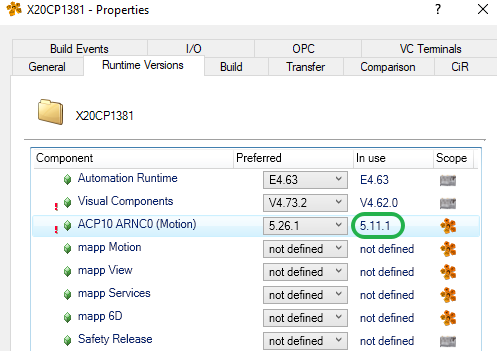
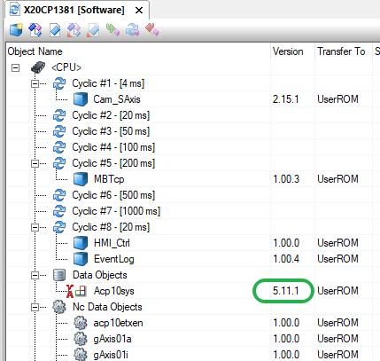
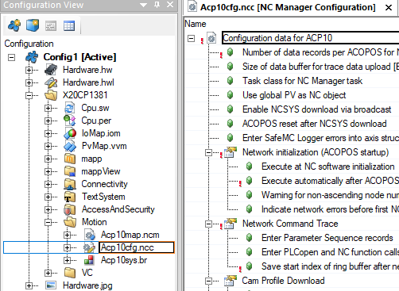
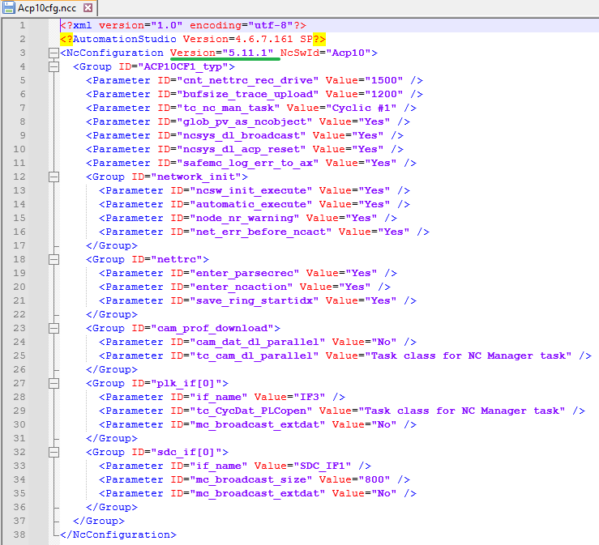

> Tags: #报警 #轴控

- [1 B06.040.轴控报警32397与ncc文件Acp10sys文件版本关系](#_1-b06040%E8%BD%B4%E6%8E%A7%E6%8A%A5%E8%AD%A632397%E4%B8%8Encc%E6%96%87%E4%BB%B6acp10sys%E6%96%87%E4%BB%B6%E7%89%88%E6%9C%AC%E5%85%B3%E7%B3%BB)
- [2 实际Acp10sys.br的版本关联](#_2-%E5%AE%9E%E9%99%85acp10sysbr%E7%9A%84%E7%89%88%E6%9C%AC%E5%85%B3%E8%81%94)
- [3 更新日志](#_3-%E6%9B%B4%E6%96%B0%E6%97%A5%E5%BF%97)

# 1 B06.040.轴控报警32397与ncc文件Acp10sys文件版本关系

- 一般情况下，PLC的配置中指定ACP10版本，则编译的时候，会根据相关配置，生成对应的Acp10sys.br，通过POWERLINK网络，更新至驱动器中。
- 程序正常运行时，PLC会检查PLC中指定的ACP10版本与实际伺服中Acp10sys版本是否一致，若不一致，则会报错32397。
    - 

# 2 实际Acp10sys.br的版本关联

- 正常情况下，在项目中，Project → Change Runtime Version → Runtime Versions，将ACP10指定版本选择调整一个版本后，对应的ncc文件会跟着变更。若没有变更，就会出现明明版本指定了一个新版本，但在Software窗口查看编译出来的Acp10sys.br版本还是老的版本，导致实际运行的时候程序报错32397。
    - 
- 实际的Acp10sys.br文件的版本是由Acp10cfg.ncc文件/Change Runtime Version中的ACP10版本决定的，不同的AS可能不同。
    - 
- 若发现Acp10sys.br版本不对，则需要修改.ncc文件指定的版本。
- 直接在AS软件中打开.ncc文件看不到指定的版本，但编辑修改此文件中任意参数，保存后版本自动跟随AS软件指定的变化。
    - 
- 使用记事本/Notepad++等软件打开，可见指定的版本号
    - 
- 根据指定的NcConfiguration版本，编译的时候会生成对应的Acp10sys.br文件，下图中的版本与ncc文件中指定的一致。

# 3 更新日志

| 日期         | 修改人 | 修改内容 |
| :--------- | :-- | :--- |
| 2024-12-06 | QZY | 内容提供 |
| 2024-12-06 | YZY | 更新   |
