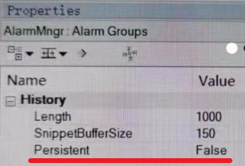

> Tags: #VC4 #报警

> 👍推荐阅读 → [024贝加莱VC4画面中的报警系统如何导出并查看](024贝加莱VC4画面中的报警系统如何导出并查看.md)
# B07.001.VC4画面中的ALARM信息如何在机器断电后仍能保存下来？

- 将PLC连接AS；在AS中打开Logical View/Visualization/Visu；在Visu窗口中点击Alarm Groups；
- 在Alarm Groups的History中，把Persistent改成True；重新下载程序以后，ALARM信息就能掉电保持了。
- 
