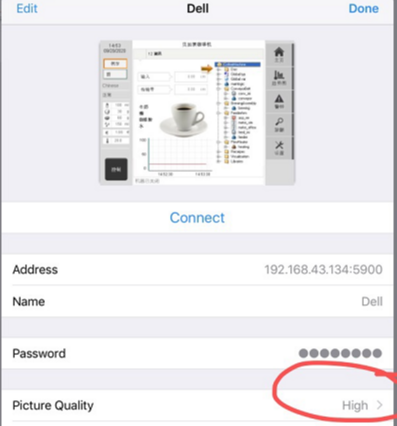
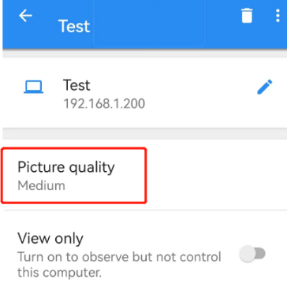

# 006使用什么软件远程访问贝加莱PLC的VC4画面
- 推荐使用VNC Viewer
- 下载地址
    - https://www.realvnc.com/en/connect/download/viewer/
- 选项设置
    -  
    - 
    - 

# 不同终端的选择建议
| PC         | IOS            | 安卓       |
| ---------- | -------------- | ---------- |
| VNC Viewer | VNC Viewer     | VNC Viewer |
|            | Mocha VNC Lite | bVNC       |
|            |                |            |
## IOS下VNC Viewer
- Picture Quality设置为High
- 

## 安卓下VNC Viewer
- 下载链接：
    - [How do I install VNC Viewer for Android without using the Google Play Store? – RealVNC Help Center](https://help.realvnc.com/hc/en-us/articles/360002762697-How-do-I-install-VNC-Viewer-for-Android-without-using-the-Google-Play-Store-)
- Picture Quality 设置为Medium
- 
