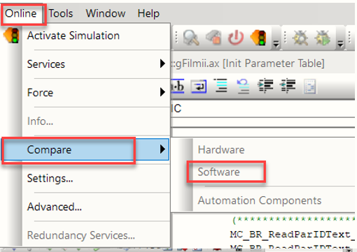
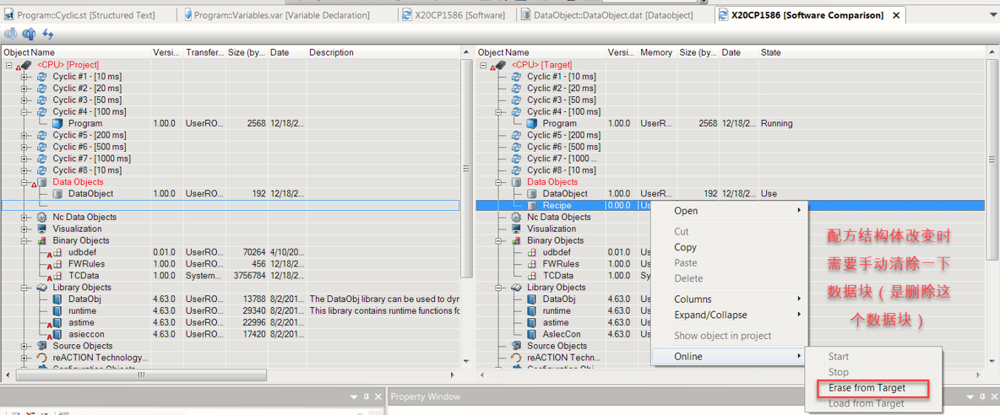
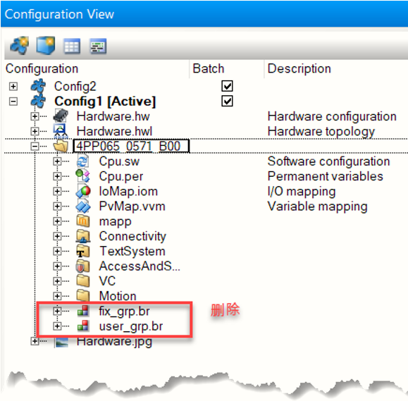

# 010配方结构体大小改变，VC4画面提示结构体大小改变报警
## 问题描述：
用标准化功能块的配方程序时，配方结构体大小改变会报警，VC4画面提示结构体大小改变报警。
## 问题原因：
CF卡内的配方结构体与工程内配方的结构体大小不一致，即工程内配方结构体增加或者删除了变量。
## 解决方案：
- 在线->软件比较-配方数据右键删除，配置里也要删除，全编译后重启。
- 
- 
- 
- 