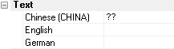

> Tags: #中文 #VC4

# VC4画面如何显示中文

- Shared Resources - Languages中增加中文语言
    - 
- Fonts字体设置Font Face为Arial Unicode
    - 
- 控件字体设置，选择已被正确设置的字体，并在下方输入中文
    - 
> 注意，输入完成后，Text窗口的内容仍是？？
> 

- 可在Visu处设置默认语言
    - 
