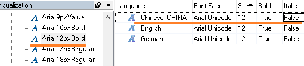
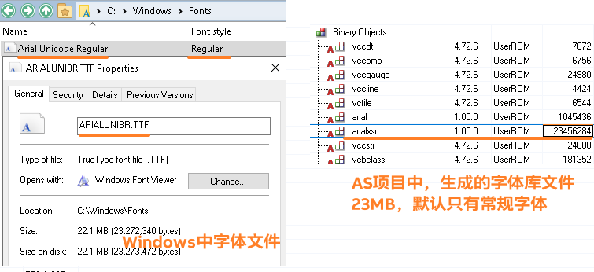
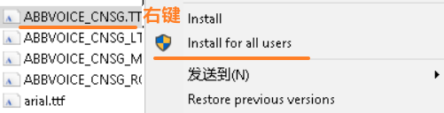
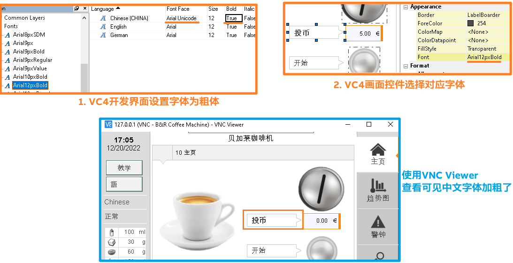
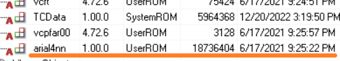
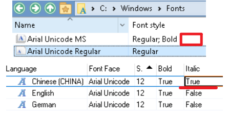
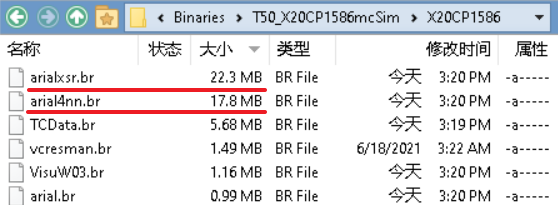
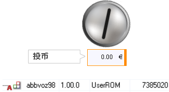

# 现象
- 使用VC4进行画面开发，有时候需要设置VC画面中中文字体的加粗或者斜体效果。
- 但在实际操作中发现，虽然开发界面中已经显示中文字体为加粗，但使用例如VNC Viewer软件查看，发现字体还是普通字体。
- 

# 原因
```
    - for each font type bold, italic, italic-bold is a font information necessary
    - the attached font files do not have bold or italic or italic-bold
    - our VC4 editor uses the Windows font render library which tries to display a font in bold, italic or italic-bold even though no font information is available for this type
    - our AC font render library does not have the information for bold, italic or italic-bold because the font files do not have any information regarding that typer
    - therefore the font is not displayed the same way as win VC4
    - 每种字体的粗体、斜体、斜体-粗体都需要一个字体信息。
    - 我们的VC4编辑器使用Windows字体渲染库，它试图将字体显示为粗体、斜体或斜体粗体 即使没有关于这种类型的字体信息可用。
    - 因为字体文件 没有任何关于该字体的信息，所以我们的AC字体渲染库没有粗体、斜体或斜体字的信息。
    - 因此，字体的显示方式与win VC4不一样。
```

- 中文的显示在贝加莱VC4画面中，默认基于Arial Unicode显示，如下图所示
- 
- 对应的字体文件为ARIALUNIBR.TTF，可见字体风格中仅有Regular
- 
# 解决方式
- 安装Arial Unicode MS的Bold字体在电脑中，百度网盘链接如下
    - 链接：https://pan.baidu.com/s/12_aG9VGAl0vqTcW3hEFGkg?pwd=sfu7 
    - 提取码：sfu7 
- 安装时将字体拷贝至桌面，点右键全部用户安装
    - 
- 安装成功后，可在`C:\Windows\Fonts`路径下看到如下信息
- 
- VC4画面进行如下设置即可
- 
- 编译后的AS项目中可见增加了大约17MB的一个字体文件
- 
## AS中字体选择与系统中字体关联
- 字体安装是否有效请检查`C:\Windows\Fonts`，若Font style中显示没有相关字体，而在AS字体设置中设置了对应的选项，则在编译过程中Output窗口会提示字体失效。
- 
- 
## 资源占用：新增一个粗体将多消耗近18MB的PLC内存
- 若使用的PLC内存占用较小，建议只保留一个字体，或者选择一个较小的字体库例如ABB Voice CNSG字体
- 
- ABB Voice CNSG占用字体大小为7MB，效果如下所示。
- 


## 字体已安装，但AS编译时提示没有
- 
- 原因为字体没有被安装成全部用户均可使用。


