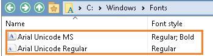

- [现象](#%E7%8E%B0%E8%B1%A1)
- [原因](#%E5%8E%9F%E5%9B%A0)
- [解决方式](#%E8%A7%A3%E5%86%B3%E6%96%B9%E5%BC%8F)
	- [AS中字体选择与系统中字体关联](#AS%E4%B8%AD%E5%AD%97%E4%BD%93%E9%80%89%E6%8B%A9%E4%B8%8E%E7%B3%BB%E7%BB%9F%E4%B8%AD%E5%AD%97%E4%BD%93%E5%85%B3%E8%81%94)
	- [资源占用：新增一个粗体将多消耗近18MB的PLC内存](#%E8%B5%84%E6%BA%90%E5%8D%A0%E7%94%A8%EF%BC%9A%E6%96%B0%E5%A2%9E%E4%B8%80%E4%B8%AA%E7%B2%97%E4%BD%93%E5%B0%86%E5%A4%9A%E6%B6%88%E8%80%97%E8%BF%9118MB%E7%9A%84PLC%E5%86%85%E5%AD%98)
	- [字体已安装，但AS编译时提示没有](#%E5%AD%97%E4%BD%93%E5%B7%B2%E5%AE%89%E8%A3%85%EF%BC%8C%E4%BD%86AS%E7%BC%96%E8%AF%91%E6%97%B6%E6%8F%90%E7%A4%BA%E6%B2%A1%E6%9C%89)
	- [字体的Font name请不要选择包含中文信息](#%E5%AD%97%E4%BD%93%E7%9A%84Font%20name%E8%AF%B7%E4%B8%8D%E8%A6%81%E9%80%89%E6%8B%A9%E5%8C%85%E5%90%AB%E4%B8%AD%E6%96%87%E4%BF%A1%E6%81%AF)
	- [如何修改合适的字库文件](#%E5%A6%82%E4%BD%95%E4%BF%AE%E6%94%B9%E5%90%88%E9%80%82%E7%9A%84%E5%AD%97%E5%BA%93%E6%96%87%E4%BB%B6)
		- [使用 Font Creator 软件修改字体步骤](#%E4%BD%BF%E7%94%A8%20Font%20Creator%20%E8%BD%AF%E4%BB%B6%E4%BF%AE%E6%94%B9%E5%AD%97%E4%BD%93%E6%AD%A5%E9%AA%A4)
- [可用字体效果与抗锯齿功能](#%E5%8F%AF%E7%94%A8%E5%AD%97%E4%BD%93%E6%95%88%E6%9E%9C%E4%B8%8E%E6%8A%97%E9%94%AF%E9%BD%BF%E5%8A%9F%E8%83%BD)
	- [下载地址：](#%E4%B8%8B%E8%BD%BD%E5%9C%B0%E5%9D%80%EF%BC%9A)
	- [搜索下载与检查字体授权](#%E6%90%9C%E7%B4%A2%E4%B8%8B%E8%BD%BD%E4%B8%8E%E6%A3%80%E6%9F%A5%E5%AD%97%E4%BD%93%E6%8E%88%E6%9D%83)

# 现象

- 使用VC4进行画面开发，有时候需要设置VC画面中中文字体的加粗或者斜体效果。
- 但在实际操作中发现，虽然开发界面中已经显示中文字体为加粗，但使用例如VNC Viewer软件查看，发现字体还是普通字体。
- 

# 原因

```
    - for each font type bold, italic, italic-bold is a font information necessary
    - the attached font files do not have bold or italic or italic-bold
    - our VC4 editor uses the Windows font render library which tries to display a font in bold, italic or italic-bold even though no font information is available for this type
    - our AC font render library does not have the information for bold, italic or italic-bold because the font files do not have any information regarding that typer
    - therefore the font is not displayed the same way as win VC4
    - 每种字体的粗体、斜体、斜体-粗体都需要一个字体信息。
    - 我们的VC4编辑器使用Windows字体渲染库，它试图将字体显示为粗体、斜体或斜体粗体 即使没有关于这种类型的字体信息可用。
    - 因为字体文件 没有任何关于该字体的信息，所以我们的AC字体渲染库没有粗体、斜体或斜体字的信息。
    - 因此，字体的显示方式与win VC4不一样。
```

- 中文的显示在贝加莱VC4画面中，默认基于Arial Unicode显示，如下图所示
- 
- 对应的字体文件为ARIALUNIBR.TTF，可见字体风格中仅有Regular
- 

# 解决方式

- 安装Arial Unicode MS的Bold字体在电脑中，百度网盘链接如下
    - 链接：https://pan.baidu.com/s/12_aG9VGAl0vqTcW3hEFGkg?pwd=sfu7
    - 提取码：sfu7
- 安装时将字体拷贝至桌面，点右键全部用户安装
    - 
- 安装成功后，可在`C:\Windows\Fonts`路径下看到如下信息
- 
- VC4画面进行如下设置即可
- 
- 编译后的AS项目中可见增加了大约17MB的一个字体文件
- 

## AS中字体选择与系统中字体关联

- 字体安装是否有效请检查`C:\Windows\Fonts`，若Font style中显示没有相关字体，而在AS字体设置中设置了对应的选项，则在编译过程中Output窗口会提示字体失效。
- 
- 

## 资源占用：新增一个粗体将多消耗近18MB的PLC内存

- 若使用的PLC内存占用较小，建议只保留一个字体，或者选择一个较小的字体库例如ABB Voice CNSG字体
- 
- ABB Voice CNSG占用字体大小为7MB，效果如下所示。
- 

## 字体已安装，但AS编译时提示没有

- 
- 原因为字体没有被安装成全部用户均可使用。

## 字体的Font name请不要选择包含中文信息

- 
- 
- AS编译时会提示异常不能正常找到对应字库文件。

## 如何修改合适的字库文件

- 确保Font name均为英文，并且英文版本信息与中文版本信息同名
- 修改软件可考虑使用Font Creator软件
- 
- VC 4 可支持字体的格式为 TrueType，即. Ttf 文件

### 使用 Font Creator 软件修改字体步骤

- <span style="background:#F0A7D8">A.</span>打开字体，在菜单栏 Font 点击 Properties，进行设置
    - 
- <span style="background:#F0A7D8">B.</span>选择 Font Tab 页，找到 Family Name，点击 +1, 将 Font Name 下的 Chinese 条目的 Content 中的信息修改为英文信息。🚩 注意，此处的 Font Name 即为在 `VC4` 中选择对应的字体名，建议 Bold 字体就在名字处改为 AlibabaPuHuiTiBold，方便选择。
    - 
- <span style="background:#F0A7D8">C.</span>导出字体，选择导出为 ttf 格式
    - 
- <span style="background:#F0A7D8">D.</span>导出弹框中选择 Output Folder 输出的地方，点击 Export 即可。
    - 

# 可用字体效果与抗锯齿功能

- 贝加莱支持各类风格字体在VC4画面中显示
- 为使得字体显示效果正常，建议 VC 4 画面开启**抗锯齿**功能
    - ⚠️ 注意：开启抗锯齿功能 `VC4` 画面会好看很多，但会增加一定的性能消耗。
- 
- 不同字体演示效果动图（可能需要登录才能看动图）

- 

## 下载地址：

- 链接：https://pan.baidu.com/s/12_aG9VGAl0vqTcW3hEFGkg?pwd=sfu7
- 提取码：sfu7

> 案例中未标🔴字体可商用
- ABBVoiceCNSG
    - ABB官方字体
- AlibabaPuhuiTi
    - 阿里巴巴普惠体
    - https://alibabafont.taobao.com/
- ArialUnicode
    - 🔴需注意需要授权
    - https://en.likefont.com/font/9060897/
- LXGW系列
    - 开源字体：霞鹜文楷
    - https://github.com/lxgw
- SimleSans
    - 开源字体：得意黑
    - https://github.com/atelier-anchor/smiley-sans
- MiSans
    - 小米MIUI 13内置的默认字体
    - https://web.vip.miui.com/page/info/mio/mio/detail?postId=33935854&app_version=dev.20051&ref=MIUI13
- NSimSans
    - 新宋体
    - https://zhidao.baidu.com/question/2126268004741562907.html
- SourceHanSerifSC
    - 思源宋体
    - http://designshidai.com/34210.html
- SourceHanSansCN
    - 思源黑体
    - https://baike.baidu.com/item/%E6%80%9D%E6%BA%90%E9%BB%91%E4%BD%93/14919098
- XiaoLaiSC
    - 小赖字体
    - https://github.com/lxgw/kose-font
- Yozai
    - 悠哉字体
    - https://github.com/lxgw/yozai-font
- YOUSHEhaoshenti
    - 优设好身体
    - https://www.uisdc.com/uisdc-haoshenti
- zcoolqingkehuangyouti
    - 站酷庆科黄油体
    - https://www.zcool.com.cn/work/ZMTg5MDEyMDQ=.html
- 微软雅黑
    - 🔴微软雅黑不能商用，字体版权属于“方正公司”
    - https://zhidao.baidu.com/question/945646634286190692.html

## 搜索下载与检查字体授权

- https://en.likefont.com/
