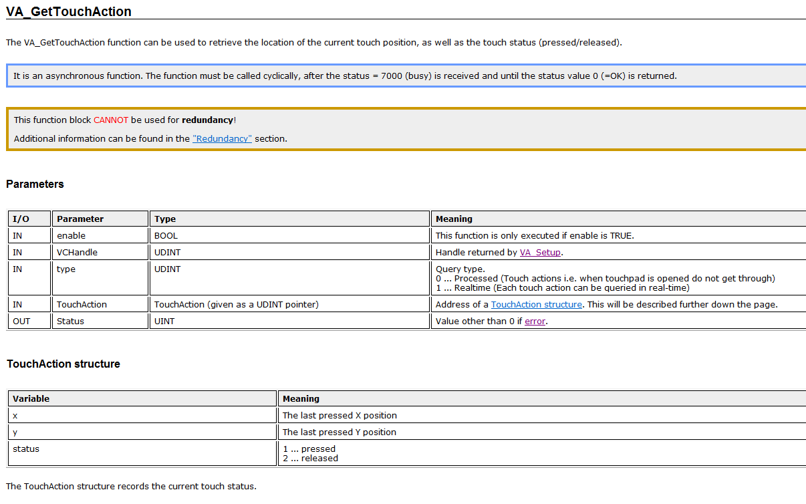

> Tags: #VC4

# B07.014VC4获取光标位置的方法

# 使用VA_GetTouchAction函数



# 代码案例

**Variable declaration (.var)**

```st
VAR     
    ready : UINT :=0;  
    VC_HANDLE : UDINT :=0;   touch : TouchAction := (0);   y_position :UDINT :=0;  
    y1 :UDINT :=0;  
END_VAR
```

**Cyclic code**

`PROGRAM _CYCLIC`

  ```st
  if ready <> 1 then  
    VC_HANDLE = VA_Setup(1 , "vga")  
   
     if VC_HANDLE <> 0 then  
         ready = 1    endif  
endif  
  
if ready = 1 then  
    if VA_Saccess(1,VC_HANDLE)= 0 then  
        VA_GetTouchAction (1,VC_HANDLE,UDINT(adr(touch)))  
        x_position = touch.x  
        y_position = touch.y  
        touch_status = touch.status  
   
        VA_Srelease(1,VC_HANDLE)  
     endif  
endif
  ```
