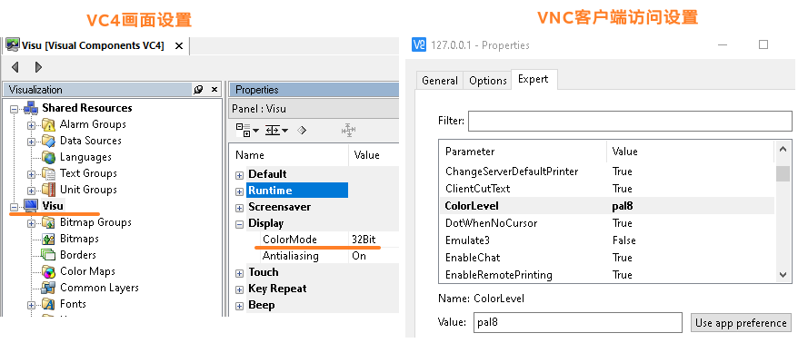

# 背景说明
- 若VC4需要动态显示图片，则通过外部文件读取最为方便，能够方便与其他程序结合使用。
- 使用VC4画面的HTMLView访问C盘中的HTML文件
- 
- 整体结构
- 
- HTML文件如下，关键信息为图片的引用
- 
- 使用PC仿真测试，测试验证VC4渲染图片的极限情况
- 此次测试使用的文件为24bit png文件，文件大小为410KB

# 注意事项
- VC4仅支持24 bit的bmp与png格式图片
- 相关的设置参数说明
    - 
- VC4不支持JavaScript。

# 结论
- 通过合理设置参数，能够实现VC4导入外部的图片能够以秒级的频率变更
- 
- VC4的显示效果需要测试以下参数：图片的大小，HTML文件变更的频率，VNC Server的Refresh Rate
    - 例如此次测试下，HTML文件的切换频率为650ms，VNC Server的Refresh Rate为700ms
        - 
- HTML必须变更文件名才能触发VNC加载
- VC4加载图片，显示图片切换的效果有限，可能会偶发出现加载不出图片导致某一瞬图片没加载出来的状态，若对图片连续性要求更高，可以考虑使用mappView来加载外部图片。
- 如果对图片更新频率有更高的要求，可以考虑使用mappView实现类似的效果
    - 相关链接：[032mappView使用外部资源](../B05_技术_mapp/032mappView使用外部资源.md)
    - 下图即为mappView下图片切换的效果
    - 