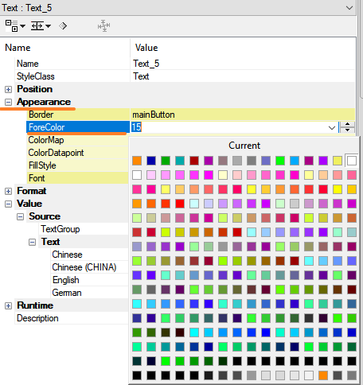
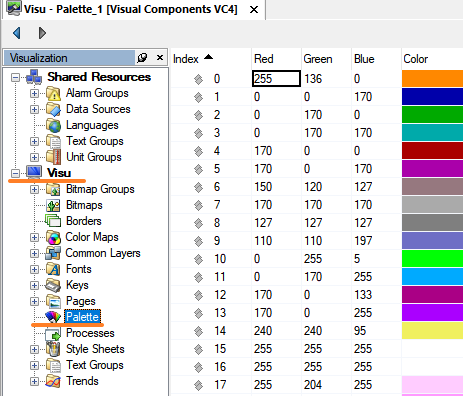

> Tags: #颜色 #VC4

# VC4如何自定义颜色

- 默认的 VC4 颜色表中没有期望的颜色，想自定义一种特殊颜色
    - 

# 实现方式

- 所有的颜色是通过 Color 的索引表选择不同的颜色，即不同的 Index 号对应不同的颜色
- 可以手动修改不使用的 Index 里的颜色，修改 RGB 的数字，指定需要颜色。
- 在颜色选择时，输入对应的 Index 颜色即可。
    - 
