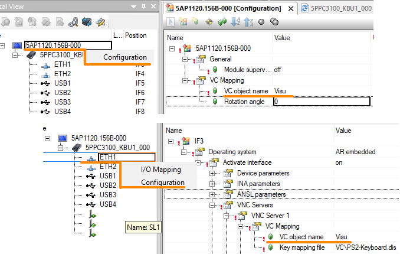
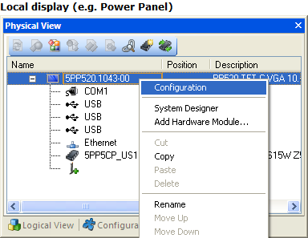
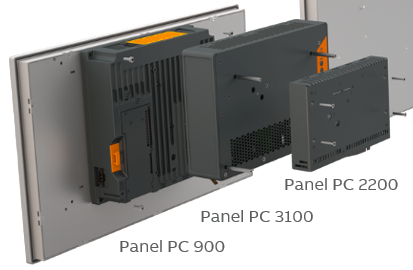
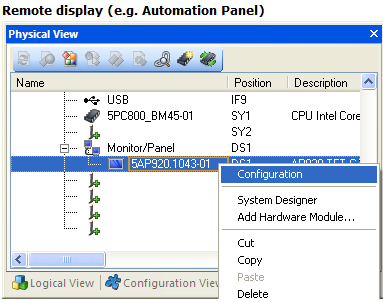
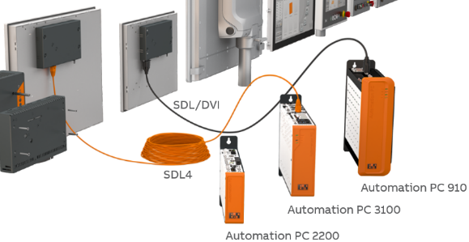
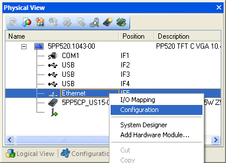

> Tags: #VC4 #PPC #C70

- [1 018VC4画面如何mapping绑定到不同屏幕与设备](#1%20018VC4%E7%94%BB%E9%9D%A2%E5%A6%82%E4%BD%95mapping%E7%BB%91%E5%AE%9A%E5%88%B0%E4%B8%8D%E5%90%8C%E5%B1%8F%E5%B9%95%E4%B8%8E%E8%AE%BE%E5%A4%87)
- [2 自带屏幕的设备（例如PPC3100，C70）](#2%20%E8%87%AA%E5%B8%A6%E5%B1%8F%E5%B9%95%E7%9A%84%E8%AE%BE%E5%A4%87%EF%BC%88%E4%BE%8B%E5%A6%82PPC3100%EF%BC%8CC70%EF%BC%89)
- [3 远端通过SDL线连接的Automation Panel](#3%20%E8%BF%9C%E7%AB%AF%E9%80%9A%E8%BF%87SDL%E7%BA%BF%E8%BF%9E%E6%8E%A5%E7%9A%84Automation%20Panel)
- [4 终端显示/VNC软件，通过以太网访问](#4%20%E7%BB%88%E7%AB%AF%E6%98%BE%E7%A4%BA/VNC%E8%BD%AF%E4%BB%B6%EF%BC%8C%E9%80%9A%E8%BF%87%E4%BB%A5%E5%A4%AA%E7%BD%91%E8%AE%BF%E9%97%AE)
- [5 更新日志](#5%20%E6%9B%B4%E6%96%B0%E6%97%A5%E5%BF%97)

# 1 B07.018-VC4画面如何mapping绑定到不同屏幕与设备

 - VC4如何绑定到不同的设备上
- 可视化对象（VC object name）和键盘配置（Key mapping file）可通过显示器或以太网接口的配置菜单在物理视图中进行映射。
- 对于带显示屏的设备，在逻辑视图（Logical View）中创建 VC 对象时会自动执行 VC 映射（mapping）
- 点击需要访问的设备或者接口，点击Configuration配置，选择对应的VC object name即可。
- 
    - 此配置，即可实现同一个硬件，即可以
        - 在PPC3100屏幕上显示画面
        - 基于以太网，在第三方设备上例如Windows/Linux，使用VNC 客户端软件访问设备的VC4画面。

# 2 自带屏幕的设备（例如PPC3100，C70）

- 
- 

# 3 远端通过SDL线连接的Automation Panel

- 
- 
- 需注意，此中配置方式，默认无法实现同一个VC4画面同时在硬件屏幕上与基于以太网的PC上显示VC4的画面
    - 若有类似的需要，可以考虑使用两个VC4画面，分别用于不同硬件屏幕的显示。
    - 也可以通过修改文件的方式实现同时画面显示的效果 [020工控机远端通过SDL线连接的AutomationPanel如何使ETH口访问同一个VC4画面](020工控机远端通过SDL线连接的AutomationPanel如何使ETH口访问同一个VC4画面.md)

# 4 终端显示/VNC软件，通过以太网访问

- 

# 5 更新日志

| 日期         | 修改人 | 修改内容         |
| :--------- | :-- | :----------- |
| 2023-12-29 | YZY | 初次创建         |
| 2024-01-22 | YZY | 更新关于SDL线使用说明 |
