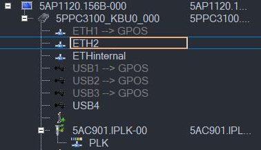
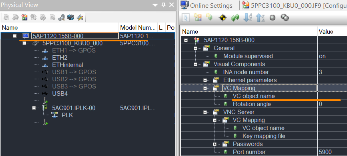
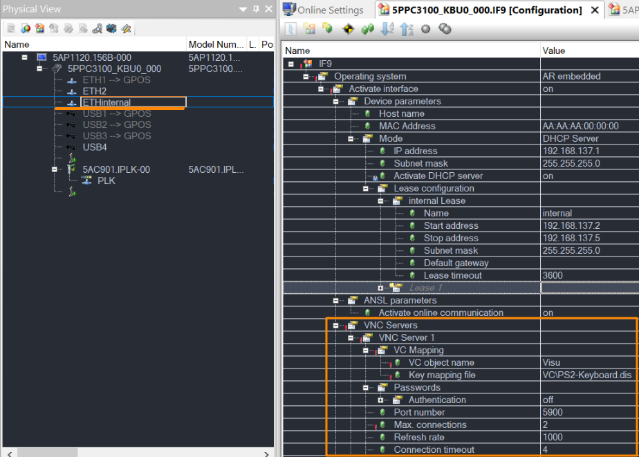

> Tags: #Hypervisor #VC4 #PPC #Windows

# B07.019-PPC系列硬件使用Hypervisor技术_如何在Windows上使用VNC访问AR侧的VC4画面

# 1 问题

- 使用PPC3100硬件，安装Hypervisor后想要在windows上显示VC4的画面，即在PPC3100上的Windows操作系统，访问PPC3100上AR侧的VC4画面。
    - 

# 2 操作方式

- 1） 先把屏幕5AP1120.156B-000里的VC mapping设定不关联visu
    - 
- 2） 到ETHinternal设定VNC
    - 
- 3） 全编译下载后重启设备，即可实现。

# 3 更新日志

| 日期         | 修改人       | 修改内容 |
| :--------- | :-------- | :--- |
| 2024-01-09 | HH YZY | 初次创建 |
