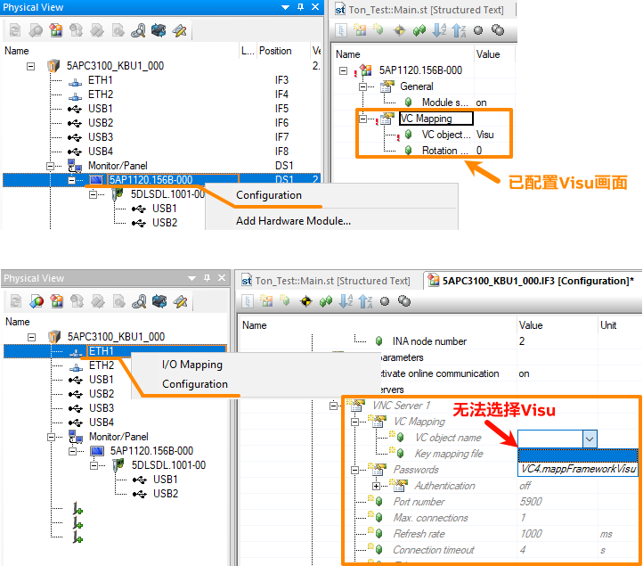
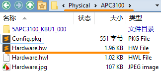
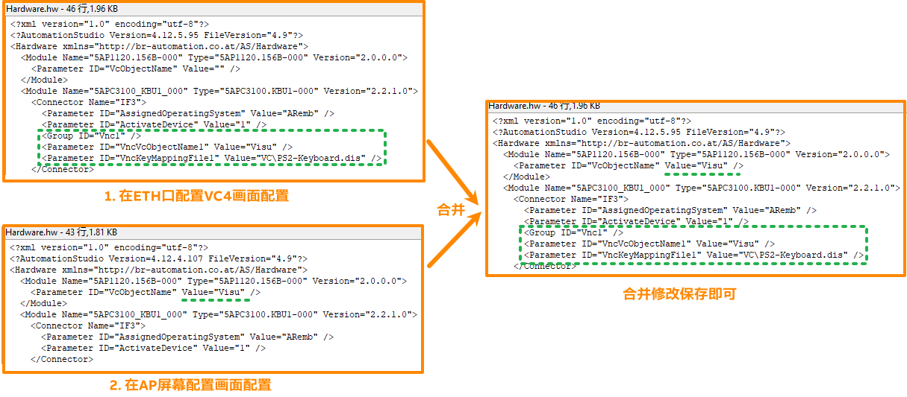

> Tags: #VC4 #SDL #工控机

- [1 020工控机远端通过SDL线连接的AutomationPanel如何使ETH口访问同一个VC4画面](#1%20020%E5%B7%A5%E6%8E%A7%E6%9C%BA%E8%BF%9C%E7%AB%AF%E9%80%9A%E8%BF%87SDL%E7%BA%BF%E8%BF%9E%E6%8E%A5%E7%9A%84AutomationPanel%E5%A6%82%E4%BD%95%E4%BD%BFETH%E5%8F%A3%E8%AE%BF%E9%97%AE%E5%90%8C%E4%B8%80%E4%B8%AAVC4%E7%94%BB%E9%9D%A2)
- [2 可尝试解决方式](#2%20%E5%8F%AF%E5%B0%9D%E8%AF%95%E8%A7%A3%E5%86%B3%E6%96%B9%E5%BC%8F)
- [3 更新日志](#3%20%E6%9B%B4%E6%96%B0%E6%97%A5%E5%BF%97)

# 1 020工控机远端通过SDL线连接的AutomationPanel如何使ETH口访问同一个VC4画面

- VC4画面对应硬件的绑定有三种方式，
- 
- [018VC4画面如何mapping绑定到不同屏幕与设备](018VC4画面如何mapping绑定到不同屏幕与设备.md)
- 其中，若APC工控机通过SDL线连接AP屏幕，则通过配置，只能将VC4画面绑定在AP屏幕上，无法再在ETH口上分配同一个画面
- 

# 2 可尝试解决方式

- 找到项目配置的 Hardware.hw文件
    - 
- 经过实际测试，将VC4配置两种方式方式信息保存记录，并合并，即可实现同一个VC4画面，同时在AP屏幕与ETH口画面同时访问。
- 

# 3 更新日志

| 日期     | 修改人     | 修改内容     |
|:-----|:-----|:-----|
| 2024-01-22     | YuanZhiyi     | 初次创建     |
