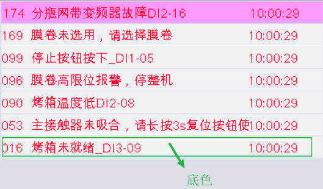
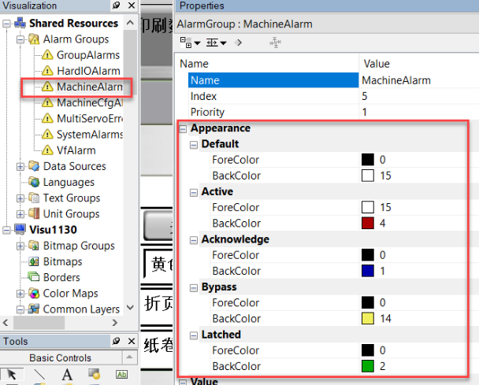

> Tags: #颜色 #VC4 #报警

# B07.021-VC4画面报警页面的颜色如何修改

- VC4的这个报警的底色应该怎么修改，需要改成和背景色一致。
- 

# 修改对应位置

- 所有报警颜色相关的都在Shared Resources的MachineAlarm处修改
    - 
- 颜色是以标号显示，自定义颜色可见以下链接
    - [017VC4如何自定义颜色](017VC4如何自定义颜色.md)

# 更新日志

| 日期         | 修改人        | 修改内容 |
| :--------- | :--------- | :--- |
| 2024-03-06 | YZY LWB | 初次创建 |
