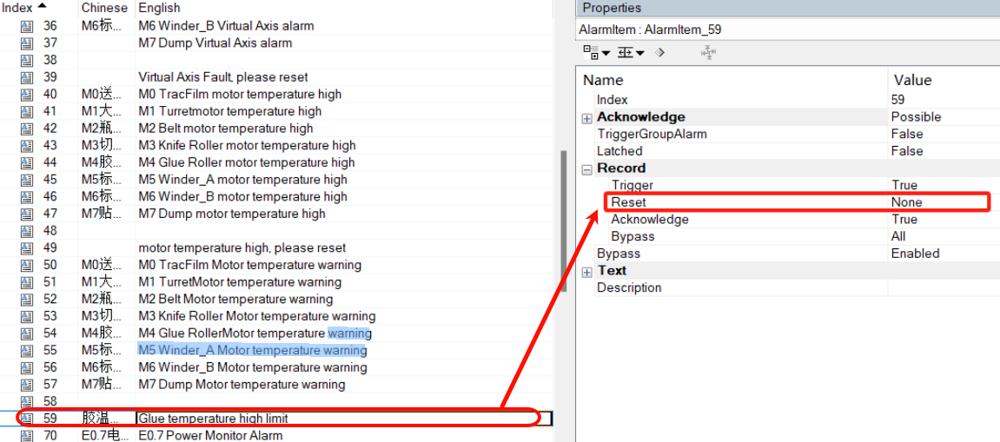

> Tags: #VC4

# B07.022.VC4中报警组中的某一条报警不记录在历史报警中

- 
- 上图设定为复位时候不记录，对于不需要记录的可以这样设定。
- Trigger设为None，表现效果为触发时候不记录到历史报警。

# 更新日志

| 日期         | 修改人 | 修改内容 |
| :--------- | :-- | :--- |
| 2024-08-30 | LFW | 初次创建 |
