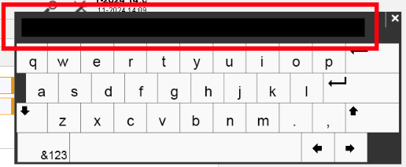
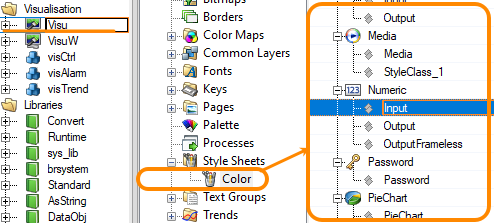

> Tags: #VC4

- [1 023VC4画面的键盘输入框是黑色，输入看不到内容](#_1-023vc4%E7%94%BB%E9%9D%A2%E7%9A%84%E9%94%AE%E7%9B%98%E8%BE%93%E5%85%A5%E6%A1%86%E6%98%AF%E9%BB%91%E8%89%B2%EF%BC%8C%E8%BE%93%E5%85%A5%E7%9C%8B%E4%B8%8D%E5%88%B0%E5%86%85%E5%AE%B9)
- [2 解决方式](#_2-%E8%A7%A3%E5%86%B3%E6%96%B9%E5%BC%8F)
- [3 更新日志](#_3-%E6%9B%B4%E6%96%B0%E6%97%A5%E5%BF%97)

# 1 023VC4画面的键盘输入框是黑色，输入看不到内容

- 现象为VC4画面点开键盘，发现输入框全黑，点击输入内容看不到变化。
- 

# 2 解决方式

- 替换VC4画面中 Style Sheets → Color 解决。
- 

# 3 更新日志

| 日期         | 修改人        | 修改内容 |
| :--------- | :--------- | :--- |
| 2024-11-19 | CZP YZY | 初次创建 |
