> Tags: #VC4 #报警

# 1 B07.024.贝加莱VC4画面中的报警系统如何导出并查看

- 默认情况下，VC4画面中的报警只记录当前上电之后的报警信息，PLC断电上电后，之前的报警信息会丢失。
- 在设置VC4 画面的 Alarm Groups 的History属性中的 Persistent 参数为True后，断电上电后之前的历史报警会一直保存。
    - 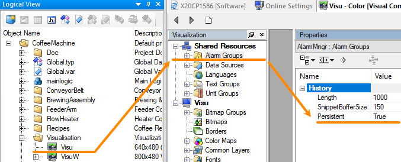
- 若开启报警存储，VC4的Alarm的报警以DataObject的形式存储在PLC中。
    - 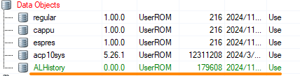

# 2 报警日志导出方式

## 2.1 通过AS软件导出

- 1___ 使用AS软件连接到PLC
- 2___ 通过AS软件菜单栏 → Online → Compare → Software
    - 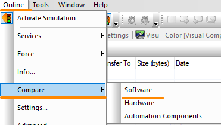
- 3___ 选择右侧的Target软件树，找到Data Objects下的ALHistory，右键 → Online → Load from Target。
    - 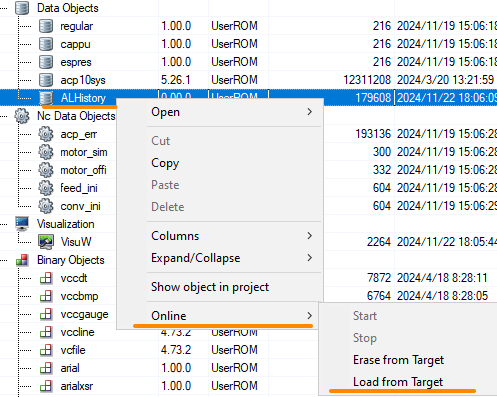
- 4___ ALHistory.br 文件即被导出到本地的Configuration 配置下。
    - 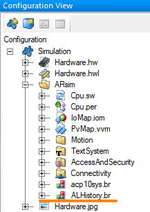
    - 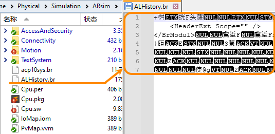

## 2.2 通过获取CF卡内文件获取

- 若现场电脑没有安装AS软件，或者现场只能寄出CF卡，我们可以通过文件的方式获取此日志。
- 日志文件存储在CF卡中的RPSHD（RPSHDS）文件夹下的USERROM中的.br文件中，名字可能会变化，但我们可以通过文件大小与内部内容了解是否是正确的文件。
    - 文件大小默认是 175 KB
    - 修改时间一般是这个文件里最新的
    - 文件开头包含 `<HeaderExt Scope=" ">` 与 `</BrModul>` 等信息。（文件可以用Notepad++等软件直接打开查看）
    - 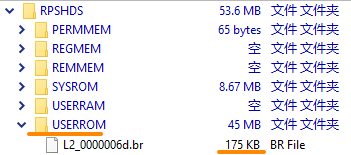
    - 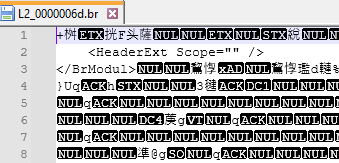

# 3 查看日志方式

- 1___ 找一个仿真项目，确认使用VC4画面，并且Alarm Groups 的History属性中的 Persistent 参数为True
- 2___ 将获取的到.br文件，确认名称为 ALHistory.br，通过拖拽的方式拖拽至Configuration View → PLC型号文件夹下
    - 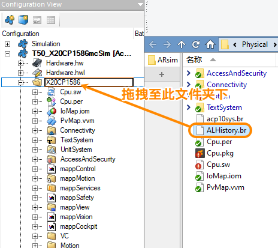
- 3___ 效果如下图
    - 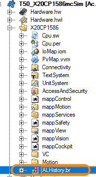
- 4___ 编译仿真项目，使用VNC软件打开查看历史报警即可见其他项目中导出的报警信息
    - 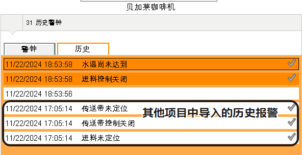

# 4 更新日志

| 日期         | 修改人        | 修改内容 |
| :--------- | :--------- | :--- |
| 2024-11-22 | LXW YZY | 初次创建 |
