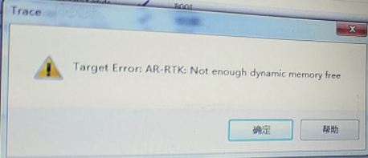
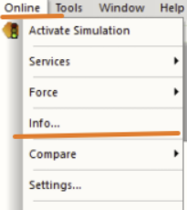
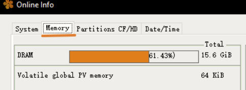

# 016通过PVI对PLC进行数据采集，运行一段时间报错
## 现象
通过AS软件对PLC进行长时间录播TRACE数据，运行一段时间，PLC会报出内存不足的提示

必须重启PLC才能解决问题
## 原因
使用AS软件或者使用第三方客户端，通过PVI对PLC访问获取数据，这一过程需要消耗PLC内存，如果贝加莱PLC的剩余内存过少，即会提示以上类似报错。
## 解决方式
- 优化程序
- PLC断电上电运行后，使用AS软件连上PLC，通过Online --- Info --- Memory查看剩余的内存是否足够。
    - 
    - 
