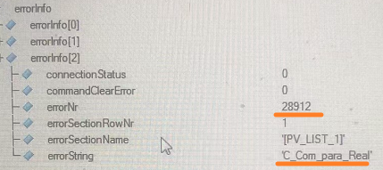

# 018使用IMA实现贝加莱PLC之间通讯
## 背景
- 贝加莱PLC之间常用AsIMA库或者AsANSL库，基于网络实现通讯。
- IMA通讯在很多维护项目上使用非常广泛，在后续维护过程中经常需要进行调整。
- IMA的通讯实现方式为：通讯函数任务 + 通讯配置数据模块
- 调整一般仅需要调整**通讯配置数据模块**
- 如果数据模块中执行到某一行配置出错，则后面的不会执行。

## 注意事项
- 通讯函数任务：
    - IMAinit
    - IMAcomm
    - IMAclose
- 通讯任务配置要求
    - 堆栈必须设大 例如：65536 或更大
    - 任务tolerance必须设大 例如：3000000us
    - 通讯连接数量必须设大   例如：32

- 通讯配置数据模块
    - 
    - Client与Sever的数据关联写法如下：
```
"/SV=READ_WRITE/SERVPV=ima_serv:a /CLNTPV=var_task:a"
```    
- 通讯模块配置注意事项
    - SERVPV的参数与CLNTPV的参数，需要确保变量存在，均为实际两个PLC中可Watch到的变量
    - 如果是局部变量，则需要在变量前写`任务名:`（需以实际配置中的任务名为准，超长的任务名会被改写）
    - 不要使用Tab键
- 通讯速度
    - PPC2100 (Server) <-> C70（Client）
    - 5000字节 大约 100ms 数量级
- 通讯配置内容
    - "/CN=IF5.4"
        - 其中IF5表示自己(Client)接口
        - 4表示目标(Server)Node号，注意：此为16进制数据
- 数据支持性
    - 单一变量
    - 结构体
    - 数组
- 通讯速率和任务周期关系
    - 通常在10ms任务周期，冗余时间加长。
    - 变量通讯速度和任务周期有关系。

## 故障排查案例
- 现象
    - 
    - 
- 原因
    - C_Com_para_Real全局变量在程序中仅有在变量表中定义，没有在程序中声明即没有分配内存，IMA通讯程序找不到，即会提示报错，导致IMA通讯大部分通讯失败。


