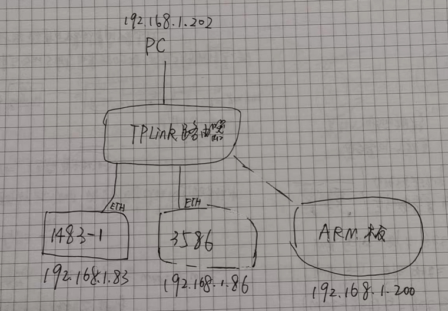
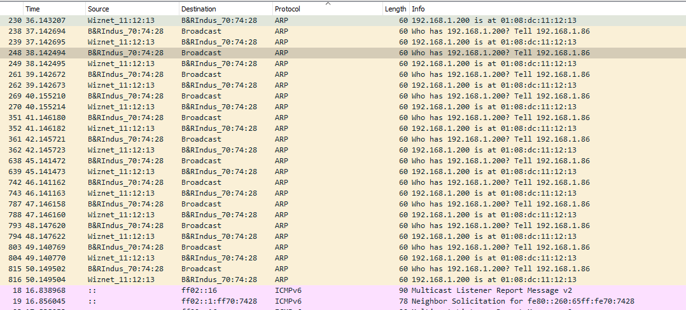
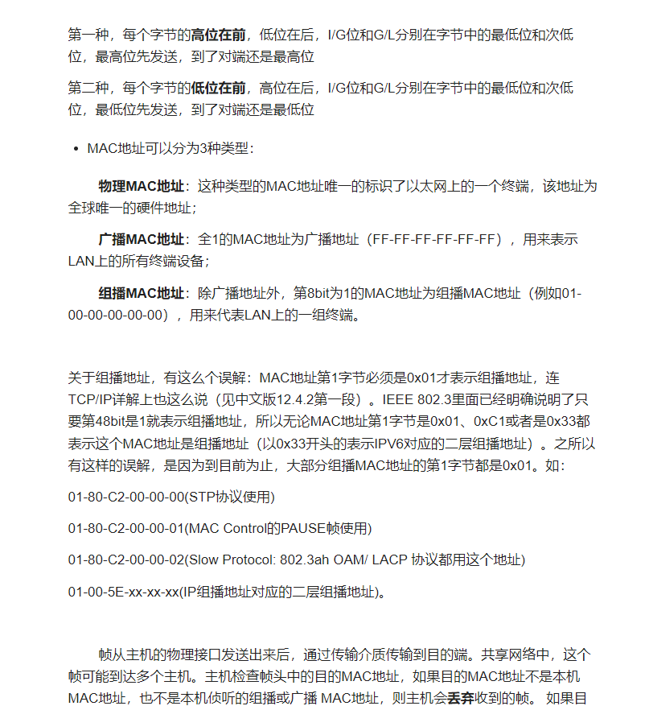

# 025X20CP3586不能ping通第三方开发板，无法建立正常通信
## 问题描述

3586/3585系列CPU无法ping通ARM开发板

使用hub抓包，发现3586和开发板只有ARP来回，没有ICMP交互
但是与1483进行ping操作，可以有ICMP交互

## 解决方案
原因是arm板的mac地址第一个字节不合规，应该是偶数才对，客户的是01，让客户改成02后测试，3585直接ping通，也可以modbustcp通讯了

