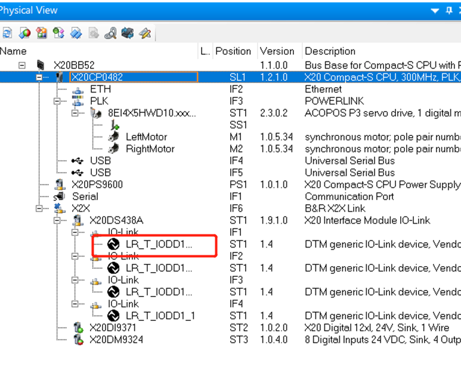

# 026 第三方 IO link 设备显示 FDT/DTM is not supported for hardware module because it's parent's DTM ID

## 问题描述

- FDT/DTM is not supported for hardware module because it's parent's DTM ID
- 
- 

## 解决方案

- 官网下载最新版本的 DTM 安装包进行更新
