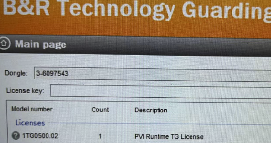
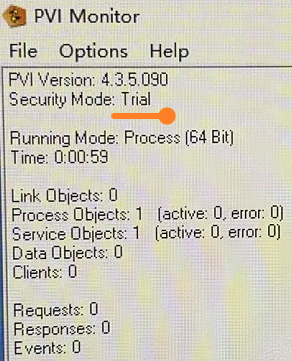
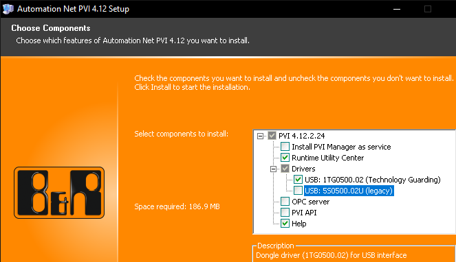

# 027TG里有PVI授权但插在电脑上未生效
# 现象
- PVI Manager在非贝加莱的第三方PC上运行时间受授权限制，持续运行2小时会自动锁定。
- 可通过贝加莱TG授权1TG0500.02，录入到TG中，插入到PC的USB口上，激活授权，使基于PVI Manager的通信无时间限制。
- 客户在使用的时候发现，TG中已有授权，但PVI Manager中没有提示授权激活。
- 
- 

# 原因
- 在进行PVI软件安装时，没有勾选USB驱动。

# 解决方式
- 重新安装PVI软件，勾选Drivers
    - 
- 正常安装后，PC上可见已安装1-Wire Drivers驱动软件
    - 

