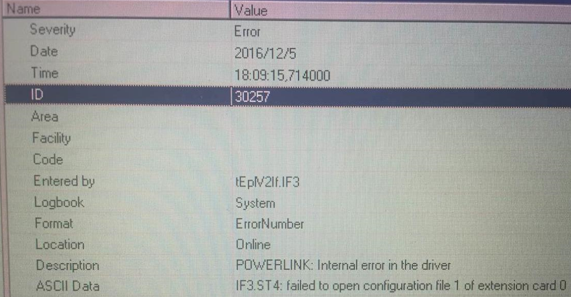
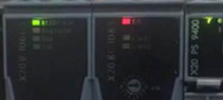
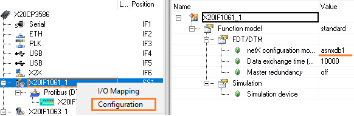

> Tags: #PROFIBUS_DP 

# B08.029.X20IF1061-1无法正常启动且Logger中有30257报错
# 现象
- 在使用例如X20IF1061-1等netX板卡的通信卡，在配置netX configuration module时，Vaule后的值必须为asnxdb+数字，例如asnxdb1，如果改成例如asnxdbT这类名称，则会导致1061-1不被识别。会出现如下状况：
- 
- 

# 解决方式
- 将netX configuration module的数值改为合理数值
- 

