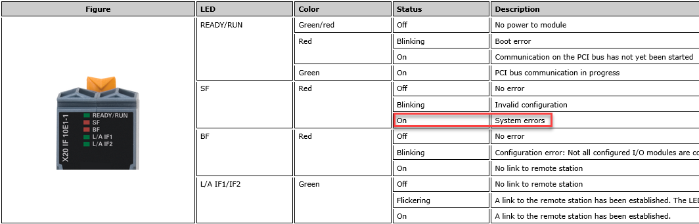
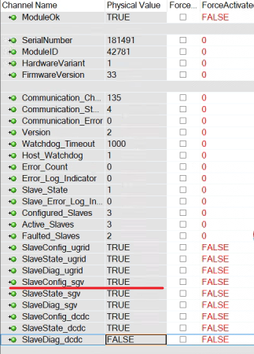
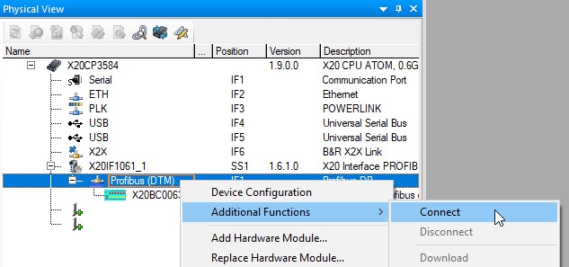
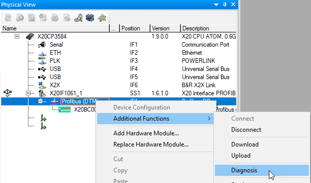
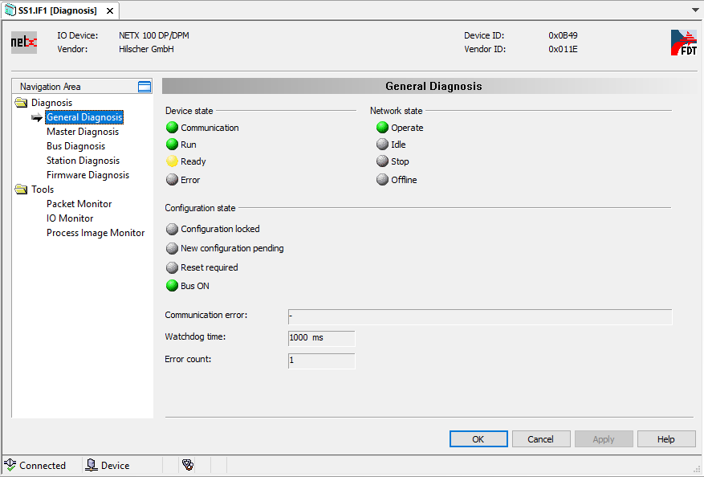
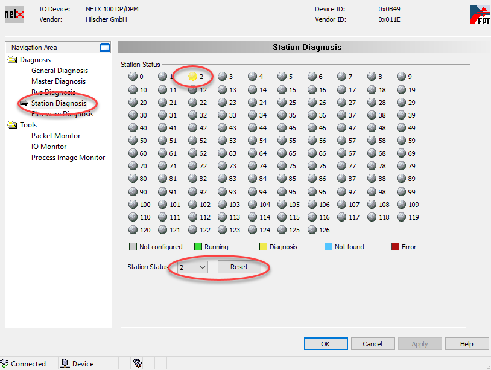

# 现象
- 使用贝加莱通信模块X20IF10E1-1作为PROFINET通信主站，连接第三方从站。
- 若是先通电PLC，再通电从站，则会显示ModuleOK，但是SF灯红灯常亮。
- 若是从站先通电运行 ，PLC后通电运行就正常；从站拔掉后，再次连接，从站报警，SF灯红灯常亮。但是，此情况下，通信正常，收发正常
- LED灯显示情况如下，SF灯红灯常亮
- 
- 检查此模块的I/O mapping通道信息，可见ModuleOK为TRUE，SlaveConfig_sgv为TRUE
- 
- 相对应的含义如下：

>当相应的从站设备提供诊断数据为 "TRUE"，则意味着
>    从站模块有错误，通信无法正常建立
>    或从站模块正在正常运行，但必须确认之前的错误，就可能出现这种情况。
> 此现象可以在Automation Studio的主站诊断中确认。

# 解决方式
## 原因一：通信异常，检查通信配置与接线
## 原因二：通信正常，需要通过AS软件进行确认
- 在对主站模块进行诊断之前，必须与该模块建立在线连接。要做到这一点，右击相应的主控模块，从快捷菜单中选择IF1附加功能/连接。
- 
- 选择 **IF1 Additional Functions / Diagnosis** 来打开对应的诊断页面
- 
- 主站诊断提供了各自网络状态的基本概述。有关各个参数的详细信息可以在在线帮助系统中找到。这可以通过帮助按钮打开。
- 
- 如果一个或多个从站处于诊断模式，你可以在 "Station Diagnosis "部分尝试确认它们。
- 