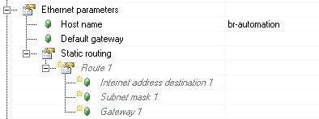
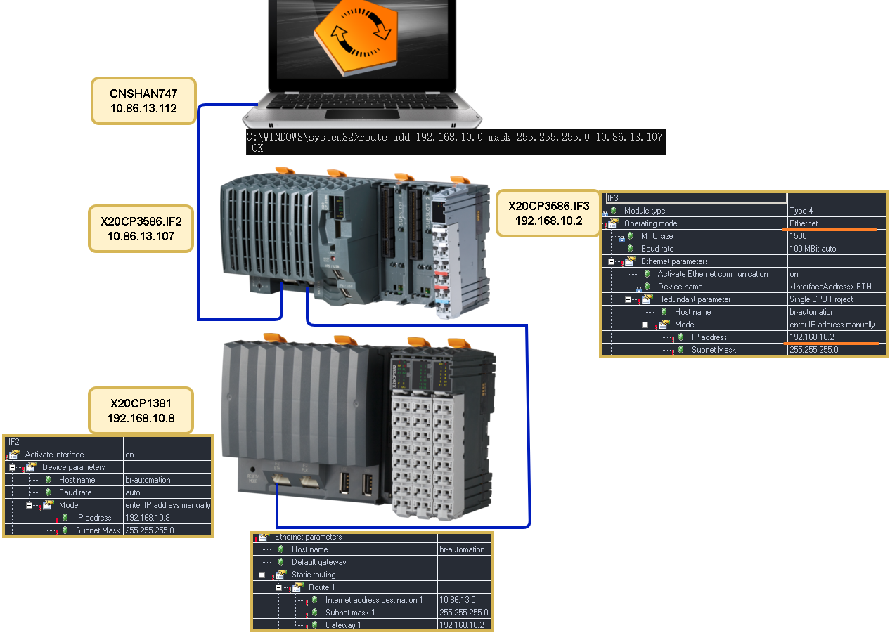
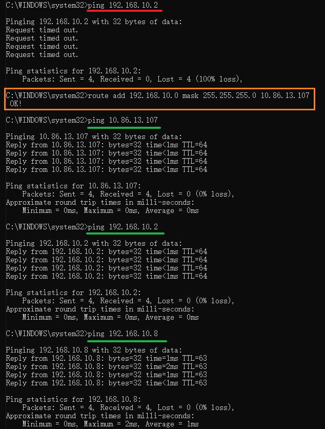
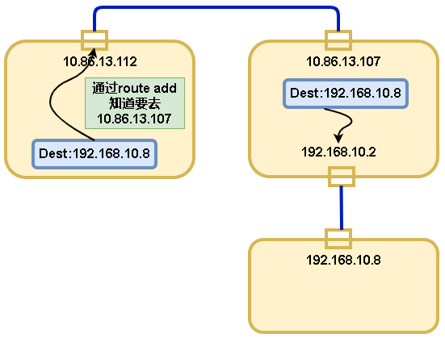
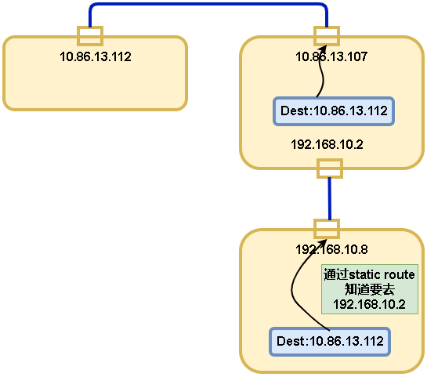
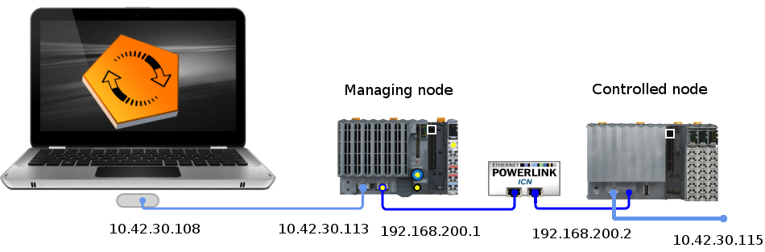

# 背景
- 贝加莱PLC具有静态路由功能，可以实现内部转发跨网段通信。
## 贝加莱操作系统设置Static routing含义
- 

| 条目 | 说明 |
| --- | --- |
| Internet address destination 1   | 静态路由目的IP地址。到达该目的地址的IP报文将被路由到指定网关。子网掩码可以用来为目标网络上的所有主机寻址。  例如:IP地址为192.168.10.0，子网掩码为255.255.255.0，则从192.168.10.0、192.168.10.1到192.168.10.255的所有报文都将路由到指定的网关。|
| subnet mask 1|  定义IP子网。如果设置为255.255.255.255，表示对单个站进行寻址。|
| Gateway 1| 指定满足Internet地址目的和子网掩码条件时，数据包应该发送到的路由器的IP地址。|

# 方案一：如何通过设置，实现PC能够跨PLC建立ETH通信
## 实现目标
- 通过PC （IP地址为10.86.13.112），ping通X20CP1381 (IP地址为192.168.10.8)
- 其中中间的PLC X20CP3586的原本IF3口从POWERLINK口改为ETH口
- 其中PC与X20CP3586通过交换机连接，X20CP3586与X20CP1381通过网线直连
- 
## 实现方式
> 以下测试场景，子网掩码均为255.255.255.0
### PC
- 需要通过管理员权限打开CMD，输入`route add 192.168.10.0 mask 255.255.255.0 10.86.13.107`
- 即意味着从PC侧输入的目标IP，若范围为192.168.10.1 ~ 192.168.10.255，均将转发至10.86.13.107这个IP地址上
- 若PC直连X20CP3586，IP地址需要为10.86.13.112，Gateway设置为10.86.13.107
### X20CP3586
- 确认IF2口的IP地址为10.86.13.107
- 确认IF3口改为以太网模式，并手动设置IP地址为192.168.10.2
- 一台PLC下多个以太网口内部互通，若PC侧已经添加好路由，则可以直接ping通192.168.10.2
### X20CP1381
- 设置IP地址为192.168.10.8
- 为了X20CP1381需要发出的数据包能够合理返回，需要添加PLC的静态路由
    - IP地址为10.86.13.0 Gate为192.168.10.2，即意味着，若发数据帧的目标IP地址为10.86.13.1~10.86.13.255之间，将数据包转发至192.168.10.2上
### 拓扑结构图
- 
### 从PC侧ping通数据CMD记录
- 没有在PC侧添加路由表，ping 192.168.10.2不通
- PC侧添加完成路由表，ping 192.168.10.2成功
- ping 192.168.10.8需要多走一层，因此TTL减1为63
- 
### 数据包流向图
- 
- 

# 方案二：如何通过设置，实现PC使用AS软件基于PLK网络访问iCN节点的PLC
使用了 X20CP1584 和 X20CP1382 处理器 ，并将它们与 PowerLink 连接起来。接下来，我将参考它们管理节点和受控节点。

## 控制节点（Managing node）PLC设置
- 1. 在管理节点的以太网配置中，将 INA 参数中的端口号更改为未使用的值（例如，原始端口号为 11159 ，新端口 号为 11158）。
- 2.在管理节点上的 PowerLink 配置的 POWERLINK 参数部分中，检查模式是否设置为管理节点状态，以及周期时间 是否与受控节点中的相同。在以太网参数中，将IP地址设置为192.168.200.1 ，将子网掩码设置为255.255.255.0。在ANSL参数中，我们激活在线通信。

## 受控节点（Controlled node）PLC设置
- 3.在受控节点中， 将 POWERLINK 参数 -> 模式 设置为受控节点。对于以太网参数，将 IP 地址添加到 192.168.200.2，将子网掩码 添加到 255.255.255.0 ，并在 ANSL 参数中启用在线通信
- 4.在以太网参数 ->静态路由 ->路由 1 (Ethernet parameters -> Static routing -> Route 1) 中配置 CPU 受控节点时，将互联网地址目标 1 设置为 10.42.30.0，将子网掩码 1 设置为 255.255.255.0 ， 将网关 1 设置为 192.168.200.1。
- 5.更新PLC程序

## PC访问设置
- 6.在管理员模式下运行 Windows 命令提示符并写入路由添加` route add 192.168.200.0 mask 255.255.255.0 10.42.30.113` （10.42.30.113 = 以太网管理节点的 IP 地址）， 然后按 Enter 键。它应该看起来没问题！
- 7.在“在线设置”中，只需创建一个新连接并输入 Powerlink 以太网控制节点中的 IP 地址（例如 192.168.200.2），现在您就可以直接通过POWERLINK网络连接，而无需通过以太网连接，就像直接连接到以太网一样。
- 8..完成后，您可以在 管理员模式下的 Windows 命令提示符下使用 route delete 192.168.200.0  命令删除路由。

- 

