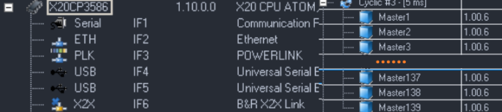
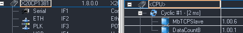
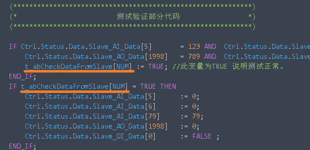
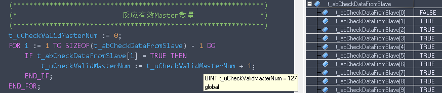

# 目的与测试思路
- 目前已知AsTCP的最大允许请求的数量为128，因此进行测试验证
- 详情说明可见 [019贝加莱PLC系统资源数量说明](../B02_技术_AutomationRuntime/019贝加莱PLC系统资源数量说明.md)
- 测试使用方式为贝加莱ModbusTCP源码库，底层使用AsTCP库实现。
- 准备两个PLC，一个作为Master，一个作为Slave，其中Master以独立的任务，占用独立的端口，每个任务循环发起9个请求。
- 
# 配置情况
- 实际X20CP3586的软件配置
    - 
- 实际X20CP1381的软件配置
    - 

# 软件检测思路
- 每个任务，均有一个`t_abCheckDataFromSlave[ ]` BOOL数组变量，若此任务建立与Slave的通信，则为True。
- 

- 使用一个任务对t_abCheckDataFromSlave变量为TRUE的状态进行统计，统计为TRUE的数量
- 

# 测试结果
- X20CP3586总共有139个Master任务发起对同一个Slave的数据请求，只有127个任务得到请求满足。
- 故AsTCP的请求资源实际限制为127。
- 此测试可重复测试。