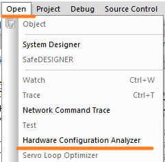

[TOC]
```toc
```

# 一、POWERLINK实时通信基本概念 

- POWERLINK周期分为同步和异步两个阶段，两个阶段合起来即为一个POWERLINK周期实际的通信时间。
    - 在同步阶段，来自网络节点的处理数据是循环传输的。
        - 贝加莱的轴控驱动器，X20BC系列模块，安全模块X20SL8100等，均是在同步段处理的。
    - 异步阶段允许在两个或多个节点之间交换非循环数据。此阶段用于网络管理、配置、诊断和非时间关键型数据查询。
    - 它还允许传输任何非POWERLINK帧，例如基于TCP/IP的数据，如
        - 网页访问
        - 安全模块之间的数据通信
        - AS软件调试的PVI通信
        - FTP通信
        - mappVision视觉方案传输图片
        - 基于X20HB8815实现的基于PLK网络通信TCPIP数据
- 默认的POWERLINK通信数据帧如下，在一个循环周期CycleTime内（例如2ms），主站发给一个从站PReq请求数据帧，等待从站响应回一个PRes帧，按照站数一个一个发起请求，等待回复。
- 默认这样的通信的好处为适应性强，一个从站崩溃了，超过了response timeout参数，则自动跳过此从站，不会因为一个从站崩溃影响所有从站。
    - 

# POWERLINK通信实时性数据

## 实际设备通信案例：400μs的PLK循环周期，基于11个PLK从站，带30个轴

| APC - system unit      | 5APC2200.AL14-000  |
| ---------------------- | ------------------ |
| APC - Interface option | 5ACCIF01.FPSC-001  |
| X20BC0083站数量        | 2个，总共15个SDC轴 |
| 伺服站                 | 9个，总共15个轴    |
| network analyzer       | PLK周期为380μs     |
| PLK Cyclic time            | 400μs            |
| X2X Cyclic time | 800μs |
| Cyclic #1 Duration | 800 |
| Cyclic #1 Tolerance | 0 |
| 设备调试情况 | 功能正常，通信均正常 |
# 二、POWERLINK实时通信周期分析与计算
## 如何估算所需的周期

- 如果您至少知道POWERLINK网络中的节点数量和类型，则可以使用以下简化假设快速估计可能的最快循环时间：
- 

> - IPG
>   - 数据包间隔（960 ns）；两个以太网帧之间的强制停顿（根据IEEE 802.3） 
> - Hub Level
>   - MN和通信到的CN之间的集线器数量（不包括CN本身的接口）

### 示例

- 网络布局： 1 CN接收30个字节，发送136个字节，并通过一个额外的集线器连接。
- 估计最短可能的POWERLINK周期时间： Tcycle min = 40μs + 6μs (PReq) + (6μs + 8μs) (PRes) + 3μs (hub) = 63μs

> 注意，贝加莱常用的Hub，PLK帧过一个Hub的时间大约为0.96μs，若使用具有存储转发的交换机，过一个Hub的时间可能变为3~10μs。

## 理论通信时间计算：Hardware Configuration Analyzer
- 
- 

## 实际循环周期查看：I/O mapping查看
- 在POWERLINK MN接口（监控Monitor模式下）上观察“CycleIdleTime”数值。
- 
- 与POWERLINK MN的Cycle time对比
- 
- 以上图为例，Cycle Time为2000 μs，I/O mappping中的CycleIdleTime为872 μs，即一个周期POWERLINK实际的通信时间为1128 μs。

## 使用Wireshark抓包
- 可通过这种方式粗略抓包，可借助X20ET8819模块作为数据中转
- 笔记本电脑通过网线连接在POWERLINK网络中，开启混杂模式，监听网络发包。
- 需注意，此方式获得时间戳不一定准确。
- 
> 🛑所有的协议（TCP/IP、Windows网络等）应该在执行捕获的PC上的控制面板中停用，以防止不 需要的数据包干扰POWERLINK网络。


## 使用X20ET8819精准抓包
- X20ET8819 为网络捕获提供了高精度、可靠的时间戳。数字输入和过滤器也可以用来触发捕获。
- 基本的拓扑结构
    - 

- 抓包软件的界面
    - 

- 使用Wireshark软件分析报文
    - 

# 三、POWERLINK循环时间的理论值与实际值差异
## 拓扑结构
- 
- 
## 通信数据配置
- 每个从站与主站之间各收发290字节数据，1个主站与5个从站进行通信。
- 
## 理论数据与实际数据对比
- 通过Hardware Configuration Analyzer分析得知PLK循环时间为<span style="background:#F0A7D8">362μs</span>
- 
- 实际测试下，POWERLINK Cycle time需要设置在<span style="background:#F0A7D8">440μs</span>以上。

# 四、深入学习
- 贝加莱官方培训手册
    - [TM950 POWERLINK 配置和诊断.pdf](https://gitee.com/yzydeer/BuR_Assistant/blob/master/TM_files/TM950%20POWERLINK%20%E9%85%8D%E7%BD%AE%E5%92%8C%E8%AF%8A%E6%96%AD.pdf)
- 贝加莱Automation Help中POWERLINK章节
    - 
- 案例分享
    - [040POWERLINK通信超时分析与解决](040POWERLINK通信超时分析与解决.md)
- 概念理解
    - [041POWERLINK常见参数设置与说明](041POWERLINK常见参数设置与说明.md)
