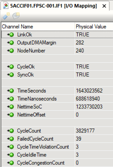
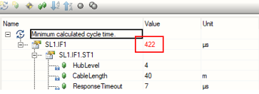
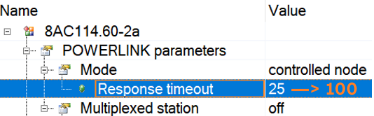
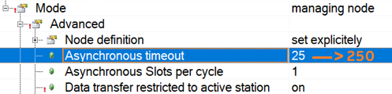
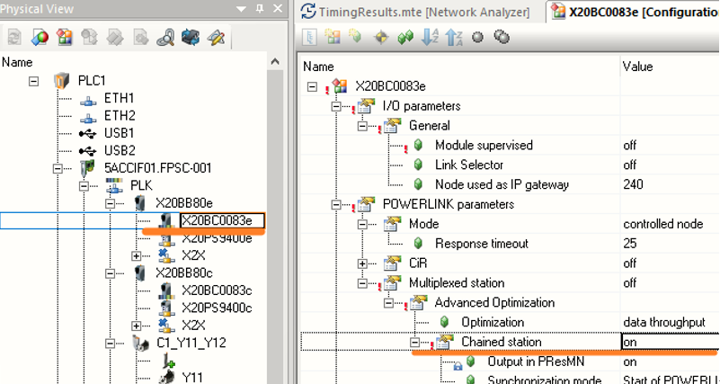
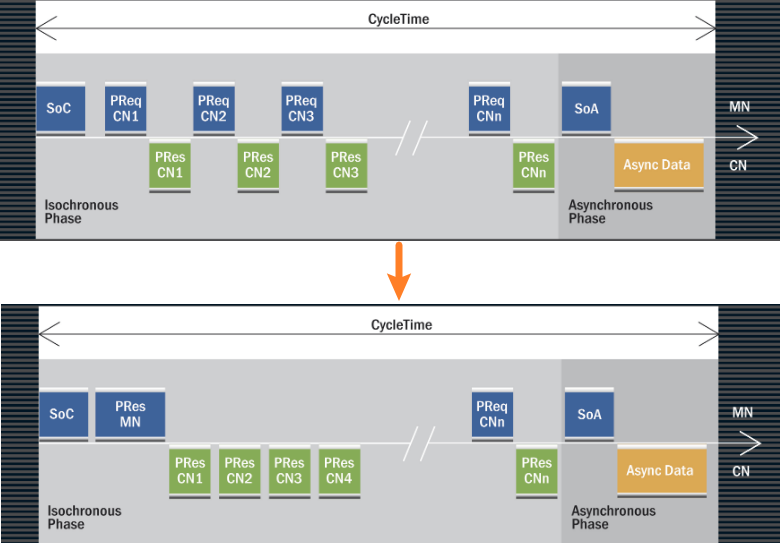

[TOC]
```toc
```

# 一、现象
- 项目的POWERLINK的POWERLINK循环周期为400μs
- 在某些操作下，会出现X20SM1436模块的SDC轴全部掉线的现象。
- ①PLC程序里trace paraID是用的MC_BR_ReadParID，以3.2ms周期触发Execute，使用该功能就会导致SDC轴全部掉线。
- ②使用TEST里的Trace都会出现SDC轴掉线，导致设备不能运行。Trace为异步操作，会增加PLK的循环通信时间，导致超时报警。

## 配置与现象总结
| APC - system unit      | 5APC2100.BY01-000    |
| ---------------------- | -------------------- |
| APC - Interface option | 5ACCIF01.FPSC-001    |
| X20BC0083站数量        | 2个，总共15个SDC轴   |
| 伺服站                 |11个，总共15个轴      |
| network analyzer       | PLK周期为422μs       |
| PLK Cyclic time        | 400μs                |
| X2X Cyclic time        | 800μs                |
| Cyclic #1 Duration     | 800                  |
| Cyclic #1 Tolerance    | 0                    |
| 设备调试情况           | 频繁出现SDC轴掉线报错<br>偶尔报出POWERLINK循环超时 |

# 二、分析
## 查看PLK主站的idle time
- FailedCycleCount为39与CycleTimeViolationCount为3
- 表现说明PLK通讯同步数据一个周期发送完成所需的时间已超过设置的PLK通讯循环时间。
- 
## 使用Hardware Configuration Analyzer自动计算POWERLINK循环时间
- 
## 如果增大Timeout则通信质量更差
- 增加从站 Response Timeout时间，从25μs变为100μs
- 
- 增大异步通信timeout，从25μs调整至250μs
- 
- 结果
    - 改了后，电机报错，消除都消不掉。
    - 调整此参数可增大POWERLINK通讯异步段的通讯数据量，避免异步段始终发不出数据。但增加此参数，如果原同步段已经完全超时，则通讯问题更加严重。

# 三、解决思路
- 根本原因
    - 在POWERLINK 400μs的循环周期下，默认参数与默认Line拓扑结构下，循环时间超时。400μs默认情况下能够带9个PLK从站。
## 解决方式：使用链式轮询应答Poll response chaining
- 操作方式
    - 调整每个PLK从站的参数，将Multiple Optimization – Chained  station 从默认的Off —> On.
    - 
    - 效果：
        - 通过调整11个从站此参数，可使得Automation Studio的NetworkAnalyzer自动计算的循环时间，从422 —> 338。
        - 经过现场测试，之前出现的通讯中断问题不再出现。

### 原理说明
- 由于MN也可以发送PRes，所以相同的过程数据可以在单个步骤（广播通道）中分布到多个CNs。链式轮询应答模式需要此机制。CNs在这种模式下运行，不再需要一个来自MN的PReq帧。相反，它们对PResMN 帧的响应是一个恒定的延迟。每个节点的延迟在启动时自动计算。
    - 可能有更多的循环节点（不增加循环时间）
    - 缩短所需的最小POWERLINK周期时间（使用相同的节点数） 
    - 减少与拓扑相关的延迟（特别是对于线性拓扑）
- 
- 链式轮询应答的好处主要是由于每个站点取消了一个PReq帧。 这种优化用于中央闭环控制系统，其中小批量的数据传输，如在数控系统（位置控制）。

# 四、概念学习
- 请参考[039POWERLINK实时通信基本概念](039POWERLINK实时通信基本概念.md)
