> Tags: #POWERLINK #通信 #轴控

- [1 POWERLINK常见参数设置与说明](#1%20POWERLINK%E5%B8%B8%E8%A7%81%E5%8F%82%E6%95%B0%E8%AE%BE%E7%BD%AE%E4%B8%8E%E8%AF%B4%E6%98%8E)
- [2 常见参数 - 同步段](#2%20%E5%B8%B8%E8%A7%81%E5%8F%82%E6%95%B0%20-%20%E5%90%8C%E6%AD%A5%E6%AE%B5)
	- [2.1 POWERLINK在 Automation Studio中的循环周期](#2.1%20POWERLINK%E5%9C%A8%20Automation%20Studio%E4%B8%AD%E7%9A%84%E5%BE%AA%E7%8E%AF%E5%91%A8%E6%9C%9F)
		- [2.1.1 AS参数配置](#2.1.1%20AS%E5%8F%82%E6%95%B0%E9%85%8D%E7%BD%AE)
	- [2.2 Response Timeout](#2.2%20Response%20Timeout)
		- [2.2.1 AS参数配置](#2.2.1%20AS%E5%8F%82%E6%95%B0%E9%85%8D%E7%BD%AE)
	- [2.3 Loss of SoC tolerance](#2.3%20Loss%20of%20SoC%20tolerance)
		- [2.3.1 AS参数配置](#2.3.1%20AS%E5%8F%82%E6%95%B0%E9%85%8D%E7%BD%AE)
- [3 常见参数 - 异步段](#3%20%E5%B8%B8%E8%A7%81%E5%8F%82%E6%95%B0%20-%20%E5%BC%82%E6%AD%A5%E6%AE%B5)
	- [3.1 Asynchronous timeout](#3.1%20Asynchronous%20timeout)
		- [3.1.1 AS参数配置](#3.1.1%20AS%E5%8F%82%E6%95%B0%E9%85%8D%E7%BD%AE)
	- [3.2 Asynchronous MTU size](#3.2%20Asynchronous%20MTU%20size)
		- [3.2.1 AS参数配置](#3.2.1%20AS%E5%8F%82%E6%95%B0%E9%85%8D%E7%BD%AE)
	- [3.3 多异步发送 Asynchronous Slots per cycle](#3.3%20%E5%A4%9A%E5%BC%82%E6%AD%A5%E5%8F%91%E9%80%81%20Asynchronous%20Slots%20per%20cycle)
		- [3.3.1 AS参数配置](#3.3.1%20AS%E5%8F%82%E6%95%B0%E9%85%8D%E7%BD%AE)
- [4 案例分享](#4%20%E6%A1%88%E4%BE%8B%E5%88%86%E4%BA%AB)
	- [4.1 拓扑结构复杂，需要更新硬件固件](#4.1%20%E6%8B%93%E6%89%91%E7%BB%93%E6%9E%84%E5%A4%8D%E6%9D%82%EF%BC%8C%E9%9C%80%E8%A6%81%E6%9B%B4%E6%96%B0%E7%A1%AC%E4%BB%B6%E5%9B%BA%E4%BB%B6)
	- [4.2 Line型网络，从站数量多，使用的不是贝加莱HUB](#4.2%20Line%E5%9E%8B%E7%BD%91%E7%BB%9C%EF%BC%8C%E4%BB%8E%E7%AB%99%E6%95%B0%E9%87%8F%E5%A4%9A%EF%BC%8C%E4%BD%BF%E7%94%A8%E7%9A%84%E4%B8%8D%E6%98%AF%E8%B4%9D%E5%8A%A0%E8%8E%B1HUB)
	- [4.3 现场PLK通信过滑环，网线质量不好，偶发丢包](#4.3%20%E7%8E%B0%E5%9C%BAPLK%E9%80%9A%E4%BF%A1%E8%BF%87%E6%BB%91%E7%8E%AF%EF%BC%8C%E7%BD%91%E7%BA%BF%E8%B4%A8%E9%87%8F%E4%B8%8D%E5%A5%BD%EF%BC%8C%E5%81%B6%E5%8F%91%E4%B8%A2%E5%8C%85)
	- [4.4 需要通过PLK网络传图片与视频，使用X20HB8815、相机](#4.4%20%E9%9C%80%E8%A6%81%E9%80%9A%E8%BF%87PLK%E7%BD%91%E7%BB%9C%E4%BC%A0%E5%9B%BE%E7%89%87%E4%B8%8E%E8%A7%86%E9%A2%91%EF%BC%8C%E4%BD%BF%E7%94%A8X20HB8815%E3%80%81%E7%9B%B8%E6%9C%BA)
- [5 深入理解](#5%20%E6%B7%B1%E5%85%A5%E7%90%86%E8%A7%A3)

# 1 POWERLINK常见参数设置与说明

# 2 常见参数 - 同步段

## 2.1 POWERLINK在 Automation Studio中的循环周期

- 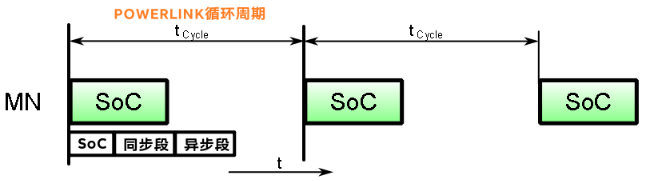

### 2.1.1 AS参数配置

- 

## 2.2 Response Timeout

- Poll 响应超时参数（CN从站参数）
    - Poll response 超时参数，当一个站点使用PReq帧进行轮询时，它需要一定的时间才能使用PRes帧进行响应。
    - 此Poll response timeout 定义了时间的最大值（μs），也就是 MN将等待一个被轮询从站的PRes帧的时间。
    - 必须考虑网络拓扑，电缆延迟和Hub层级的关系。
- 下图可见此参数在一个POWERLINK通信中所处的位置。
    - 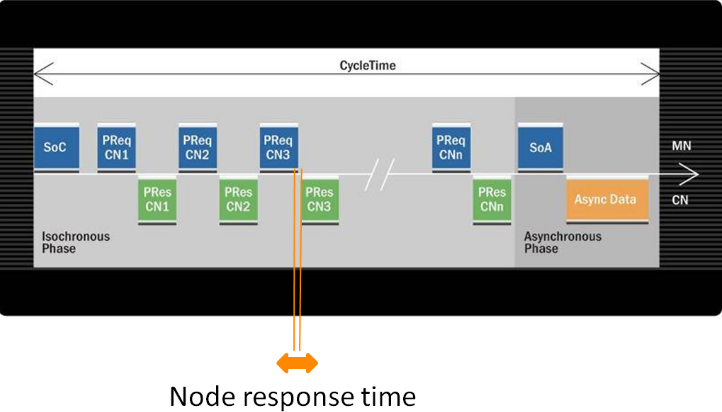
- 需要注意，如果Hub层级比较多，需要注意Hub的影响
    - 每过一次Hub都增加一个过Hub的时间，以贝加莱的驱动器为例，过一次驱动器的PLK Hub需要消耗0.96μs。
- 下图中，主站与末端的CN从站通信，则需要过两个Hub来回各两次，需要多消耗0.96μs * 4 = 3.84μs。
    - 
- 若使用第三方交换机，过一次交换机的延迟时间可能为3μs，则一个Line型，10个从站的PLK网络，主站与末端的CN从站通信，则需要过9个Hub来回各两次，需要多消耗3μs * 18 = 54μs，远超过默认的25μs。

> 🔴 所有从站的Response timeout的时间之和，不要超过POWERLINK循环周期的 80%，否则通讯会很不稳定。

### 2.2.1 AS参数配置

- 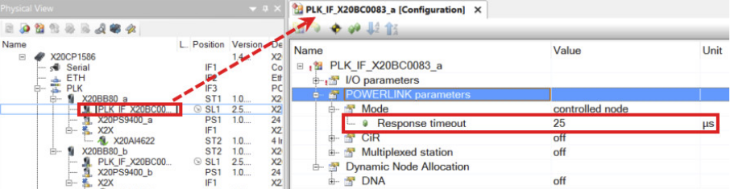

## 2.3 Loss of SoC tolerance

- MN 参数
- CN监控由MN发送的SoC帧的精度。如果SoC未在规定的容忍范围内接收到，则视为丢失。
- 因此，应该根据MN的性能来设置“Loss of SoC tolerance”参数。
- 如果通信质量较差，过滑环，有随机干扰，可以考虑增加此参数，将默认的2，改为更大的数值。
- 运动控制中，如果通信质量较差，可能会报出6002报警，将此参数调大能规避。

### 2.3.1 AS参数配置

- 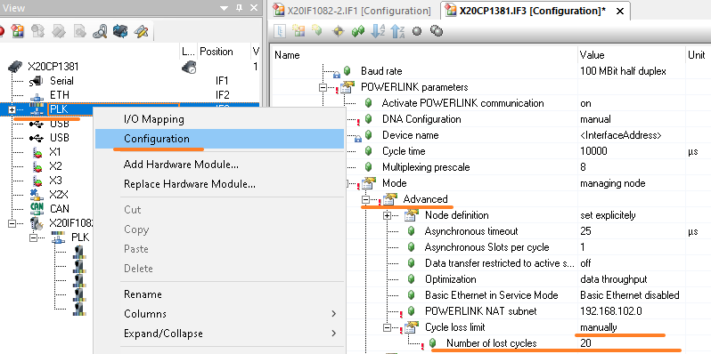

# 3 常见参数 - 异步段

## 3.1 Asynchronous timeout

- MN主站参数
- 异步超时参数 当一个站收到来自MN的发送异步数据的许可时，在发送SoA和接收来自各自站的ASnd之间存在一定的延 迟。
- 此 Asynchronous Timeout 参数定义了最大时间（μs） 也就是发送SoA后，MN将等待接收帧的时间，类似于 PRes超时(Poll Response Timeout)。
- ⚠️此参数的设置取决于网络拓扑结构（长线缆和集线器/交换机会增加延迟，此参数需要增大）。
- 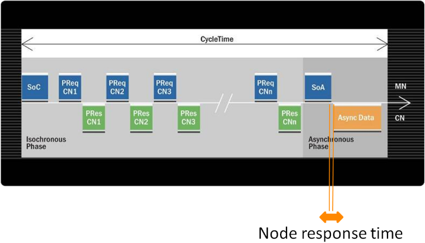

### 3.1.1 AS参数配置

- 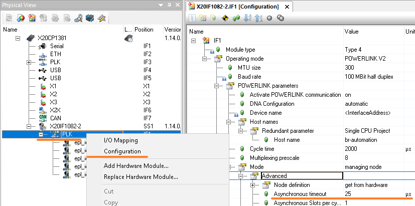

## 3.2 Asynchronous MTU size

- 主站参数
- 异步MTU48 大小定义了POWERLINK异步阶段的以太网帧允许的最大负载（以字节为单位）。
- 如果要以短周期时间运行网络，则此参数不能设置得过高。
- 最低的设置是300字节（默认参数即是300字节）。
- 另一方面，如果对于特定的应用程序，更大的异步吞吐量更重要，那么应该将参数设置得更高
- 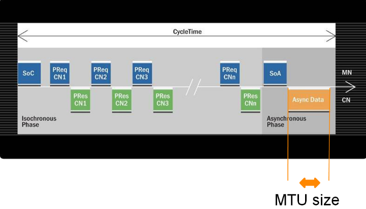
- 仅调整参数，通过Hardware Configuration Analyzer得到的理论循环时间也会变大
- 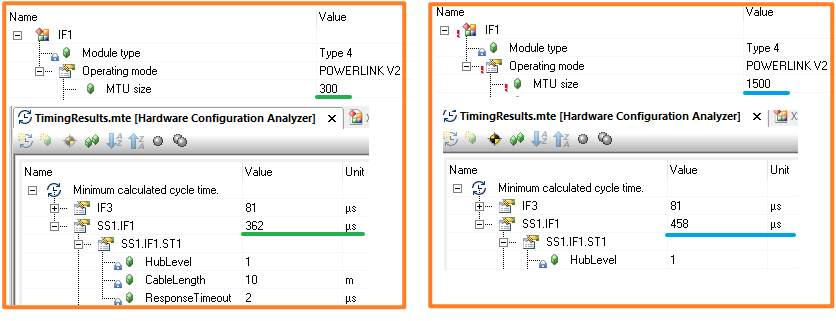

### 3.2.1 AS参数配置

- 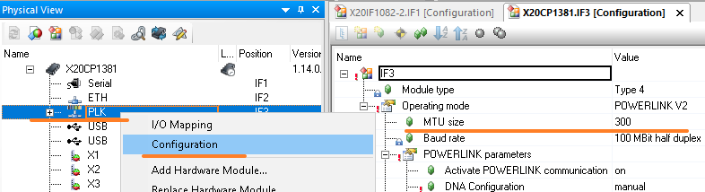

## 3.3 多异步发送 Asynchronous Slots per cycle

- 为了增加异步阶段的数据吞吐量，可以在一个周期中发送多个异步帧。每个CN仍然必须被MN邀请，但是这必须使用不同类型的帧来完成 - 异步邀请（AInv）。
- MN不使用AInv帧来邀请自己，而是在“扩 展”异步阶段直接发送异步数据。
- 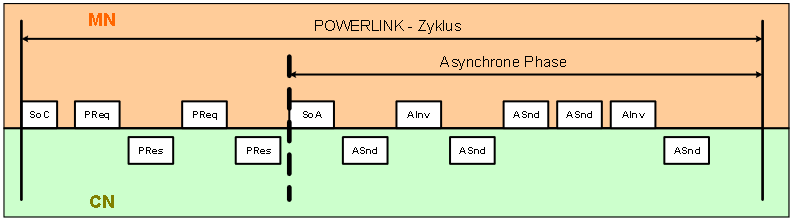
- 当目标是优化POWERLINK网络上非实时数据的吞吐量时，将使用多个异步发送。 例如，在传输需要大量带宽的图像数据时，就使用了这种优化。

### 3.3.1 AS参数配置

- 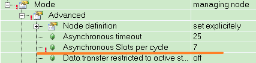

# 4 案例分享

## 4.1 拓扑结构复杂，需要更新硬件固件

- 贝加莱硬件模块的固件更新是通过异步段通信，若异步段设置的过小，很有可能难以更新成功
- Response Timeout 调整为 250 μs
- Asynchronous timeout 调整为250 μs
- MTU Size 调整为 1500 （酌情调整）

## 4.2 Line型网络，从站数量多，使用的不是贝加莱HUB

- 从站响应可能花的时间会长
- Response Timeout 调整为 250 μs
- Asynchronous timeout 调整为250 μs
- 🔴 默认两参数均为25μs，建议根据实际情况调整，可通过抓包工具分析报文，来明确合理的Timeout参数。
- 🔴 每个从站的 Response Timeout参数之和，不要超过POWERLINK网络循环时间的 80%。

## 4.3 现场PLK通信过滑环，网线质量不好，偶发丢包

- Loss of SoC tolerance设置为Manual，数量调整为10

## 4.4 需要通过PLK网络传图片与视频，使用X20HB8815、相机

- MTU Size 调整为 1500
- Asynchronous timeout 调整为250 μs
- Asynchronous Slots per cycle 调整为7

# 5 深入理解

- [039POWERLINK实时通信基本概念](039POWERLINK实时通信基本概念.md)
- [040POWERLINK通信超时分析与解决](040POWERLINK通信超时分析与解决.md)
